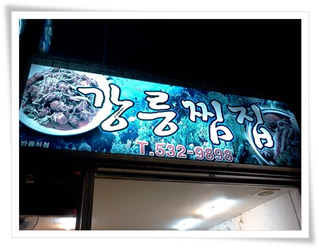

# 당일치기 대진항 여행

애들 축구하는 모임이 있는 토요일.

부모들 중, 그 지난 주에 동해안을 다녀온 한 아빠 한 분이 요새가 동해안 놀러가기 제일 좋은 때라고 바람이 잡으셨다.

갯바위에서 낚시를 했는데, 팔뚝만한 놀래미가 쉬지도 않고 잡혀 팔이 아팠다라는 낚시꾼의 기본적인 허풍에 덧붙여, 홍게가 제철이라 아주 저렴한 가격에 배터지게 먹었다라고.

여행 좋아하는 내가 , 가을인데도 단풍놀이도 안 가고 있던 차에 무척이나 당겼다.

갑작스런 번개가 추진되었다.  20대도 아닌데, 간만에 해 보는 번개다.

너무나 날씨 좋은 이 가을의 주말은 꼭 여행을 가야만 할 것 같은 공감대가 형성되어,  총 4식구로 동해 번개 멤버가 조직되었다.

멤버는 지난번 진천 야영했던 그 식구들..

세식구는 번개가 추진되는 바로 토요일 그 날 저녁 동해를 출발하기로 했고, 우리 식구는 다음 날 새벽에 출발하기로 했다.

동해안을 당일치기로 놀러갔던 적은 없었던터라, 아침 일찍 가야겠다는 생각에, 알람을 3시 50분으로 맞춰놨다.

3시 50분, 괜히 가겠다고 했나라는 몇시간 못자고 일어난 피곤함을 잠시 뒤로 하고, 5시에 출발했다.

아직 깜깜한 새벽을 2시간 반을 달려, 날이 밝아오는 7시 반에 횡성휴게소에 들렀다.

앞으로 한달만 있으면, 스키시즌이 되어 이 시간에 보드복을 입은 사람들도 북적일텐데, 아직은 한산했다.

횡성휴게소에서 소고기국밥을 꼭 먹어야 한다는 강추가 있었기에, 그걸 아침으로 먹었다.

고속도로 휴게소에서 이 정도 맛있는 음식도 있구나라는 감탄을 할 정도로 괜찮았다.

나도 앞으로 영동고속도로를 탈 때면, 이제 횡성휴게소에서 이 소고기국밥을 먹어야겠다.

전날 출발한 세 식구가 있는 대진항의 모텔로 도착한 시각 9시.

밤 10시가 넘으면 모텔은 더 이상 손님이 없기에 흥정을 하여, 방 하나에 3만원씩 하여 세식구가 모델 한층 전체를 차지했다고 한다.

흥정을 잘 하면, 역시 안되는 게 없구나..

여행의 베테랑에게 이런 걸 좀 배워야겠다.

날씨는 구름도 없고, 따뜻하여 여행에 더할나위 없이 좋았지만, 바다는 파도가 있어, 전날 배가 뜨질 못했다고 한다.

그 덕에 횟감의 가격이 2배이상 올라, 신선한 해산물을 배불리 먹겠다는 계획에는 차질이 생겼다.

그래도 동해에 왔으니, 아침부터 회.

종목은 오징어회.

여행의 베테랑께서 직접 묵호항에서 사온 오징어회에 햇반, 김을 비벼 먹었다.

장소는 모텔 앞 평상.

바닷가 바로 앞에 있는 평상이고, 네식구 14명이 대식구 함께 먹은 아침 식사라, 더더욱 맛있더군.

애초 낚시로 많은 고기를 잡아, 직접 회를 떠 먹겠다는 생각에 칼과 초장도 준비해 왔는데, 기회가 오지 않았다.

진정되는 파도로 고기는 입질도 없었다.

남자들은 낚시, 여자들은 수다, 아이들은 바위틈에서 게를 잡고,.. 이렇게 낮시간을 보냈다.

진정한 낚시꾼이 아닌터라, 기다림의 미학이라는 낚시의 본질을 즐기지 못하고, 고기 잡겠다는 목표 달성이 안되어, 좀 김이 빠지긴 했다.

이번 여행의 가장 큰 수확은 맛집 발견.

이제껏 동해 여행을 즐겨하지 않는 이유중 하나가, 맛집을 알지 못했다는 것.

서울의 식당보다 맛도, 가격도, 서비스 어느 하나 나은 식당을 경험해 보지 못했었는데, 베테랑 여행가를 따라가니, 묵호항 시장 근처에 현지인들이 이용하는 식당이 바로 그 곳.

가격도 싸고, 맛도 좋았다.  장치조림과 아구찜을 먹었는데, 장치조림이 그 집의 주력 메뉴라고 했다.

들어보기도 처음이고, 먹어보기도 처음이었던 장치조림.

장치라는 물고기가 동해안 북쪽에서만 잡히는 거라고 한다.

아주 맛있었다.

식당 아주머니도 아주 친절했고..

\- 저녁으로 장치조림 먹은 식당. 강릉찜집

묵호항 근처 가면, 다시 한번 먹어보려고 간판 사진은 찍고, 식당 이름으로 위치 검색을 해 보려고 했는데, 정말 현지인만 이용하는 식당이라 그런가 검색에 전혀 걸리지 않더군.

어둑어둑 해졌을 때, 앞차만 따라가서, 식당 위치도 잘 모르겠고,...

당일치기로 운전만 거의 8시간을 했는데, 간만에 맛 있는 음식을 먹어 보람찬 주말이었다.

요즘 귀차니즘이 도를 더 해 가는지, 카메라를 들고 가서도, 기껏 찍은 것은 폰카로 찍은 저 간판이 전부.

사람은 나이를 먹을수록 귀찮음만 심해진다는데,..

그리고, 여행은 고수를 따라다니면 편하다는 만고의 진리도 새삼 확인.

앞으로 고수를 따라다니며 의 가르침을 전수 받을 예정.

