# 신륵사

추석 전날 아내가 집안에서 음식 준비를 하는 동안, 딸내미를 데리고 나들이를 나섰다.

목적지는 신륵사.

여주에 있다는 것만 알고, 그냥 네비게이션에 목적지를 입력하고 출발했다.

여주면 집에서 그리 멀지 않을 줄 알았다.

그런데 막상 가보니, 휙하니 산책삼아 가기에는 먼 거리였다.

1시간반 가량을 고속도로와 국도를 주행하여 도착했다.

무척 낯 익은 장소였다.

여주에서 양평으로 가는 다리를 건너면 바로 있는 곳이고, 시내와 가까워 이곳을 여러차례 지나쳤는데, 여기에 유명한 절이 위치하고 있는 줄은 몰랐었다.

여주생활도자관이 있는 곳에 같이 있었다.

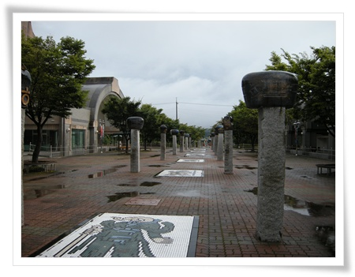

-여주생활도자관.  전시회가 없어서 그런가 텅 비었다.

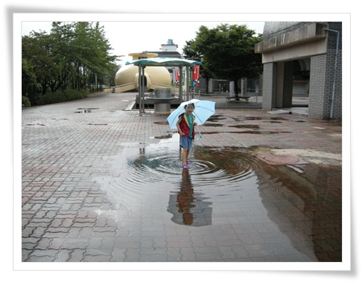

\- 물 만난 물고기마냥 물만 보면 첨범첨벙 들어가려고 하는 딸내미.

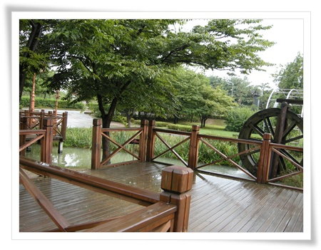

\- 신륵사 가는 공원길.

\- 신륵사 입구.  왼쪽이 주차장, 오른쪽은 인도.  아직 공사중인데 어수선한 분위기.

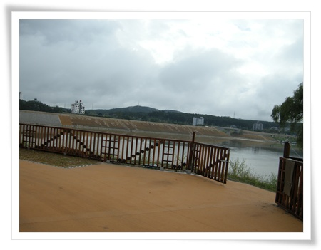

\- 4대강 공사로 영 좋게 보이지 않은 된 강 넘어 풍경

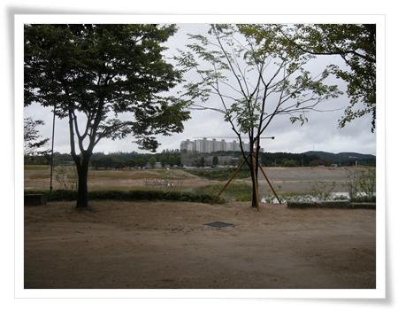

\- 강넘어 공사중인 아파트와 타워크레인이 이곳의 주된 경치인가 보다

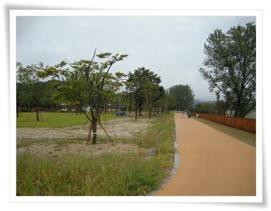

\- 입구를 지나 뭔가 어울리지 않게 너무 인공적인 모습의 산책로.

입장료 2,200원을 내고 입장했다.

절 내부도 공사중이고, 외부는 4대강으로 공사중이고 하여 어수선한 분위기라 입장료가 아깝긴 하지만, 먼 길을 달려온 것이 아까워 들어갔다.

산이라 부르기엔 어색한 언덕에 위치한 사찰이라, 다른 절과는 많이 다른 느낌이었다.

시내에 위치한 포교원같은 느낌으로, 절 자체의 규모도 아담했다.

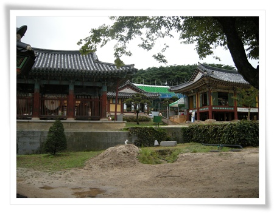

\- 사찰 내부.

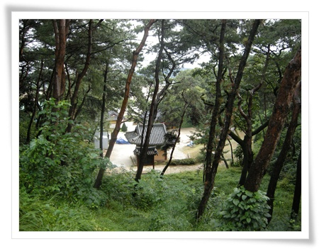

\- 뒷동산 올라서 본 절 풍경.  나무때문에 안 보이는군.

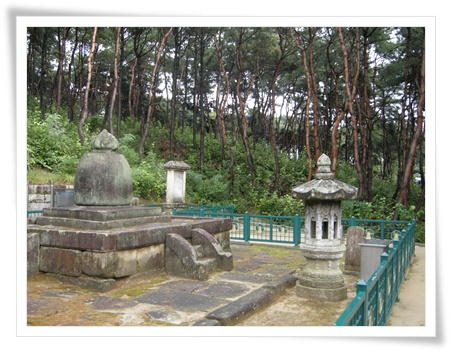

\- 신륵사의 유명한 문화재.  보제존자 석종.

고려말, 조선초에 무학대사 등과 함께 이름난 승려인 나옹화상을 위한 부도탑, 부도비, 석등이 있는데, 이 곳 신륵사 보제존자 석종은 전형적인 석종형 부도탑의 모습으로 신라에서 고려초까지 유행한 것이라 한다.

그래서 일반적인 팔각형 모습이 아닌 돌종의 모습을 하고 있는거라 하는군.

-잠자리 잡아 달라는 딸내미의 지시에 잠자리 한마리 잡아 줬더니 좋아한다.

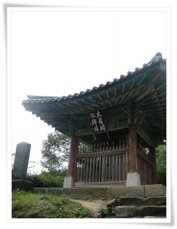

\- 신륵사 대장각기비

극락보전 서쪽 언덕에 있었던 불경을 만들어 보관하던 곳인 대장각을 세운 내력을 새긴 것으로, 목은 이색이 고려 우왕시절 시절 세웠다고 하는군.

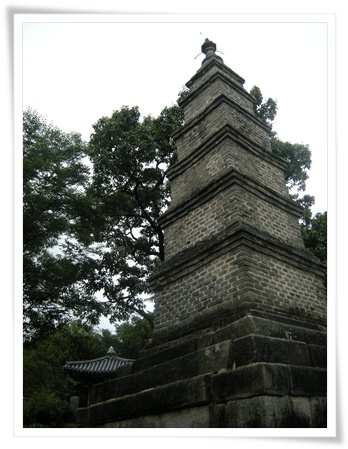

- 신륵사 다층전탑.

벽돌로 쌓아 만든 전탑으로 우리 나라에 남아 있는 고려 시대의 유일한 전탑이라고 한다. 남한강을 내려다 보는 위치에 있고,  신륵사가 있는 이 곳이 조포나루였다고 하는군.

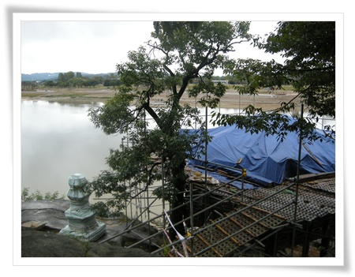

\- 3층석탑 옆에 공사중인 정자.

신륵사를 검색해보면, 이 정자와 남한강이 같이 나오는 구도의 사진 제일 먼저 나오는데, 좋은 장면을 볼 수 없어 아쉽더군.

이 곳 신륵사에서 남한강 풍경을 즐기면서 잠시 쉴 수 있는 멋진 곳이라는데 말이다..

