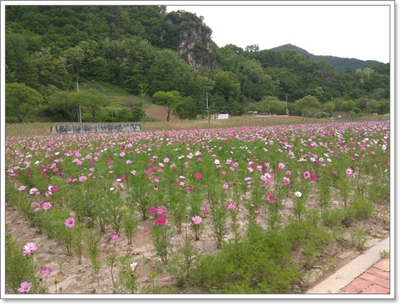
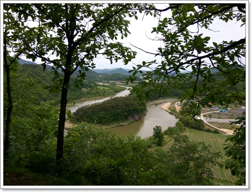
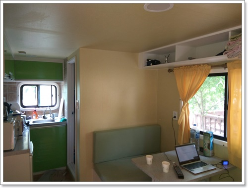
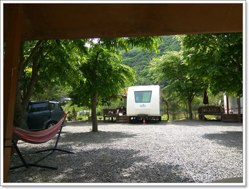
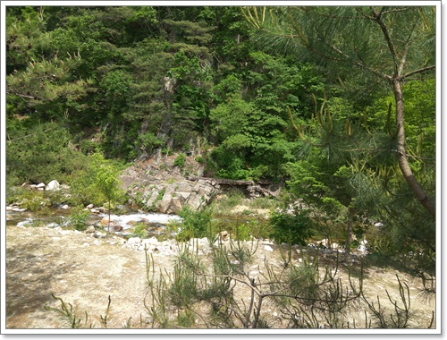
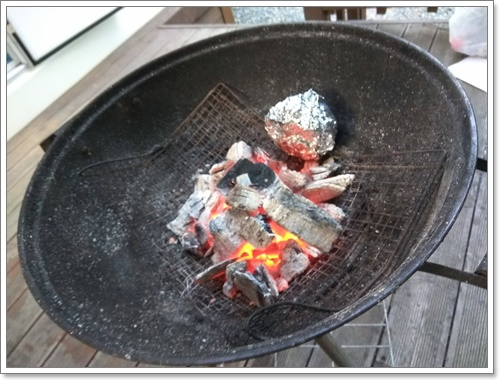

# 영월 별마로 카라반으로 2박3일 여행

5월 부처님오신날 징검다리 연휴.

카라반 여행을 갔다.

장소는 영월군 무릉도원면 법흥계곡에 있는 별마로펜션.

카라반은 이번이 두번째다.

첫번째는 10년전 한탄강에 있는 카라반으로 놀러갔었는데 그 때 가는 길 부부싸움을 대판하는 통에 카라반에 대한 좋은 추억이 없었다.

일요일 새벽 출발했다.  6시 20분 출발.

막히지는 않았다.

그래도 영월은 멀긴 멀었다.  2시간을 갔다.

8시20분쯤 영월군 서부시장에 도착해서 아침을 먹었다.

그리고 단종의 유배지였던 청령포로 갔다.

청령포는 이번에 네번째 가는 거다.

첫번째는 결혼 1년차때 겨울 단체여행으로 태백눈꽂여행으로 갔었다.

두번째는 CNS 문화유산답사 동호회에서 갔었다.

세번째는 영월이 고향이 김병국과장 결혼식에 참석후 커피 마시러 왔었다.

바로 여행 직전 비가 많이 왔던 터라 물이 많이 있었다.

그래서 청령포로 가는 배는 운행을 안해 전망대에서만 봤다.

대신 자전거를 빌려 산책길을 달렸다.

잘 꾸며져 있었다.

서울 인근에 이정도 경관이라면 자전거, 사람으로 붐빌텐데 한적했다.

그래서 더 좋았다.

코스모스를 일찍 심어서 그런가 꽃도 일찍 폈다.

가을되면 더 멋있을 것 같다.

한반도 지형을 들렀다.

새벽부터 움직인 터라, 아직 숙소 체크인시간까지 많이 남아 있었기에 근처 관광 코스로 여기를 선택했다.

가벼운 산책길이었다.

영월 관광객들은 여기 다 모인 것 같았다.

영월별마로 카라반 도착.

1시에 도착했다.

원래 세시 체크인이라 그냥 계곡에서 시간 보내려 했는데 입실을 시켜줘서 일찍 들어갈 수 있었다.

꽤 깨끗했다.

잘 관리되고 있었다.

처음 이 곳을 검색했을 때 그다지 후기도 많지 않고, 그나마 있던 후기도 온갖 이모지 아이콘으로 치장된 광고성 글이라 믿지 않았었는데, 아주 좋았다.

이제꺼 가본 사설 캠핑장 중에서 제일 좋았다.

\- 우리 식구가 묵은 카라반.  맨 앞에 있어 프라이버스도 좋았다.

\- 바로 앞에 있는 법흥천.

5월 무더위로 물을 들어갈 수 있을 거라 생각하고 스노클링까지 챙겨왔는데, 도저히 들어갈 수 없을 만큼 차가운 물이었다.

\- 아내와 딸, 이렇게 세명이라 고기 좀 구워먹고, 고구마 굽고도 숮이 여전히 불길이 죽지 않았다.

영월에서 숙박을 하며 여행을 한 적은 처음이다.

좋았다.

사람이 붐비지 않아서 좋았고,

자연 경치도 싱그러운 나무, 풀들로 가득한 산들이 많아 좋았다.

