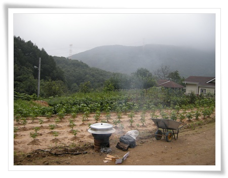
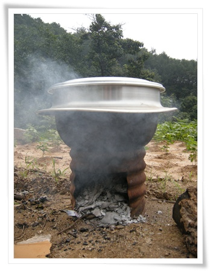
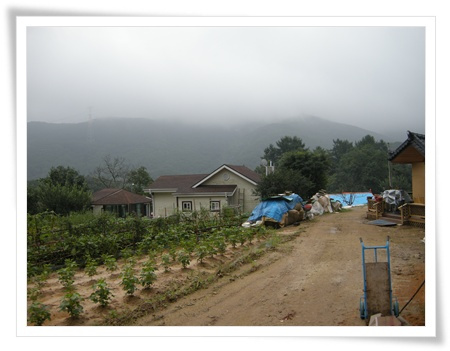
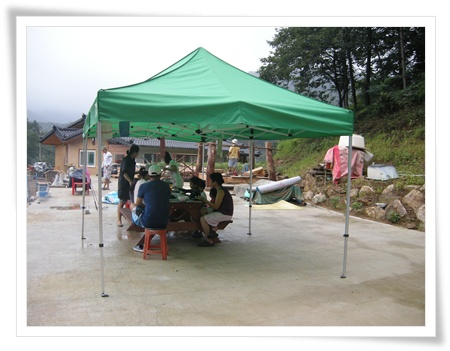
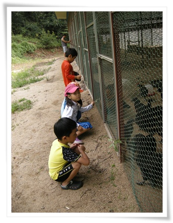

# 진천군 연곡리

8월 15 광복절이 월요일이라 3일 연휴.

갈천으로 야영한지 일주일만에 그 천막 그대로 들고 충북 진천국 연곡리로 향했다.

아내의 모임으로 진천군이 시댁인 가족의 초대로 그 곳으로 6가족이 여행을 갔다.

그 집 마당에 2박 3일간 텐트 치고 지내기.

진천군으로 가는 길은, 작년 한창 프로젝트 하느라 드나들었던 충북 음성 그 길 거의 그대로였다.

여행으로 가면 참 좋은 풍경인데, 일로 얽히면 왜 그리도 이 좋은 풍경이 마음에 들어오지 않는 것이던지...

\- 목적지 연곡리의 집에서 내려다 본 풍경.

산으로 4면이 완전히 둘러쌓여 있고, 그리고 집이 가장 높은 곳에 위치하여 가장 전망 좋은 곳이었다.

이제꺼 가본 곳 중 그 어떤 펜션보다도 훨씬 좋은 풍광과 위치였다.

\- 마지막날에 솥을 걸고 닭 백숙을 만들고 있는 장작불.

여지껏 야영하면 그저 숯불에 삼겹살이었는데, 이렇게 닭백숙을 먹으니 정말 좋았다.

나야 요리에는 관심이 없어, 우리 식구만 갈 때는 그냥 일회용 요리들만 준비해 가지만, 요리에 관심있는 사람들이 같이 가니 이렇게 맛있는 것도 먹을 수 있고 좋더군.

\- 마당 텃밭에는 콩과 토마토가 자라고 있고, 산에는 안개도 걸쳐있고,  여기 초대된 모든 사람들이 다 감탄

나도 나중에 이런 곳에서 살 날이 오려나...

\- 식사는 창고용 터에 대형 천막을 치고 여유롭게.

이튿날 간 곳은 근처의 만뢰산 상태공원.

여름이고 하니 애들 물놀이를 하기 위해서다.

생태공원이라 해 봤자, 이번 여름 산사태난 우면산 생태공원 가 본 것이 다 이지만, 이렇게 잘 만들어 놓은 생태공원이 또 있을까라는 감탄이 나왔다.

\- 생태공원안에 있는 물놀이장.  정자도 두개나 있어 어른들도 편안히 쉬면서 애들 볼 수 있다.

\- 생태공원에서 닭,오리,칠면서 사육장도 있던데 애들은 여기서 닭한테 모이도 아닌 풀을 먹인다고 재미있어 한다.

진천군은 혹시 군내에 금광이 있는 것이 아닐까?

그렇지 않고서 어찌 이런 시골이 잘 가꾸어져 있을까?

어렸을 때 친가, 외가집이 모두 시골이라 방학때면 시골로 놀러갔었다.

지금 내 딸내미는 친가, 외가 모두 도시.  그래서 시골 생활 경험해 볼 일이 없는데, 이렇게 시골을 찾아갈 사람이 있다는 것이 부럽기도 하다.

막상 시골을 본가, 친가로 둔 사람은 농번기마다 농사일 도우러 가야한다고 불평을 하겠지만 말이다.

