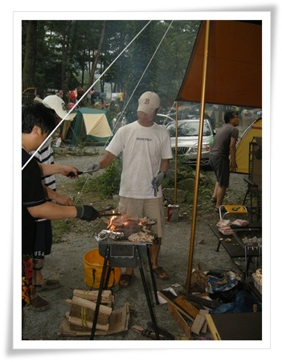
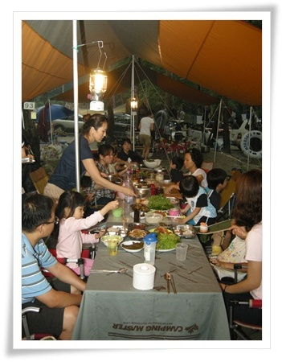

# 난민촌과도 같았던 갈촌캠핑장

8월 2일부터 4박5일 여름휴가.

이번 여름휴가는 갈천캠핑장으로 갔다.

총 10가족이 한꺼번에, 그것도 여름휴가 극성수기에, 그것도 제일 인기많은 야영장으로,..

갈천으로 가는 길까지는 좋았다.

강원도 인제군 오지 산골로 가는 길.

아침가리골이 지금처럼 유명하지 않았던 시절 4륜구동차를 끌고 심상민을 데리고 초겨울 오프로드를 했던 방동리 아침가리골 근처를 지나갔다.

다시 4륜구동차를 타고 오프로드를 질주하고픈 본능이 되살아나더군.

그리고 작년 영흥멤버와 같이 갔던 진동리도 거쳐갔다.

1년 사이 진동리 거리엔 펜션들이 더 많아진 듯 했다.

사정없이 구불구불한 길을 지나 도착한 갈천오토캠핑장.

그 첫인상에 이거 잘못 왔다라는 생각이 들었다.

땅을 보기 힘들 만큼 빽빽히 들어찬 텐트들, 그리고 넘쳐나는 사람들, 그리고 빨래줄에 널린 빨래, 통로자체가 막힐 정도로 가득찬 차.

성수기 요금이 33,000원.  이 거금을 들이고 3시간반을 운전하여 기껏 난민촌을 왔나라는 짜증.

물론 극성수기이니 어쩔 수 없지 않냐라는 변명도 있을 수 있겠지만, 그래도 맨땅을 하루 쓰는데 33,000원이나 내는데, 그렇게 빽빽하게 많은 사람들을 받는 상술이 이게 아니지 않나라는 생각.

그래도 텐트를 치고, 타프아래에서 있다보니, 차츰 난민촌에도 적응이 되긴 하였다.

\- 야영의 주메뉴 숯불삼겹살.

\- 10가족 대식구의 저녁식사

내가 제일 좋아하는 곳은 축령산 자연휴양림.

나라에서 운영하는 곳이라 북적이지 않고, 그리고 오토캠핑장이 아니라 장비빨로 무장한 사람들보다는 소박하게 놀러온 사람들이 많다는 점.  그래서 숲속에서 자연 자체를 느낄 수 있어서인데, 갈천오토캠핑장에 오면서 더이상 오토캠핑은 하지 말아야겠다라는 다짐마저 들었다.

동네 뒷산을 오르면서도 에버레스트를 정복할 장비로 무장한 것처럼, 캠핑이 유행이다보니, 장비발로 무장한 틈에 끼고 싶은 생각이 사라졌다.

캠핑사이트를 보다 보면 종종 등장하곤하는 "캠퍼"와 "행락객"의 구분에 대해서도 분개를 하곤 한다.

캠퍼라고 지칭하는 사람들이 자신들은 여름 한철을 브랜드 없는 장비로 야영을 즐기는 행락객을 수준낮은 존재로 묘사하며 "캠퍼"는 "행락객"과 수준자체가 다름을 강조하지만, 정작 자신들은 장비의 브랜드나 줄줄 외며 한낱 장비매니아가 아닐까 하는 생각.

갈천캠핑장이 인기있는 이유는 수세식 화장실과 온수 샤워실이 있고, 전기를 쓸 수 있다는 점.

전기를 쓸 수 없고, 대형 타프를 칠 수 없지만, 정말 자연에 가까운 자연휴양림으로나 가야겠다.

