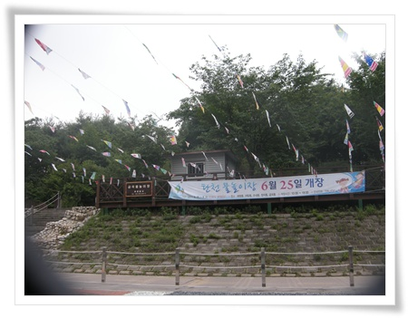
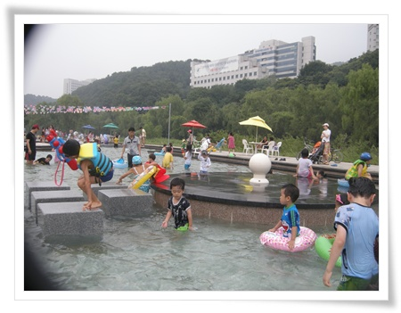
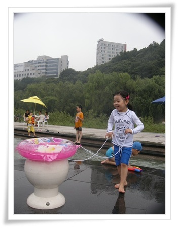

# 탄천 금곡 야외 물놀이장

예전 양재천 근처에 살 때에는 딸내미가 너무 어려 물놀이장에 갈 수 없었는데, 지금 사는 탄천 근처에는 제법 잘 이용하고 있다.

성남시에서 여름에 운영하는 탄천 물놀이장.

그 중 집에서 제일 가까운 금곡물놀이장.

자전거에 딸내미를 태우고, 불곡중학교 건처의 탄천변에 있는 탄천물놀이장으로 갔다.

자전거로 5분 거리라, 금방 도착하였고, 물을 본 딸내미는 환호성을 지른다.

\- 올해는 6월 25일 개장했군.  이제 일주일됐다.

\- 구름많은 날씨라 그런지 사람은 적은 편.

탄천구간중에서도 특히 바로 옆 언덕에 나무가 많아 시원스런 경치가 있는 곳이다.

\- 분수대에 튜브 올려놓고, 재밌다고 하는 딸내미.

안전요원도 세명이 배치되어 있고, 물도 자주 교체하는지 깨끗하다.

화장실과 샤워실도 잘 준비되어 있더군.

물에 한번 들어간 딸내미는 나올 생각을 안 해, 저녁으로 접어드는 6시에야 집으로 나설 수 있었다.

