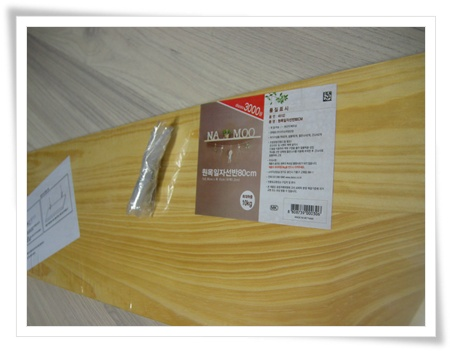
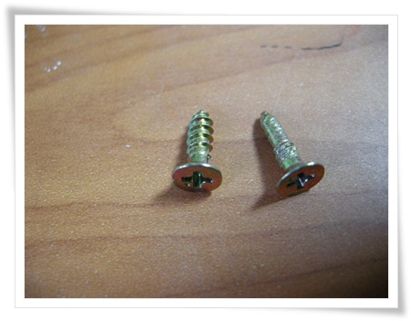
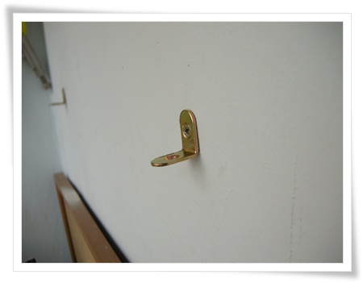
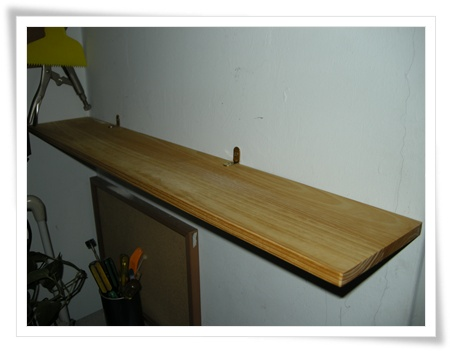

# 다이소에서 산 3천원짜리 선반

퇴근길 한국은행옆에 있는 다이소에 들렀다.

이 다이소는 4층짜리 건물 전체를 사용해서 제법 많은 물건이 많이 있는 곳이다.

거기서 산 3,000원짜리 80cm짜리 원목일자선반.

용도는 만성 공간 부족을 호소하는 내 베란다 작업공간 확장.

포장을 뜯고, 부속품을 확인하는데 나사가 이상하다.

총 4개의 나사중, 나무에 고정하는 두 나사중 하나가 나사산이 없다.

다이소도 품질 관리가 제대로 안되는 곳인가 보다.

내 연장통에서 비슷한 크기의 나사가 있어 그걸로 대치했다.

\- 먼저 시멘트벽에 ㄱ자 고리를 칼브럭과 나사로 고정하고,

\- 다음 선반 고정

\- 완성된 모습.  한결 정리되어 보인다.

불량나사 하나 잘못된 꺼 빼놓고선, 가격대 성능비 우수하다.

특히 원목이라는 점도,..

