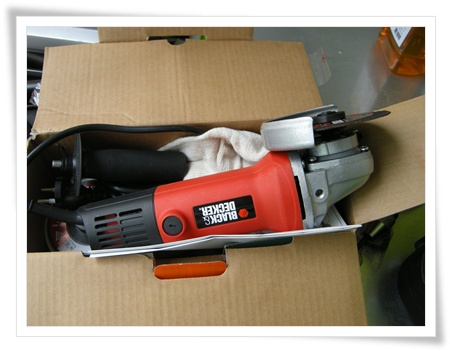
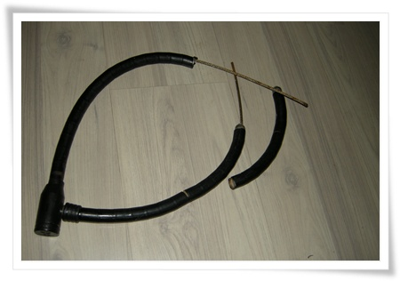

# 전동공구 그라인더 지르다

카센터 주인이 되고 싶다고 생각한 적이 있었다.

결코 자동차 고치는 것을 좋아해서가 아니다.

카센터에 있는 그 많은 공구들을 사용해 보고 싶을 뿐, 아니 소유하고 싶을 뿐이었다.

그러다 보니, 대다수 남자들이 그러하듯 전동공부에 대한 지름욕이 있다.

여자들이 가방에 환장하듯, 난 전동공구에 환장한다.

지난번 콤프레샤에 이어 이번엔 그라인더를 질렀다.

지르게 된 계기는 딱히 없다.

그냥 가지고 싶었다.

선지름 후합리화를 할 뿐이다.

거의 한달을 쇼핑몰에서 기웃기웃거리다가 결국 결제 버튼을 누른 제품은 블랙앤데커의 KG100 4인치 그라인더.

가격은 35,000원.

\- 역시 우려한 선과 근육질의 멋진 모습이다.

이거 하나 들고 있으면 맥가이버가 부럽지 않다. ㅎㅎ

일단 포장을 풀고, 전원을 꽃아 웅장한 11000rpm의 웅장한 모터음에 역시 멋진 소리야라고 감탄했다.

그리고 어디다 써볼까 용도를 찾았다.

첫 대상자로 열쇠를 잃어버려 그냥 자전거에 걸쳐만 있는 자물쇠를 끊기로 했다.

\- 그라인더로 자르기 시작하지 불과 3초만에 힘없이 끊긴 잠금장치.

훌륭한 성능을 검증했으니, 다음 타켓은 무엇으로 할까 여기저기 기웃거려본다.

