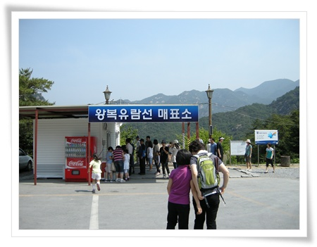
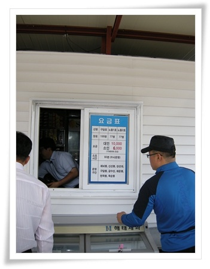
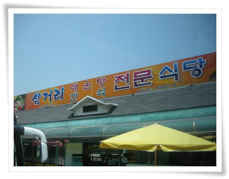
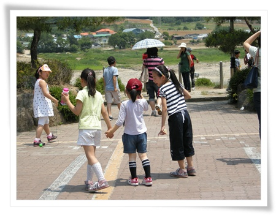
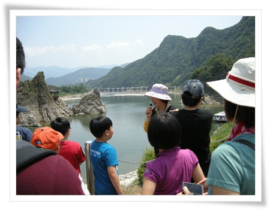
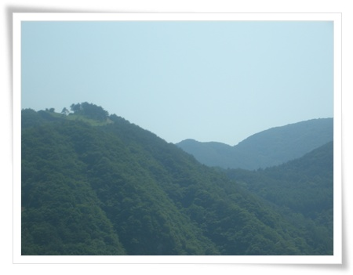
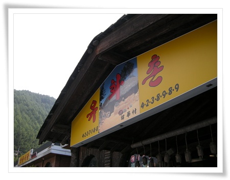
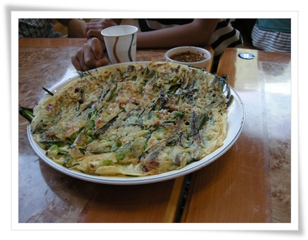

# 단양팔경과 구인사

수도권에 살다보니, 당일치기로 여행가는 범위는 자연히 경기도권으로 좁혀질 수 밖에 없었다.

조금이라도 멀리 갈라치면 실제 목적지에서 하는 여행보다 차 운전하는 것이 대부분이어서 여행을 한 건지, 운전을 한 건지 구분도 안되고 말이다.

그래서 자가용으로 하는 여행보다는 조금은 내 일정대로는 못 하더라도 단체로 여행하는 것이 차츰 좋아지더군.

사내동호회인 문화유산답사모임의 6월 여행지가 당일치기 단양으로 결정되었다.

토요일 아침 7시 명동에서 모여 버스를 타는 것으로 시작하는 단양 여행.

7시까지 명동에 가기 위해, 4시 반 일어나, 5시 반에 집 앞에서 광역버스를 탔다.

7시에 명동에 와 본 일이 없어서 그런가 7시의 명동 풍경은 색달랐다.

바삐 움직이는 청소차량과, 비행기를 타기 위해 떠나는 관광객들이 있었다.

7:00

버스에 탔다.  45인승 버스는  대략 10가족 42명정도이 인원으로 가득찼다.

운영진이 준비해 준 김밥과 생수를 마시 편안한 여행을 즐기기 시작.

버스는 남산터널을 통과하여, 올림픽대로, 중부고속도로, 영동고속도로, 중부내륙고속도로를 달렸다.

중간에 치악휴게소 한번 들르고, 단양톨게이트로 나왔다.

10:00.

단양 여행의 시작지 단양군에 있는 장회나루에 도착했다.

단양까지 오는데 3시간이 걸렸다.

멀긴 멀더군.

이 거리를 직접 운전해서 왔으면 얼마나 피곤했을까 하는 생각에 새삼 행복해지더군.

\- 충주호에 있는 나루터중 이번에 유람선을 타는 장회나루터.

\- 1시간 왕복 유람선 요금은 대인 10,000원/소인 6,000원.

\- 배를 타기 위해 계단으로 내려갔다.

\- 승선명부에 기록하고..

\- 유람선 선장이 직접 마이크를 들고 관광안내

충주호는 충주댐 만드느라고 생긴 인공호수라는군.

단양8경은 옥순봉, 구담봉, 사인암, 하선암, 중선암, 삼선암, 석문, 도담삼봉으로 조선명종시대 퇴계 이황이 단양군수로 재직시 중국의 8경보다 나은 절경이라고 했다 한다.  그 중 옥순봉, 구담봉이 유람선을 타야지만 볼 수 있다고 하더군.

\- 호수 건너편에 있는 저 묘가 퇴계이황을 6개월간 모신 관기 두향의 묘라고 한다.

\- 빨간색 표시가 충주댐의 만수 위치.

\- 뱃 머리는 애들 차지.

\- 옥순봉에서 가족 사진 촬영.

배가 운행하는 동안, 선장이 구담봉, 옥순봉, 거북바위등을 알려주었지만, 여행이 끝나고 사진으로만 다시 뭐가 구담봉이였지한다.

구름 한 점 없는 뜨거운 초여름의 땡볕이 가뜩이나 더위에 약한 나의 경치감상 의지를 약화시킨게 아쉽다.

선선한 가을에 오면 좋을 듯 했다.

12:00

점심은 충주호 근처에 있는 식당으로 갔다.

\- 어른들은 더덕구이, 아이들이 된장찌게 먹었다.

관광지치고는 가격과 맛이 괜찮은 편이었다.

13:00

단양팔경의 1경이라 일컬어지는 도담삼봉에 도착했다.

\- 저 세바위가 도담삼봉.

가운데 있는 정자는 조선시대때에도 있었지만 잦은 홍수로 떠내려가 다시 세운거라 한다.

정자에 올라갈 수 있는 때는 겨울 강물의 얼어붙어 있을 경우만 가능하다고 한다.

\- 가족단위 모임이다 보니 애들이 많아 딸내미는 언니들 사이에 끼여 재밌게 논다.

그덕에 내가 딸내미 시중이 줄어들이 더더욱 편안한 여행이었다.

\- 도담삼봉에서 오후 여행의 안내해주신 자원봉사 가이드를 만나 설명을 듣고 있다.

\- 구인사로 이동하는 동안 차창을 통해 본 온달산성.

역시 가이드가 있어야 놓치는 것이 없다는 생각이 든다.

14:00

구인사에 도착했다.

구인사는 10년전에 동생이라 처음 와 본 후 이 번이 두번째이다.

그 전에도 와 보고 싶었지만, 거리가 거리인지라 마음먹기 쉽지 않은 곳이긴 하다.

버스에서 잠든 딸내미는 잠에 깨자마다 가파른 경사를 오르는데 짜증을 내어 사천왕이 있는 데까지 업고 갔다.

\- 다른 절의 사천왕과는 달리, 이 곳 구인사의 사천왕상은 시멘트로 되어 있다.

이는 구인사의 역사 자체가 오래되지 않아 건물자체도 목조가 아니라서 일관성있게 간 모양이다.

\- 계곡에 가득한 구인사 건물.  건물도 멋있지만 주변 경치와 어울리는 것에 더욱 감탄이 나온다.

\- 가장 최근에 지어진 건물인데, 이름을 까먹었군.

이 건물에서 천태종산하 각 사찰의 합창단이 다 모여 합창연습하고 있었다.

구인사를 이번에는 가이드덕을 보나 했지만, 설명에는 관심없는 딸내미 시중드느라 가이드 따라 가질 못해 결국 구인사는 그냥 눈으로만 보는 것으로 종료했다.

다음에는 미리 공부를 하고 와서 제대로 감상해야겠다.

\- 절보다는 그냥 돌기둥에 붙은 거미가 더 재미있어야 하는 애들.

16:30

구인사에 내려와 다시 서울로 복귀하기전 간단하게 막걸리 마시고 떠나기로 했다.

\- 주차장에 앞에 있는 유화촌이란 식당.

좌석수에 비해 많은 손님을 감당하지 못하는지 많이 느린 식당이었다.

\- 파전에 막걸리.  역시 산에 올라갔다 와서 그런가 맛있다.

17:30

관광버스에 탑승.  사진을 보니 관광버스 회사가 푸른솔관광이었군.

비교적 정체도 없고 하여 죽전휴게소 2시간만에 도착했다.

보람찬 단양 여행 끝.

