# 이천 임실치즈 체험

애는 커감에 따라 놀러가는 것도 점점 업그레이드되어 하는데 돈이 없다.

놀러가기 좋은 5월인데, 한번 놀라갈라치면 돈이 제법 든다.

그러다 회사에서 지원하는 육아프로그램인 임실치즈스쿨 체험을 가게 되었다.

장소는 이천. 고속도로로는 서이천IC에서 좀 더 내려간 위치였다.

작년에 한동안 업무차 음성을 오고 가느라 지나던 지역이었다.

맑은 토요일이라 차가 제법 많아, 지각했다.

10:30까지 도착했어야 하는데, 11시에 도착했다.

폐교를 체험학교를 리모델링한 곳으로, 옛날 초등학교다보니 내부가 그리 넓지는 않았다.

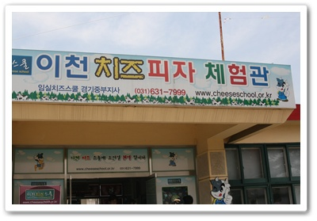

-치즈피자체험관

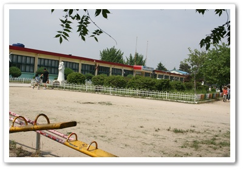

\- 장소는 모가면의 폐교

지각한터라, 치즈피자를 막 만들기 시작한 때 바로 들어가 자리를 잡고 피자 만들기 시작했다.

피자 먹기를 좋아하는 나인데, 아직 피자를 직접 만들어 본 적은 없었다.

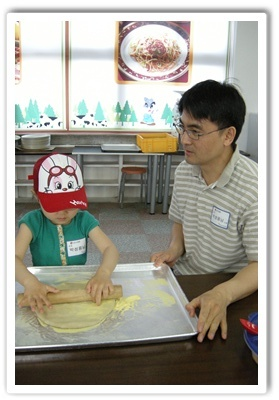

\- 이렇게 밀대로 밀어서 늘린다.

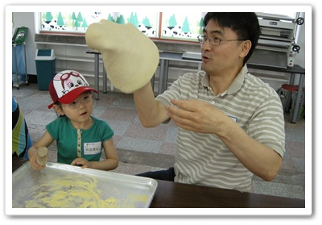

\- 도우를 돌려서 늘리라는데, 그게 쉽게 되는게 아니란 걸 알았다.

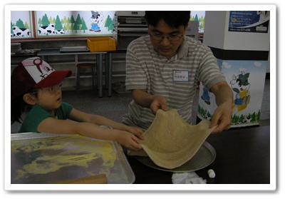

\- 피자틀에 반죽을 올려놓고.

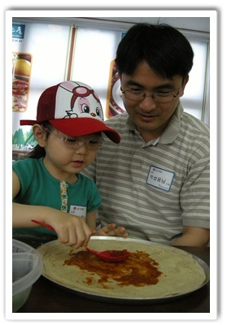

-토마토소스로 된 걸 바른다.

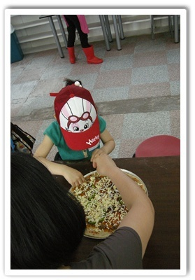

\- 그 위에 햄, 옥수수등의 토핑 재료를 올리고 치즈를 올렸다.

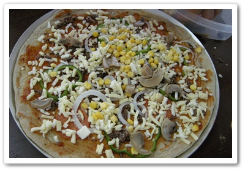

\- 굽기전 완성작.

여기까지 30분 소요.

그 다음 피자를 선반에 올려놓고 퇴장한후, 다른 교실로 이동.

퇴장과 동시에 다른 체험조가 입장하여, 혼돈의 장소였다.

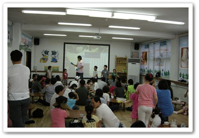

\- 피자가 구워지는 동안 진행되는 프로그램.

이 교실의 컨셉은 치즈에 대해 알려주는 지식전달과 퀴즈라는 컨셉이었는데, 사실 본질은 체험객을 많이 받기 위해 시간을 때우기성이 좀 강했다.

10:30 ~ 11:00 재미없은 비디오와 재미없는 퀴즈쇼, 그리고 애들 장기자랑을 하다가, 11시 모짜렐라 치즈 만들기가 시작 되었다.

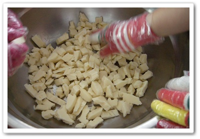

\- 치즈덩어리를 쪼개 넣고,

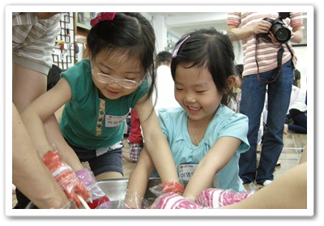

\- 물어 붓고 반죽한다.

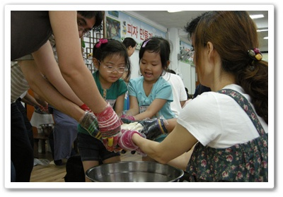

\- 그런 다음 반죽을 잡아 늘리기를 4회 반복.

6명 한조다 보니 두 식구가 한조가 되어 치즈를 뜨거운 물에 넣고 반죽을 하고 네차레 늘리면서 만드는 것인데, 그렇게 하니 치즈가 말랑말랑하니 맛있더군.

12시가 되자, 또 다시 바삐 퇴장하고, 다른 반 사람들 입장.

아까 만들었던 피자가 다 구워졌다.

식당에 들어가 점심은 직접 만든 피자를 먹었다.  여기에 스파게티와 사이다 한병씩 제공되더군.

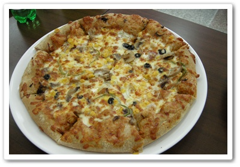

\- 구워진 피자는 아주 맛있더군.  아무래도 재료가 좋아 맛있나 보다.

어찌나 타이트하게 움직이는지, 식사시간도 30분.

30분이 지나자 또 다른 반 사람들이 들어왔다.

이어진 시간은 마당에서 노는 시간.

건물앞에 놓여진 훌라우프, 굴렁쇠, 팽이로 시간도 보내고, 배부른 토끼와 산양한마리에게 풀 주기인데, 좀 놀이기구 보강이 많이 필요해보이더군.  다 너덜너덜해져서 너무 성의없어 보였다.

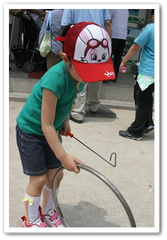

\- 굴렁쇠 한번 굴려보고,

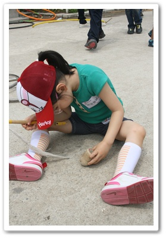

\- 팽이가 왜 안돌가는지 원인을 분석중이나, 정작 팽이보다는 팽이채의 끈이 다 닳아서 지쳐지지가 않는 거였다.

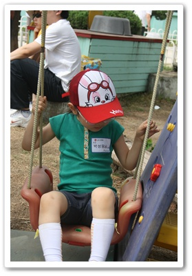

\- 그리고 또 하나의 성의없는 놀이기구 그네.

\- 피자와 스파게티에 배는 뽈록해져서 좋다고 하는 딸내미.

\- 좁은 주차장은 가득채운 차들.

사람들이 무지하게 많았다.

적정 수용인원보다 많이 받는 듯 했다.

좀 여유있게 받아, 차분히 진행했으면 좋으련만, 박리다매를 모토로 하는지, 너무 사람도 많고, 그 사람들을 계속 돌릴려니 시간도 빡빡하게 운영해, 어수선하고 정신이 좀 없었다.

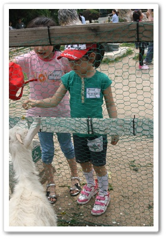

\- 산양에게 먹이주기 체험.  산양은 한마리 끝.

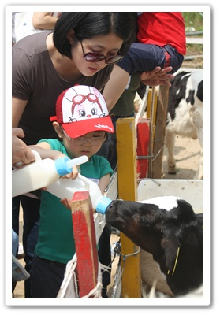

\- 새끼 젖소에게 우유주기 체험.  등장 새끼 젖소 세마리.

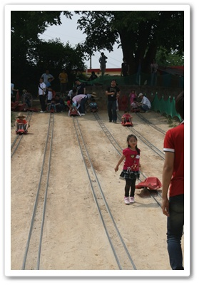

\- 그리고 레일썰매.  애들은 신나하는데 썰매를 위로 나르는 부모들의 표정은 다들 지쳐 어둡더군.

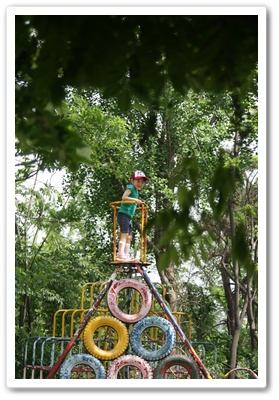

\- 관리가 안되서 빛이 바랜 것이긴 한데, 빛바랜 모습은 의외로 분위기 있다.

홈페이지를 들어가보니, 원래 체험가격이 1인당 24,000원이더군.

그 가격에 피자도 만들어 먹고, 스파게티도 먹고, 치즈도 만들어 먹는 걸 생각하면 생각보다 싸긴 하다.

피자와 치즈 정말 맛있었다.

