# kobaco 남한강연수원

2박3일간의 합숙 교육을 받으로 간 장소가 kobaco 남한강 연수원.

양평군 강상면, 남한강 바로 옆에 위치해 있더군.

연수원이란 시설을 뭐 이용해볼 기회가 거의 없긴 하다.

차를 운전하고 양평 남한강가를 가는 길도 운치있긴 하지만, 주말이면 항상 정체라 경치를 막끽하기는 쉽지 않다.

버스에서 연수원으로 들어가는 사람들 표정에선 다들 와하는 표정이 나왔다.

경치가 참 좋았다.

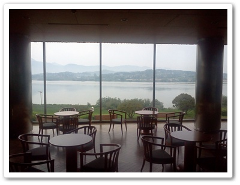

\- 1층 로비에 앉으면, 남한강과 강넘어 용문산이 한폭의 그림이다.

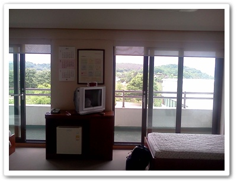

\- 내가 묵은 4인 1실 객실.

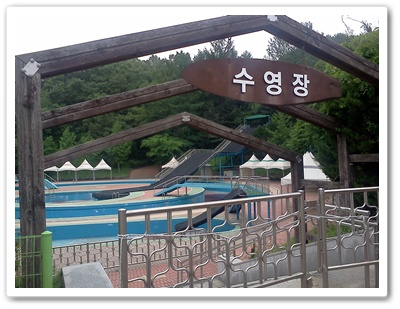

\- 여름에는 수영장도 운영하나 보다.

수영장이 있는 것 보니, 혹시 여름 한철에는 일반인에게 오픈하나 싶어 자세히 살펴봤는데 그런 내용은 안 보이더군.

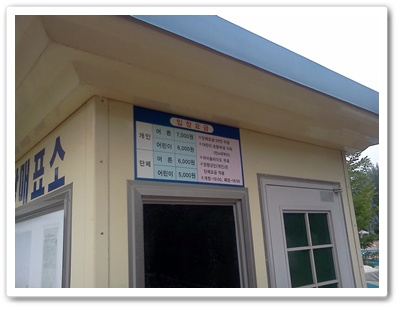

\- 수영요금은 어른 7,000원

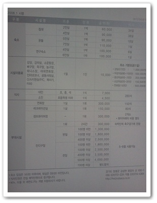

\- 이용요금표

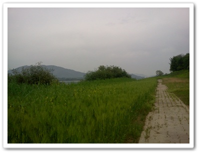

\- 남한강 수변에 청보리가 심어져 있다.

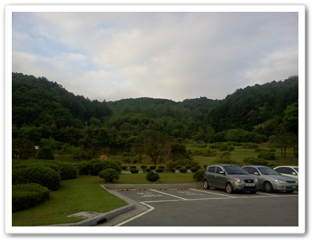

\- 완벽한 배산임수로, 나즈막한 언덕도 있고, 그 언덕으로 산책로가 나 있다.

나의 취미가 동네탐험이므로, 낯선 장소에 왔으므로 이 곳 탐험을 시작했다.

아침부터 밤까지 일정이 잡혀 있으므로, 나만의 탐험이 가능한 시각은 아침 식사전이다.

그래서 아침형 인간답게 6시에 일어나 산책을 나섰다.

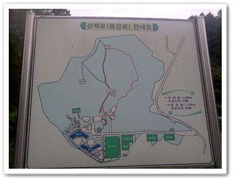

\- 산책로 안내도를 보니 거리가 길지 않군.

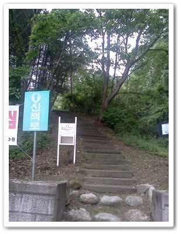

\- 산책로를 따라 오르기 시작

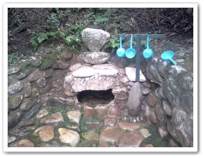

\- 약수터도 있고

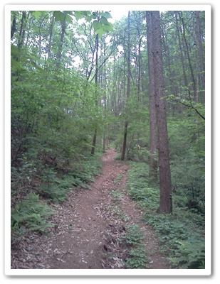

\- 내가 좋아하는 산길를 따라 올라가면

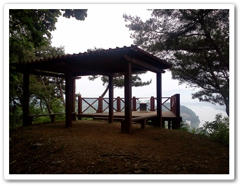

\- 남한강이 한눈에 보이는 전망대가 있다.

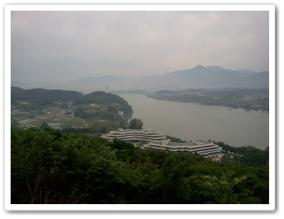

\- 전망대에서 본 경치

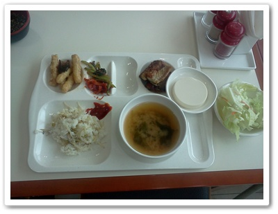

\-  연수원내 식당 밥.  정갈하고 맛있다.

단가를 보니 한끼에 7천원이더군.

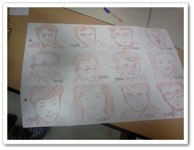

\- 같은 조원중 한명이 그린 조원들 커리커쳐.  나는 첫줄의 세번째.  세상에 재주 많은 사람도 많다.

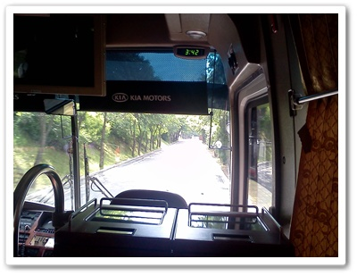

\- 다시 버스 타고 서울로.

또다시 이용해보고 싶은데, 과연 이용해 볼 수 있는 기회가 주어질까나 모르겠다.

상수원보원구역내에는 투숙시설이 허용이 안되므로, 이런 기업체대상의 연수원 시설만 가능하므로 일반인을 받을 가능성이 매우 낮아 보이긴 하다.

