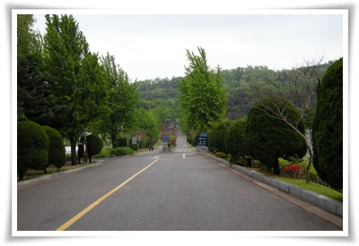
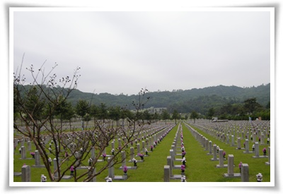
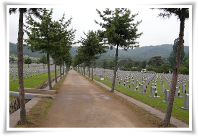
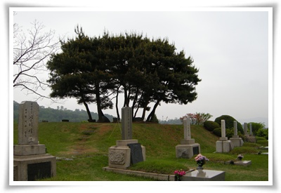
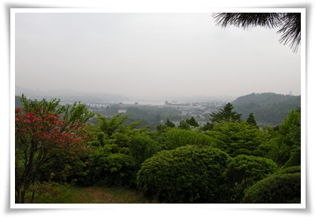

# 동작동 국립묘지 산책

서울, 아니 이제는 수도권에서 거의 30년 가까이 살았지만, 현충원을 못 가봤다.

하긴 63빌딩도 밖에서 보기만 봤지, 들어가 본 적이 없구나...

토요일 삼색볼펜스터디후 김대원씨의 슈퍼카 라세티프리미어로 드라이빙을 나섰다.

토요일 서울 오후, 당연히 정체된 도로.  어디로 가볼까 하다가 국립도서관에서 멀지 않은 국립묘지가 떠올랐다.

예전에 동작동 국립묘지에서 불과 2km 떨어져 있는 곳에서 3년간 회사를 다녔는데도, 막상 한번도 가 보지 못했었다.

남자 셋이서, 국립묘지를 들어섰다.

위병이 지키고 있어, 괜히 군대 위병소 통과하는 듯한 묘한 기분은 들더군.

혹시나 주차비 받지나 않을까 했지만, 그런거는 없더군.

\- 정문 통과후 주차장에 차 세운 후 걷기 시작

- 대부분 6.25 전사자들의 묘가 빽빽히 차 있었다.

\- 이날의 산책 멤버

6.25 세대도 이제 살아 있는 분들이 없어서인지, 자원봉사로 묘비 닦는 학생들외에는 거의 없었다.

그래도 현충원이 제일 바쁜 시기인 6월을 앞두고 있어, 뭔가 행사 준비를 하는 듯 했다.

\- 다른 나라와의 전쟁이 아닌 내전으로 돌아간 분들의 비석들이 보니 안타깝다.

\- 가장 전망 좋은 곳에 위치한 넓직한 장군들의 묘.

살아서나 계급이지, 죽어서까지 계급별로 묘지가 차별받는 모습이 그리 좋아보이지는 않는군.

\- 바로 앞 동작대교도 보이는데, 시계가 좋지 않아 서울 공기가 탁하다.

