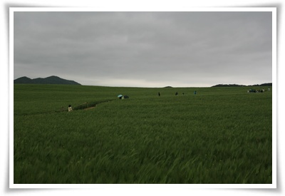
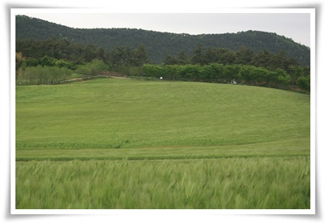
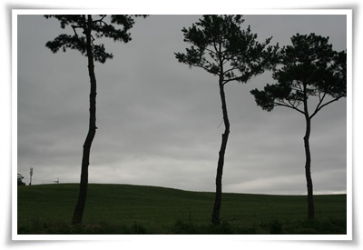

# 고창 청보리밭

고창 선운산 유스호스텔 체크아웃하고 청보리밭으로 나섰다.

청보리밭은 선운산에서 40여분 운전을 하니 도착할 수 있었다.

마침 청보리밭 축제가 전날 끝난 터라, 인산인해의 정체는 피할 수 있었다.

\- 청보리밭

\- 바람이 불면 청보리의 이삭 물결이 멋있다.

\- 여기서도 딸내미 한장 찍어보고

\- windows xp 배경화면을 연상시키는 듯한 화면

청보리밭을 거닐다보니, 어렸을때의 기억이 살아나더군.

어렸을 때 보리피리를 제법 잘 만들어 불었는데, 그때의 기억으로 보리피리 만들어보려는데 소리도 안나오더군.

너무 오래됐나 보다.

살던 곳이 조그만 섬이여서, 그곳은 논은 없고, 밭만 있었는데, 보리밭이 많았었다.

언덕위에서 보리밭을 바라보던 것도 생각나고,보리사이로 뛰어놀던 기억도 난다.

밭주인한테 보리밭 사이로 노는 것 걸리면 혼나기에 항상 주변 망을 보고 놀곤 했었다.

보리의 키가 그때 내 키보다 훨씬 컸기에 그 사이를 돌아다니면 꼭 밀림의 타잔이 되어 탐험을 하는 듯한 재미가 있었다.

점심으로 보리밭 농장 직영식당에서  7천원짜리 보리밥과 5천원짜리 메밀국수를 먹었는데 그 성의없는 차림에 대실망.

역시 관광지에서 뭘 사먹으면 안된다는 것을 다시 한번 깨달을 수 있었다.

아참, 이번 여행의 먹거리.

선운산 관광단지의 한 식당에서 백반.  1인분에 8천원짜리.

맛과 차림에도 실망했지만, 게다가 2인분이라 만육천원이었는데, 값싼 백반은 남는 것 없다고 현금결제해달라고 하는 주인의 말에 기분이 팍 상하고 말았다.

전라도하면 일단 기본으로 맛있고 가격이 싸다는 기대치가 있어서 그런가, 이번 여행에서 맛집부분은 영 실망이다.

물론 전라도라도 현지 주민들이 이용하는 것이 맛있지, 관광객 상대하는 식당들은 어차피 두번 볼 손님들이 아니기에 기대치를 낮춰야하는 것이 사실이다.

맛집을 서울에 다 모여있는 듯 하다.

지방의 맛있는 집이라고 하는 곳을 가봐도, 회사 근처의 직장인들이 주로 이용하는 식당들이 오히려 더 맛있는 느낌이다.

아무래도 지방에서 맛있는 식당들은 그 볼륨을 키우기 위해 더 많은 소비자가 있는 서울이라는 강호에 모여 실력을 겨루게 되니, 서울이 음식이 가장 맛있는 듯 하다.

