# 선운산

5월 연휴 2박3일간 여행의 숙소는 선운산 유스호스텔.

군청에서 운영하는 곳이라 요금 1박에 6만원으로 나름 저렴하고 시설도 괜찮다.

이제까지 유스호스텔을 대학생들만 이용하는 곳으로 잘못 알고 있었는데, 앞으로 적극 이용을 해 볼 참이다.

유스호스텔에 짐을 풀고서 산책과 저녁식사를 하기 위해 나섰다.

숙소에서 차로 10분거리에 미당시문학관이 있었다.

고창이 배출한 대표적인 인물이 서정주인데, 그게 하필이며 친일파인게 그렇다.

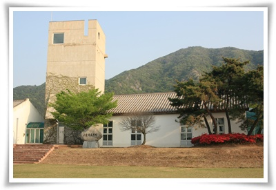

\- 폐교된 초등학교를 군청에서 사들여 미당시문학관으로 만들었다.

들어오기전까지는 미당시문학관이면 당연히 친일파의 행적은 최대한 감추고 미화하는 것만 해 놓았을거라는 생각을 가지고 있었는데, 의외로 공평한 시각으로 만들어놓았더군.

조선의 청년들보고 일제 전쟁에 적극 참가라고 한 시도 전시되어 있고,

전두환 생일을 맞아 민족의 영웅이라고 치켜세운 시도 전시되어 있고,

죽기직전까지 자기는 친일파가 아닌 종천순일파라고 한 망발도 전시되어 있어 이 문학관에 대한 부정적인 생각이 많이 가시게 했다.

선운산앞에 풍천장어의 본산지라고 한다.

그래서 모든 집들이 다 풍천장어집이다.

유스호스텔 프런트 직원이 추천한 아산가든이란 식당으로 들어갔다.

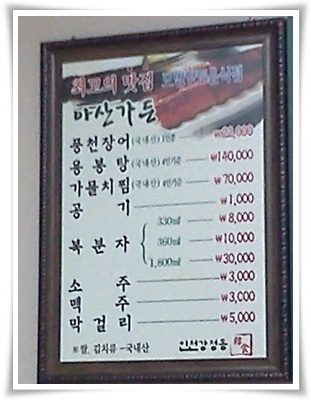

\- 풍천장어 1인당 22,000원.

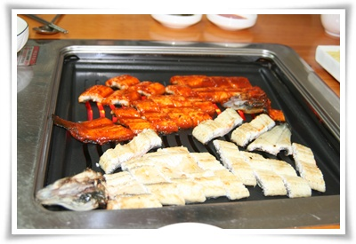

\- 양념장어 1인분과 소금구이 1인분 주문했다.

맛있다.  1인분에 22,000원씩이나 하나 당연히 맛이 있어야겠지.

그런데 서울에서는 비슷한 가격이겠지?  장어란게 워낙에 비싼거라서 도통 먹어보질 않아서 맛을 비교할 수가 없군.

아침식사후 선운산 산책 시작.

입구에는 여느 산입구처럼 노점상들이 있다.

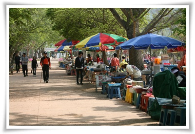

\- 파는 것들을 주로 복분자즙과 떡 등의 주전부리

보통 여행기들보면 노점에서 파는 거는 다 비추하지만, 여기 선운사 노점에 파는 복분자쥬스는 추천하길래, 여기서 2잔에 5천원하는 복분자쥬스를 샀다.

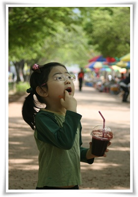

\- 이게 복분자주스.

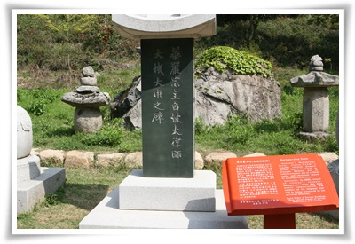

\- 백파선사와 추사의 일화로 유명 백파선사비는 이제 박물관에 들어가고, 대신 모형이 원래 자리에 있었다.

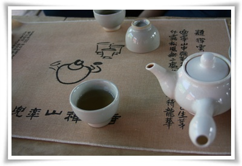

\- 만세루에 앉아 차를 마시고 잠시 땡볕을 피해 사찰 구경

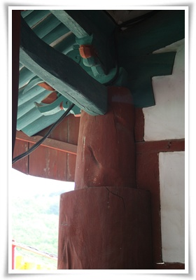

\- 만세루 기둥

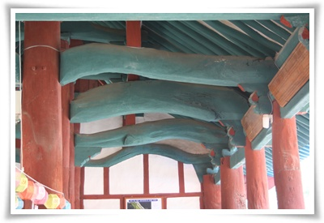

\- 만세루 대들보

만세루가 다른 건물 짓고 남은 자투리 목재로 지은 건물이라는 설명에 걸맞게 조각조각이고, 나무도 구불구불한데, 오히려 그게 더 정감있다.

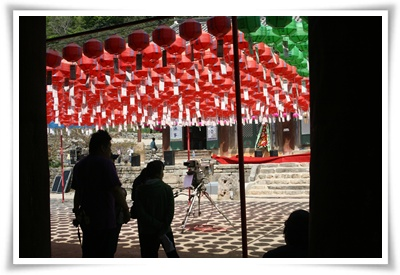

\- 부처님오신날 전날이라 방송국에서도 취재나왔다.

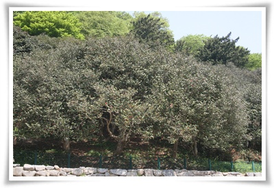

\- 동백꽃은 이제 꽃은 거의 다 진 모양.

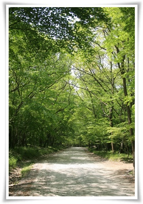

\- 이제 도솔암쪽으로 올라가는 연두색 산길.

강원도의 거친 산을 좋아했는데, 이곳 선운산에 오르다보니 강원도의 산과는 다른 편안함을 느낄 수 있었다.

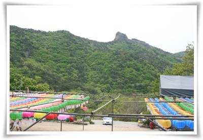

\- 도솔암에 도착

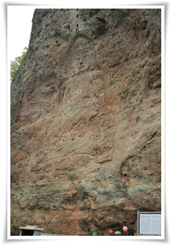

\- 도솔암 위에 있는 마애불상

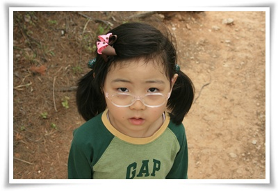

\- 두시간 산행에 지친 딸내미의 표정

\- 낙조대.

저기가 대장금의 최상궁이 자살했다는 바위라는데 대장금을 안봐서 그런가 큰 감흥은 없지만, 선운산이 정말 경치가 좋아 곳곳이 드라마촬영지였다.

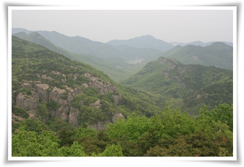

\- 낙조대에서 본 풍경

원래 이곳에서 서해 바다도 보인다고 했는데 대기가 깨끗하지 못해서인지 바다는 보이지 않았다.

