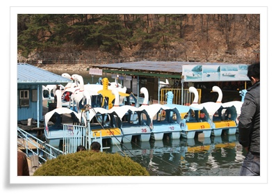
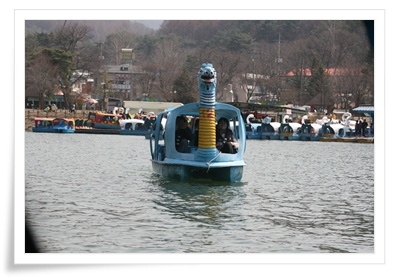
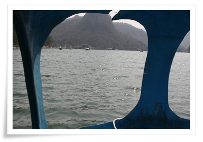
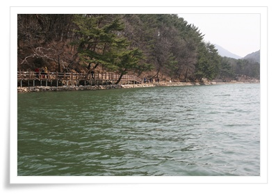
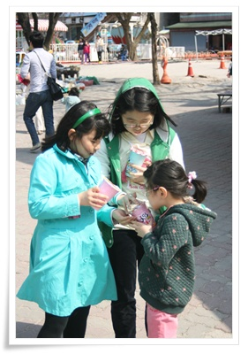
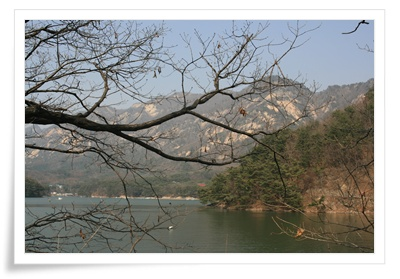

# 산정호수 봄 나들이

아버지 산소에 온 식구가 가면서, 오는 길에 산정호수에 들렀다.

[산정호수에 예전에 갔을 때](../6166880.html) 는 겨울이라, 별 볼 것이 없었는데, 봄도 되고 하여, 제법 산책할 만 했다.

날도 따뜻하고, 하늘도 깨끗하여 봄 나들이로 최적의 날씨였다.

\- 저 오리배를 탔다.

\- 총 8명의 식구가 간 터라, 오리배 2대에 나눠탔다.

오리배는 1대에 4명씩.  30분에 만원, 1시간에 만오천원이다.

\- 처음 타보는 오리배라 그런지, 시원한 호수바람과 풍경에 좋았다.

\- 호수에 뜬 상태로, 바라본 산책로.

\- 페달을 돌려야 가는 오리배.  그런데 페달을 빨리돌린다고 빨리 가는게 아니더군.

약하게 돌리나 세게 돌리나 가는 속도는 비슷하다.

\- 솜사탕 먹는 조카와 딸내미.

- Docs 뷰어로 열기
- 현재 탭에서 열기
- 새 탭으로 열기
- 새 창으로 열기
- 링크 다른이름으로 저장
- 주소 복사하기

\- 예전 김일성별장터라고 한 곳에서 본 풍경.

