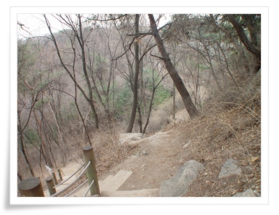

# 북악산 산책

불곡산, 광교산, 법화산 이렇게 세개의 산이 동네 뒷산.

동네 뒷산 탐험을 다 마쳤고 하여, 어느 산으로 갈까 하다가 북악산으로 가기로 했다.

북악산이 청와대 뒷산이라, 자동차로 올라갈 수 있는 북악스카이웨이만 가능하다가, 노무현대통령때 성곽을 따라 올라갈 수 있는 산책로가 개방되었다.

오전 10시, 경률씨와 미금역에서 만나 M4102버스를 탔다.

\- 평일에는 엄청난 치열함이 있는 이 버스를 이렇게 한가롭게 타니 새로운 느낌이다

\- 버스를 타고 내린 곳.  종로 2가.

\- 얼마만에 와보는 광화문로인가,.  토요일 아침은 한가롭다.

\- 마지막으로 봤을 때가 복원공사중이던 모습이었는데,.

\- 경복궁 옆 청와대쪽길을 따라 갔다.  여기서부터 정복,사복 경찰들이 쫙 깔려있더군.

\- 저 앞에 보이는 건물이 아마 청와대 기자실, 춘추관이라 불리는 것 같다.

\- 등산복 완전무장차림의 경률씨.

\- 그리고 나.

\- 입구까지 가는 버스가 있는데, 너무 일찍부터 걸었다.  아직 입구도 못 갔다.

\- 북악산 옆에 있는 인왕산.  어째 인왕산으로 가보고 싶더군.

\- 여기가 북악산 등산로 입구.

\- 저 철조망부터가 군사구역 시작.  신분증 검사후, 입장패찰을 착용해야 한다.

그리고, 저 위부터는 거의 10미터 단위로 전경으로 보이는 경비요원들이 배치되어, 사진촬영하는지, 이상한 행동을 하는지 감시하고 있었다.

사진촬영도 50m 마다 있는 휴게장소에서만 가능했다.

\- 사람들의 목에는 패찰이 있고, 올라가는 모든 길은 전부 계단.

\- 계단도 꽤나 가파르다.  그런데 좌우로 보이는 풍경이 좋다.

\- 인왕산 모습도 잘 보인다.

\- 북악산 정상

\- 청명한 하늘이 아니라서 시야가 그리 멀지 않아 아쉽긴 한데, 서울 시내가 한눈에 보인다.

\- 정상에서 간단한 간식.  역시 산에서는 뭐든지 맛있다.

\- 셀카의 달인께서는 셀카찍으시고.

정상에서 하산방향은 성북동쪽으로 했다.

그 방향도 말바위안내소까지는 상엄한 경비중이었다.

\- 마치 DMZ 온 것 같은 느낌의 철조망.

\- 숙정문.  4대문중 북쪽문에 해당하는 것.

저 너머가 상청각인데, 역시 그 방향엔 군사시절에 있다고 사진촬영 금지 대상이다.

\- 말바위안내소 바로 위의 휴게소.

말바위를 끝으로 군사구역도 끝.

감시요원의 눈길도 종료되었다.

북악산 산책로가 경치는 좋은데, 감시요원이 너무 많고, 제약도 많다 보니 아무래도 편안한 산책은 안되더군.

\- 와룡공원까지는 서울성곽은 이어져 있지만, 군사시설이라 개방안된 구간이라 성곽밑으로 내려가는 산책길이다

\- 다시 성곽안으로..  여기는 와룡공원 입구

\- 성곽기준으로 왼편은 사대문밖 성북구.  오른편은 사대문안 종로구.

그런데, 성북구의 높은 지대라 드라마에서 보던 달동네 풍경이 아직 남아 있다.

-성곽 끝.  원래는 이 성곽이 동대문의 낙산공원까지 이어져 있는 것인데, 끊긴 구간이다.

\- 이번 산행코스.  거리는 8km

