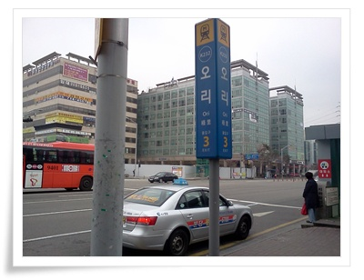
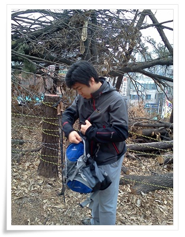
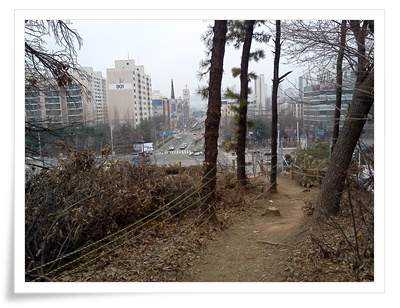
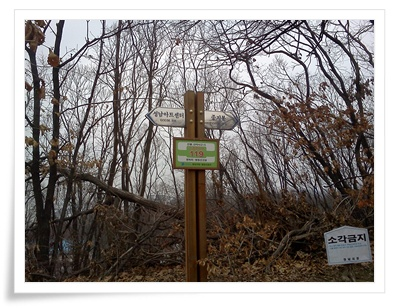
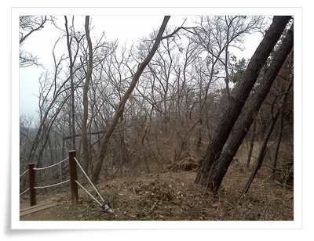
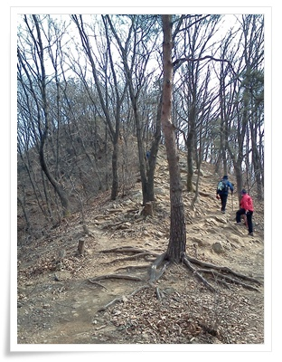
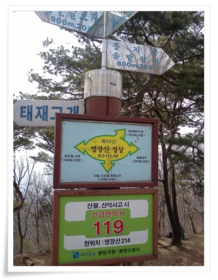
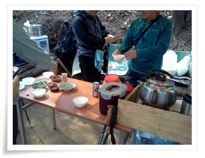

# 봄맞이 영장산 오르기

겨울동안은 그냥 동네 뒷산 불곡산만 오르다가, 지난주 광교산을 시작으로 활동범위를 넓혔다.

산행동무는 경률씨.

영장산은 불곡산과 마찬가지로 성남과 광주의 경계를 이루고 있다.

경률씨와 오리역에서 만나 이매역으로 가, 이매역에서부터 오르기로 했다.

\- 일요일 봄 아침, 한가롭다.

\- 산에 오르기 전 채비하는 경률씨.

\- 이곳이 이매역, 성남아트센터 언덕인 출발장소.

\- 가까운 봉우리가 종자봉.

\- 작년 태풍의 영향으로 산 곳곳에 뿌리뽑히거나 넘어갈 듯한 나무들이 많이 보였다.

\- 저곳이 종자봉.  아직 파릇한 싹이 나오기 전이라 산 자체는 황량하다.

\- 1시간 반정도 걸어가 도착한 영장산 정상.

\- 산 정상에 이렇게 막걸리 파는 곳이 있어, 한잔에 2천원하는 막걸리 한사발 먹었다.

저 거 먹고 나니, 만취상태가 되어 땅이 흔들리더군.

지난 겨울이 많이 추웠다.

그래서, 등산에 굶주린 사람들이 많았나 보다.

날이 따뜻해지니, 등산객이 꽤 많았다.

복장도 에베레스트라도 올라갈 차림으로 무장한 사람들이고, 나처럼 그냥 동네뒷산 산보 차림은 없었다.

\- 오늘의 총 등산경로. 2시간 15분 동안 4마일정도되니까 8km정도 걸었나 보다.

