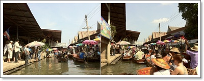
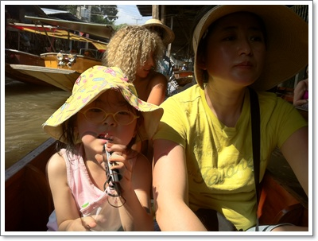
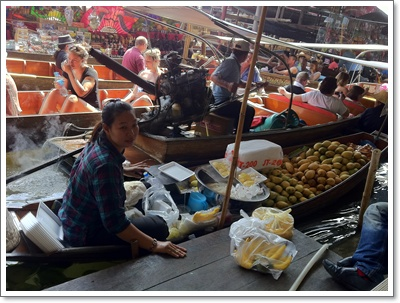
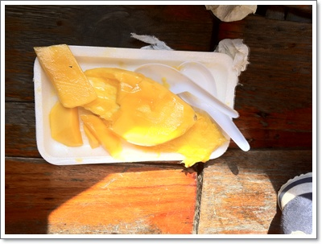
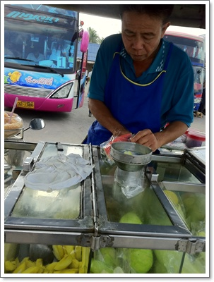
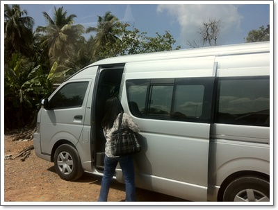
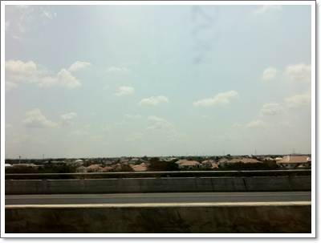
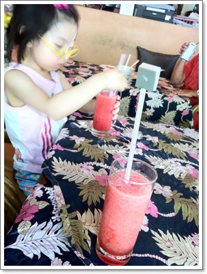

# 담넌사두악 수상시장

방콕여행에 많이들 간다는 수상시장 구경에 나섰다.

예약은 방콕 출발전 홍익여행사를 통해 예약했다.

_가격 : 어른, 어린이 모두 한분에 250바트(왕복 교통비와 긴꼬리 보트 포함, 점심은 불포함)_

_일정 :_

_\- 7시 카오산의 홍익여행사 앞에서 출발(2인 이상일 경우 시내 호텔에서 픽업 가능하고,  픽업 시간은 호텔 위치에 따라 조금 달라질 수 있습니다. 단, 투어가 끝난 후 해산 장소는 카오산입니다.)_

_\- 9시 코코넛 설탕 농장 도착 및 구경(가지 않는 경우도 있슴)_

_\- 9시 30분 긴꼬리배를 이용 수상시장으로 이동, 구경 (옵션으로 배를 이용 수상시장 구경시 일인당 150밧)_

_\- 11시 방콕으로 출발_

_\- 1시 방콕 도착_

\- 홍익여행사에 설명된 담넌사두악 반나절투어 설명

아침 일찍 출발하는 거고, 우리가 묶은 윈저스윗호텔로 6시 20분에 픽업한다고 하여 5시반에 식사를 하고 픽업을 기다렸다.

픽업봉고가 도착할 시각은 6시 40분.  꽤 늦게 왔다.

봉고는 카오산로드까지 중간중간 여러 호텔을 들러 사람들을 태웠다.

카오산로드에 7시 20분쯤 도착했는데, 여기서 다시 봉고차 재배치를 하더군.

일일투어가는 사람들은 일단 여러봉고차들이 다 태우고 난 후, 각각의 행선지별로 다시 봉고를 타는 방식이었다.

7시 50분이 되어서야 봉고는 카오산로드를 출발했다.

목적지 담넌사두악수산시장은 방콕에서 90km 떨어진 곳이라 봉고는 꽤 오랫동안 달렸다.

9시 10분에 목적지에 도착하여 롱테일 보트를 타고, 수산시장입구까지 이동했다.

-담넌사두악 수산 시장 도착

수산시장에 도착하니, 가이드는 11시 15분까지 지금 이 장소로 다시 모이라고 하였다.

따로 배를 탈 사람은 1인당 150바트내는 옵션을 하라고 했다.

홍익여행사에서는 이 배타고 시장을 움직이는 것은 추천하지 않는다고 했는데, 그냥 타봤다.

홍익여행사 말을 들을 껄 그랬다.

워낙에 많은 배가 있어, 배가 도무질 움직이질 않는 거였다.

거의 20분가량 선착장에서 움직이지도 못하고 있다가, 배는 전진을 포기하여 후진하여 뒤의 한 20여미터 한 바퀴 도는 것으로 끝냈다.

\- 뜨거운 햇살아래 거의 움직이지 않는 배에서..

\- 상인배보다 많은 관광객 배.

망고 접시에 50바트에 판다고 했다.

비싸다고 안산다고 하니까 상인은 40바트로 내렸고,  두개사면 70바트, 세개 100바트라고 했다.

두접시 샀다.

-배에서 사먹은 망고.  너무 미끄워 무려 4조각이나 떨어뜨렸다.  배에서 망고 사먹는 것은 비추.

\- 20바트 주고 사먹은 수박.  역시 더울땐 수박이 최고다.

수상시장이 아침에만 열린다는 설명대로, 11시가 되니 상점들이 문을 닫기 시작하고, 관광객들도 썰물처럼 빠져나갔다.

왔다갔다 총 4시간을 소모하고, 수상시장 자체는 거의 1시간정도밖에 구경하지 못하는 것이라, 다시는 수상시장 구경은 안할 듯 싶다.  별로 볼거리가 없었다.

\- 다시 방콕으로 돌아가기 위해 봉고차 탑승.  도요사 15인승짜리인데, 좋더군.

\- 방콕가는 길

-카오산로드에 도착하여 시원한 수박쥬스

**2월 16일 수요일 담넌사두악 수상시장 : 250바트x3**

06:40 ~ 07:20 호텔에서 픽업 봉고탑승하여 카오산로드로 이동

07:50 ~ 09:10 카오산 로드 ~ 수상입구 도착

                   화장실이용 5바트x2

09:20 ~ 09:30 로테일 보트타고 수상시장 도착

09:30 ~ 10:00 보트 탈려고 대기

10:00 ~ 10:40 보트타고 시장 구경 ( 150바트 x3 : 17,000원 )

                   배에서 망고 2봉지 사먹음  70바트=2,800원

10:40 ~ 11:15 보트에서 내려 걸어서 시장 구경

                    아이스하드 15바트 x2 = 1,200원

                    수박 한봉지 20바트 = 800원

                    과자 20바트 = 800원

                   화장실이용 5바트x2

11:30 ~ 14:00 카오산로드로 복귀

