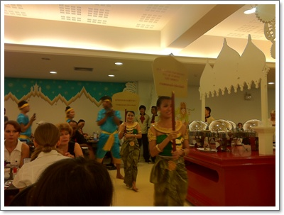

# 태국전통공연 - 씨암니라밋쇼

여행일정을 이렇게 짰다.

첫날 \- 이동, 태국전통구경 관람

둘째날 \- 수상시장 구경

세째날 \- 왕궁 구경

넷째날 \- 쇼핑, 귀국

아주 여유있는 일정이다.

빨빨거리며 쉬지 않고 돌아다니는 내취향은 아니지만, 식구의 체력에 무리가 없도로 아주 여유있게 짜봤다.

다들 씨암니라밋이라는 공연이 볼만하다고 하였다.

출발전 [홍익여행사](http://hongiktravel.com/) 를 통해 씨암니리밋과 수상시장을 예약했다.

\- 메일로 도착한 바우처.  씨암니라밋 3,450바트, 수상시장 750바트

호텔에 도착하고, 바로 씨암니라밋을 보기 위해 출발했다.

씨암니라밋 공연장은 호텔이 있는 쑤쿰빗역에서 세정거장 거리인 쑨왓타니탐역 근처에 있었다.

\- 전철역까지 이동.  후덥지근하다.

예전보다 방콕의 교통상황은 더 안 좋아진 것 같았다.

전에도 많았지만, 훨씬 더 차가 많아진 것 같고, 오토바이가 많다보니 소음이 장난아니다.

그래도 전철을 타니, 빠르긴 했다.

쑨왓타니탐역을 나오니, 바로 앞에 셔틀봉고차가 대기하고 있었다.

그걸 타고 5분정도 가니 씨암니리맛 공연장.

\- 입장권

바우처를 입장권과 교환하고 나니, 웬여인네가 꽃을 주고, 그리고 사진사가 사진을 찍으려 들었다.

분명 돈을 받을 것 같아, 안 찍는다고 하니 free라고 하여 일단 찍었다.

나중에 보니, 그 찍은 사진은 기념 액자로 만들어 팔더군.  하나에 200바트.  물론 사지는 않았다.

저녁 부페를 포함한 씨암니라밋쇼는 어른 1,200바트(48,000원), 아이 950바트(39,000원)아니 그리 만만한 가격은 아니더군.

그런데 저녁 부페에 대한 평이 영 좋지 않았다.

저녁 부페를 1,000바트이니 부페 자체 가격이 200바트(8,000원)이라는 소리.

그래서 대부분 거기서 식사하기보다는 근처 까르푸 매장 옆에 있는 MK수끼에서 먹는 것을 추천하더군.

딸내미도 있고 하여, 최대한 동선을 줄여야했기에 그냥 저녁부페를 먹었다.

\- 부페 식당

\- 부페 음식

역시 평대로, 맛은 영 아니었다.

이건 단순히 태국음식이 우리나라 입맛에 안맞는다는 문제가 아닌, 그냥 맛이 없는 거였다.

\- 7시쯤 되니, 식당안에 무용수가 돌아다니며 야외공연이 시작한다고 하였다.

\- 밖에는 큰 코끼리가 있고, 코끼리에게 사탕수수를 줄 수도 있고, 탈 수 있게 되어 있었다.

사탕수수 주는데 30바트(1,200원), 코끼리 탑승하는데 100바트(4,000원).

\- 본 공연전 야외에서 하는 공연.  볼만했다.

\- 미스인도 후보자들이 화보촬영을 왔는지, 사람들의 시선은 다들 저 미스 인도들에게 쏠리더군.

\- 공연장 밖에 우리 민속촌처럼, 전통가옥들이 만들어 있는데, 이것도 괜찮았다.

공연장 내부는 사진촬영 금지였다.

공연장 들어갈때 소지품 검사하여, 카메라가 있으면 보관시켜야 하는 방식이었다.

\- [씨암니라밋 홈페이지](http://www.siamniramit.com) 에서 가져온 사진

공연은 볼만했다.   추천할 만한 볼거리였다.

무대장치가 과히 놀라웠다.

바다속을 표현한 장면도 아주 멋졌고, 무대에 설치된 강에서 수영하는 장면, 그리고 비가 내리는 장면등 어떻게 저런게 무대장치로 가능할까하는 놀라움을 자아내게 했다.  코끼리도 무대와 객석에 자주 등장하여 다양한 볼거리를 제공했다.

도착 첫날의 피곤함으로 그게 조금 반감되었던게 아쉽더군.

나름 여유있게 짠다고 한 것인데, 첫날 공연을 보는것은 좀 무리더군.

그래서 다음날로 예정했던 수상시장 투어는 홍익여행사에 전화하여 그 다음날로 연기시켰다.

**2월 14일 월요일 씨암니라밋 공연**

17:10 ~ 17:30 호텔에서 ~ 쑨왓타니탐역 ( 전철 20바트x3 = 2,400원, 길거리에 쥬스 20바트 : 800원)

17:45 ~ 17:50 셔틀버스 탑승 ~ 공연장 도착

18:00 ~ 19:00 저녁식사

19:00 ~ 19:40 야외공연, 전통가옥 구경 ( 코끼리 먹이 30바트 = 1,200원 )

20:00 ~ 21:30 씨암니라밋 본 공연 관람 ( 3,450바트 = 15만원)

21:30 ~ 22:30 호텔로 복귀 ( 전철 20바트x, 10바트x1 = 2,000원, 편의점에서 과자와 물:68바트=2,800원 )

