# 방콕가는 길

태국 가본지 6년이 됐다.   비행기 타본지도 3년이 되었다.

어디로 놀러갈까 고민하다 태국으로 정했다.  가본 나라들중 태국이 가장 가격대비 만족이 컸다.

가깝고, 물가도 비교적 싸고, 치안 좋고, 사람들도 친절하고, 그리고 맛있는 것들도 지천에 널려 있다.

여행가서 하고 싶은 것을 정리해보니,

1\. 열대과일 먹기 - 특히 망고스틴.

2\. 맛있는 태국 음식 - 팟타이, 쌀국수, 게요리 등등..

3\. 스쿠버 다이빙 - 필리핀 가서 어드밴스드 라이센스까지 땄는데, 아직 그 후에 안해봤다.

4\. 바다에서 윈드서핑 - 이것도 최근에 못 해 봤다.

그래서 푸켓으로 가볼까했는데, 이게 생각보다 훨씬 비쌌다.

하긴 5년전에 갔을 때, 캄보디아까지 67만원정도 들어서 6박7일로 갔다왔던 생각때문에 그런 듯 하다.

그냥 방콕으로 가기로 했다.

먹을 것은 방콕이 나을테고, 경비도 훨씬 쌀테고, 식구들 구경거리도 방콕이 낫겠다 싶었다.

그래서 땡처리사이트에서 나온 것을 예약대기 시켰다.

그리고 나서 여권 준비할려고 보니,여권보다는 미국비자 만료될 때가 됐을 것은 생각이 들었다.

그런데 여권이 안보이는 거였다.

3년전 사용하고서, 한번도 안 썼는데, 아내가 어디다 치운 모양이었다.

다음날 찾았는데, 아내랑 내 여권의 유효기간이 지났다.

다음날 지하철역 즉석 사진기에서 여권사진 촬영하고, 성남시청으로 갔다.

여권 발급비용 55000원.  헌데 사진에서 퇴짜를 맞았다.

밝은 색의 셔츠를 입은게 어깨선 구별이 잘 되지 않는다는 거였다.

그래서 야탑역에 있는 홈플러스에서 12000원 주고 다시 사진을 찍고, 3일 후 새 여권 수령.

여행은 3박5일 에어텔 즉 자유 여행.

나 혼자라면 아마 하루 만원짜리 게스트하우스를 이용했을 테지만, 식구가 있기에 아무래도 숙소가 편안해야겠고, 수영장도 있어야 할 것 같았다.

모두투어에서 예약했고, 1인당 599,000원짜리.  세금과 유류할증료를 하니 세명해서, 항공권+호텔비 하여 210만원 되더군.

오랫만에 위키 여행계획 페이지를 열고 준비물과 시간 계획을 세웠다.

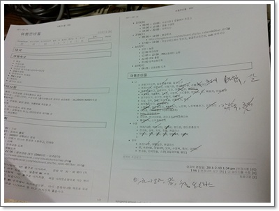

\- 준비물 하나씩 제거하며, 최종 짐 점검

2월 14일 월요일,  4시에 일어나, 5시 40분에 집을 나섰다.

영하 6도의 기온이라, 겨울옷이 문제였다.

두껍게 입고 갔다가는, 부피 큰 겨울 옷이 태국 도착하면 그대로 짐이 되어버리기에, 태국에서도 문제없는 얇은 복장에 봄가을 잠바를 입었다.  그래서 공항버스 기다리는데 자칫 춥지 않을까 염려했는데, 다행히 6시 출발하는 공항버스는 오리역에 우리가 도착하던 5시 55분에 도착하여 출발시간동안 대기를 하더군.

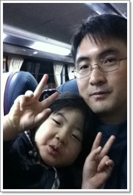

\- 아직 잠이 덜깬 딸내미

버스는 1시간반을 달려 7시 30분에 인천공항에 도착했다.

지하1층 외환은행에서 50만원어치 태국돈으로 환전하고, 아침밥을 먹으려 식당을 찾아봤다.

검색결과 인천공항에 맛 집이란 없다고 했기에, 가격대 성능비 좋다는 직원식당을 찾으려 했으나, 못찾고, 나와 딸내미는 버거킹에서 햄버거를, 아내는 혼자 값비싼 22,000원 짜리 갈비탕을 먹었다.

8시 30분 모두투어 접선장소에 가 항공권을 받고, 오리엔트 타이항공사 티케팅하러 줄을 섰다.

봄방학 시기라 여행가는 사람이 많았다.

9시 30분 출국심사대를 통과.

타고 갈 OX301편의 탑승구는 126번.  신터미널이었다.

신터미널까지는 지하철을 타고 이동하는 거더군.

간만에 비행기를 타니 새로운 것이 많이 생겼나 보더군.

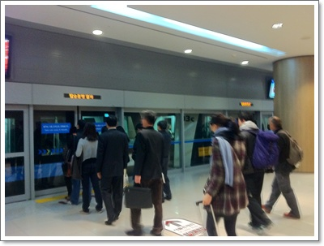

\- 126번 탑승구로 가기 위해 지하철 탑승.

10시50분 이륙 비행기라 시간 여유가 많이 있어, 신청사 2층에 있는 한국박물관에 들렀다.

한가한 전시장의 안내원이 우리를 반겼다.

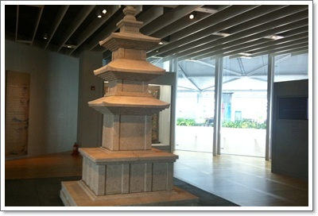

\- 깔끔하게 구성된 한국박물관

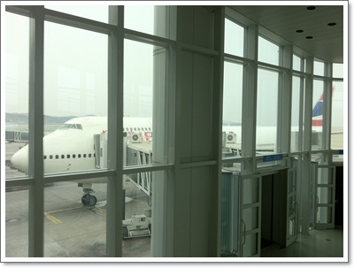

\- 이제 비행기 탑승.  저가항공사 오리엔트타이는 처음 타본다.

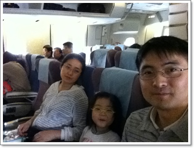

\- 탑승 완료.

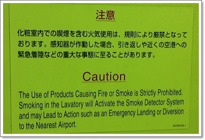

\- 비행기안의 모든 안내문은 일어와, 영어로만 되어 있었다.

태국 항공사인인데 태국어가 없는 걸 보니, 아마도 일본항공사에서 중고로 구입한 비행기인가 보다.

암튼, 비행기 내부는 좀 많이 낡았다.  TV도 브라운관이고, 개인LCD단말기도 없고,..

그리고, 와인과 맥주를 공짜로 주지 않더군.  어차피 공짜로 줘도 술을 먹지는 않지만...

기내에서 와인을 300바트(12,000원), 맥주는 60바트(2,400원)를 지불해야 먹을 수 있더군.

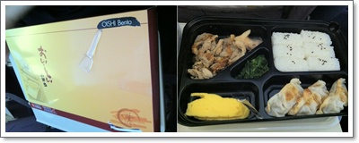

\- 기내식으로 나온 도시락.

오리엔트항공의 기내식은 맛없기로 유명하다고 하더군.

다른 여행자들 표현에 의하면 그냥 주먹밥이라고 했다.

받고 다니, 정말 주먹밥 6조각에, 닭고기, 만두3개, 계란찜, 미역 이게 다 였다.

맛도 없는데다, 차갑기까지 하여 아주 모처럼 만에 먹어보는 맛없는 식사였다.

오후 3시에 방콕공항에 착륙했다.

사완나품공항.  이제까지 돈무앙공항밖에 이용못해봤는데, 그 동안 사완나품공항으로 바뀌었더군.

만들어진지 얼마 안되는 공항이라는데, 인천공항보다 훨씬 떨어지는 시설이었다.

입국심사와 짐을 찾고, 택시를 타는데까지 한시간 정도 걸렸다.

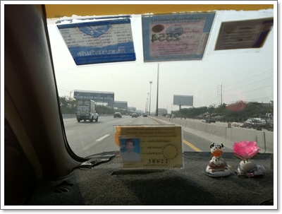

\- 택시타고, 수쿰빗에 있는 윈저스윗호텔로 이동.

택시비는 총 380바트(미터요금 280바트+공항대기료 50바트 + 고속도로톨비 50바트 = 약 15,000원)

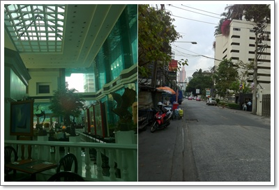

\- 호텔 내부와, 호텔 밖 길 풍경.

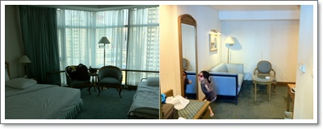

\- 이번 여행 3일간 묵은 2006호.  침실과 거실이 분리되어 있다.

가져온 짐을 해체하니, 이제 완전한 방콕에 왔다는 자유감을 만끽..

**2월 14일 월요일 : 출발~호텔도착**

04:00 기상

05:40 ~ 05:55 오리역으로 이동

06:00 ~ 07:30 공항버스 타고 인천공항으로 이동 ( 12,000원 x 2 )

07:30 ~ 07:40 환전 50만원 (환율 1바트=39원), 구급약 구입 6,000원

07:40 ~ 08:20 아침식사 ( 햄버거+아이스크림 9,100원, 갈비탕 22,000원 )

08:30 ~ 09:00 모두투어 직원으로부터 항공권 수령

09:00 ~ 09:30 출국장 통과

10:90 ~ 15:00 인천공항이륙~수완나품공항착륙

15:30 ~ 16:30 택시타고 공항에서 호텔로 이동 380바트(15,000원)

17:00 객실 짐해체 완료.

