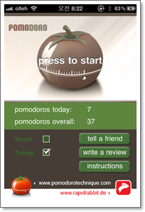
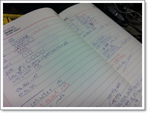

# 뽀모도로 테크닉 적용 소감

[삼색볼펜스터디모임](../10458999.html) 에서 동함이 요상한 주제로 발표를 했다.

뽀모도로라고 했다.

첫 발표때는 동함도 자신이 현재 직접 적용하고 있는 것은 아니라서 그런가, 그런게 있는가보다라는 수준으로 했다.

그래서 나도 그런게 있는가보구나, 요즘 유행하는 시간관리법인가보다라고만 생각했지, 크게 와 닿는 것은 없었다.

그리고, 그 다음 모임때 동함은 2차 발표를 했는데, 이번엔 그간 자신이  뽀모도로를 적용하였고, 놀라운 성과를 체득하고 있다는 것이다.

마치, 교회에서 신앙간증을 하는 듯한 자세로, 아주 열정적인 모습이었다.

뽀모도로를 적용했더니, 집중도 아주 잘되고, 하루에 처리하는 일도 많아졌다는 것이다.

원래 자극은 가까운 사람의 체험을 봐야 효과가 있는 법.

그래서 나도 따라 해보기로 했다.

뽀모도로 방법은 아주 간단하다.

25분 집중하고, 5분 쉬고.  이게 한 뽀모도로인데, 4개의 뽀모도로 후에 30분 쉬고..

이론이 어려운 것이 얼마나 되겠는가?  대부분 행동으로 옮기기 않는 것이 문제이지...

실천에 앞서, 25분을 뭘로 잴까하다가?  아이튠즈에서 검색해보니 뽀모도로 앱이 많이 있었다.

그중 무료이면서 제일 단순해보이는 "pomodoro technique" 앱을 다운받았다.

\- 나의 뽀모도로에 사용하는 앱.  시작을 누면 25분 카운터가 돌아간다.

아침에 오늘 뭘 할 것인가를 적고, 몇개의 뽀모도로를 할당할 것인가를 적어놓고 시작.

\- 난 그냥 수첩에 activities와 to do list 를 썼다.

뽀모도로 시작한지 이제 2주가 되었다.

아주 괜찮다.

여타의 시간관리 방법들과 달리, 죄책감을 주지 않는다.

그래서 부담없이 시작하게 되고, 목표는 집중도 비교적 잘 되더군.

동함에게서 8년전 배운 마인드맵 방법을 아직까지 요긴하게 잘 사용하는데, 이 뽀모도로도 오랫동안 쭉 갈 것 같다.

왜 이게 요즘 인기있는지 알겠다.

