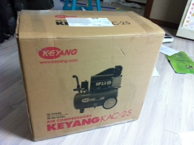
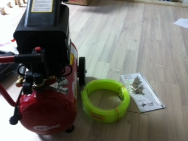
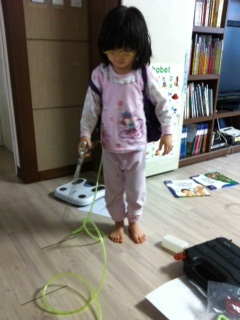

# 남자의 공구 사랑 - 계양 콤프레샤 KAC-25

공구상가나 마트에 진열된 공구들을 보면 아직도 가슴이 설렌다.

저 공구들만 있으면, 맥가이버 이상으로 만능으로 모든 작업을 직접 다 할 수 있을 것 같은 착각에 빠지기도 하고..

컴프레셔, 일본식 발음으로는 콤프레샤.  건설용어처럼 이 장비의 일반용어는 콤프레샤로 정착된 듯 하다.

이 컴프레셔를 가지고 싶었다.

내가 본 컴프레셔의 쓰임새.

1\. 카센터에 가면 바람도 넣고, 렌치도 돌리고, 바람도 불어내고,

2\. 인테리어 가게에서는 이걸로 페인트 칠하고,

3\. 스키장에서는 장비에 붙은 눈을 불어 내고,

4\. 수영장에서는 튜브에 바람 넣고,

5\. 셀프세차장에서는 실내청소할때 구석에 박히 먼지 불어내고,..

6\. PC정비업체에서 먼지 청소하기.

완전 만능인 공구다.

이 컴프레셔에 필이 꽂힌지, 어언 6개월.

어설피 지르기가 힘든게, 감당하기 힘든 소음과 크기.

코스트코 갈 때면, 당장 날 사가라는 표정으로 전시되어 있는 컴프레셔앞에서 괜히 한번 만져보기만 했다.

아내한테도 컴프레셔 사달라고 했다.  당근 일언지하에 거절.

여태의 장난감을 사는 것과 같은 이유로, 지름의 합리적인 이유는 없다.

그냥 선지름 후합리화가 있을 뿐.

그래도 사게 되면 쓰일 법한 용도.

1\. 차 실내 청소할때 쓰고,

2\. 집안 청소할 때 창틀에 끼인 먼지들 불어낼 때 쓰기.

한 4개월을 아내한테 사달라고 졸라댔다.

컴프레셔를 사기 위해, 사전 조사를 했다.

산업용은 너무 무리고, 나의 사용용도로 봤을 때 적당한게 2.5마력짜리였다.

에누리닷컴에서 콤프레샤로 검색하니 2.5마력짜리중 가장 싼 게 계양에서 만든 제품이었다.

그리고, 마침내 아내는 내 생일선물로 컴프레서를 사 줬다.

\- 총 11만 4천원.

\- 택배 아저씨가 낑낑대고 가져온 박스.  우람하다.

\- 포장을 뜯으니 역시 너무나 멋지다.

이제 신상녀 등장.

집안으로 배달되는 모든 신상품은 신상녀에 의해 검수 테스트를 거친다.

\- 일단 무게 테스트.  듬직한 무게가 마음에 드는 모양.

\- 이제 작동 테스트.  전문 테스트 요원이 이방저방 돌아다니며 바람 세기를 점검중이다.

검수요원은 성능이 괜찮다며, 검수테스트 통과시켜줬다.

이제 실 사용자, 내 사용소감.

장점은 바람은 셀프세차장에서 쓰던 그 쎄기로 잘 나온다.

단점은 집안에서 사용하기는 제법 시끄럽다.  이거야 원래 알고 있었으니 단점으로 볼 수는 없지.

근데, 중국공장 QA가 바퀴상태는 점검하지 않는지, 바퀴 연결부의 마무리가 별로 좋지 않더군.  바퀴 굴러갈때 몸체와 닿는다.

그리고 소형 컴프레셔 답게 탱크용량이 작아, 모터가 자주 돌아간다.

호스를 30미터로 샀는데, 사고 보니 너무 길더군.

그냥 돼지꼬리모양으로 꼬인 걸로 짧은 것을 살 껄 그랬다.

첫 실 사용은, 본가에 가는 김에 차가 싣고 가져가, 뒷마당에서 자동차 실내 청소를 해 봤다.

만족스럽다.  셀프세차장의 컴프레셔 바로 그 맛이다.

