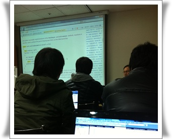

# helele 선생, 이복영강사

내게 컴퓨터관련해서  큰 영향을 끼친 사람중 한 사람이 helele선생이다.

처음 만났을 때가 세기말 암울한 분위기가 지배했던 1999년 하반기 백수시절이었다.

그 후 최근까지 본 적도 없어, 이름도 까먹고 단지 helele선생으로만 기억하고 있다.

그때 IT SW산업계의 질적하락을 불러왔다는 소위 6개월짜리 학원과정에 다니고 있었고, 그 곳에서 일주일짜리 ASP 강의를 하는 helele 선생을 만났었다.

기술에 대한 열정이 대단하셨다.  쌩초보들 앞에서, 본 강의의 범위를 뛰어넘는 여러가지를 열정적으로 알려주셨다.

그에 대한 감동으로 수료작으로 그 당시 별로 일반적이라고 하지 않았던 COM+ 객체만들어 MTS로 돌리고, 3-tier로 하는 것을 만들었다.

그 덕에 파워빌더로는 거의 쓰지 않는 방식이라, 무수한 삽질을 하긴 했었지만,..

왜 helele 선생으로 기억하는가 하면, 모든 변수이름과 함수명을 helele로 했고, helele 변수를 사용중이며 hevele라고 했었다.

꽤 유머도 있었고, 수업도 상당히 재미었었다.  너무 많은 걸 알려주려는 통에 제대로 따라가는 것이 힘겹기는 했지만, 머리를 깨뜨리는데 많은 도움을 줬었다.

그 영향으로 나도 별 의미없는 파일명이나 변수명 지을때, helele, hevele를 많이 쓰고 있다.

작년부터 틈나는대로 [한국소프트웨어기술진흥협회에서 하는 재직자 교육과정](http://edu.kosta.or.kr/index) 으로 통해 배우고 있다.

도서관과 함께, 내가 납부하는 세금에 대해 만족을 느끼는 곳이다.

고용보험를 납부하는 직장인을 대상으로 하는 교육인데, 직장인에 맞게 야간교육 위주로 강의가 편성되어 있고, 강사진도 수준 높아 만족감도 높다.  물론 가장 큰 장점은 공짜라는 점.  고용보험료를 통해 지원되는 구조이기 때문이다.

최근 매주 주말마다 하는 C# MEF 6주 과정을 수강하고 있는데, 그곳에서 helele 선생을 만났다.

12년만에 이름도 다시 알 수 있었다.  "이복영" 강사님.

처음 외모를 보고, 혹시 그 helele 선생이 아닐까하는 생각이 들었는데, 본격적인 실습에 들어가면 helele, hevele 가 변수명, 함수명으로 남발되는 것을 보고, 확신하고, 인사했다.

경력 28년인데, 여전히 현역으로 뛰고 있고, 12년 전과 똑같은 열정적인 모습을 볼 수 있었다.

\- KOSTA에서는 강의중인 helele 선생

나도 나름 C#으로 개발을 하는 몸인데도, 모르는 것들이 태반이군.

"helele", "hevele", "어머, 짐승같아.." 어록들과 나름 귀여운 표정들과 유머로 꽤나 재미난 수업이다.

