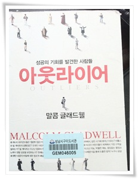

# 아웃라이어

성공 혹은 자기개발 서적을 그리 좋아하지 않는데, 그 정점을 찍은 책이 "시크릿"이란 책이었다.

그 유명한 "시크릿"을 읽고 난 후 느낌은,

"간절히 원하면 이루어진다고?  그렇다면 지금 가난한 사람이라니, 억울한 일을 당하고 있는 사람은 사회의 문제가 아닌, 그냥 그 개인 자체가 간절히 원하지 않은 그 개인의 문제라는 것이군.  뭐 이런 쓰레기 같은 책이 있나?" 였다.

아웃라이어 이 책이 꽤 인기있었던 책인데, "성공"관련 서적이라 지레 짐작하고 제껴놓고 있다가 빌려봤다.

어느정도 선입관을 가지고 읽어 봤는데, 이 책에 대한 나의 선입관은 완전히 틀렸다.

성공 사례와 성공의 원인을 분석해 놓은 글들을 읽는데, 구태의연하지 않고, 도덕책을 읽는 따위도 아니었다.

기억나는 내용들.

1. 캐나다의 아이스 하키 선수

\- 캐나다에서는 아이스하키 선수가 아주 유망한 직업인가 보다.  암튼 어릴때부터 하키 영재들을 발굴 육성하는데, 현재 성공한 하키선수들을 보니, 다들 1월~5월 생이라는 거였다.  이유는 매년 영재를 발굴할 때 1년단위로 하고, 비교를 같은 해에 태어난 사람을 대상으로 하다보니, 어릴 때는 몇개월차이가 능력의 차이가 크다는 것이다.  즉 1월생이 12월보다는 몸도 크고 발달도 잘 한다는 것.  그렇다보니, 연초에 태어난 사람들이 영재교육을 집중적으로 받다보니 유명한 선수로 된다는 것.

\- 이 이야기를 읽으니, 내 딸이 5월에 태어나니, '5월생이 머리가 좋대더라'라는 말이 생각난다.  우리라는 3월~익년2월까지 출생하는 애들이 경쟁하는 구도이기 때문에, 5월생이면 확률상  2/12 로 상위를 차지하기 때문일 것이다.

2. 빌게이츠의 성공

\- 학교에 컴퓨터를 사용할 수 있는 기회가 있었고, 비싼 터미널 사용료를 아까워하지 않는 재력의 부모가 있었고, 물론 본인도 컴퓨터에 미쳐 1만시간을 컴퓨터에 사용하였다.   즉 본인의 능력뿐 아니라, 주변의 환경이 아주 잘 맞아 떨어졌기 때문에 성공할 수 있었다는 것.  만약 빌게이츠가 조금 일찍 태어났거나, 늦게 태어났다면 지금과 같은 성공을 이루기는 힘들었을 것이다.

3\. 대한항공의 괌 추락사건

\- 가장 흥미있었던 부분.  괌 추락사건에 대해서는 네셔널지오그픽채널 방송으로 한 번 본적은 있었는데, 이 책에서 근본적인 원인을 말해주었다.

우리나라 대부분의 직장 문화처럼, 대한항공의 조종실도 강한 서열이 존재하는 조직이었다고 한다.  그래서 기장의 판단과 행동에 부기장이 감히 참견을 할 수 없는 분위기였다고 한다.

괌 사고시에도, 부기장은 위기를 알았고, 부기장이 기장에게 강하게 위험을 알리거나, 조종간을 빼앗았다면 사고를 피할 수 있었지만, 부기장은 기장에게 아주 공손하게 말을 했고, 기장은 그 공손한 말속의 뜻을 제대로 잡아내지 못했다는 것이다.

암튼, 이 사고 이후, 대한항공의 조종실에서는 한국어 사용이 금지되었고, 기장이 부기장을 의견을 두번 무시한 경우는 부기장이 기장의 권한을 박탈할 수 있도록 규정을 바꾸었다고 하는군.

5\. 한국,중국,일본인들이 어렸을 때 수학을 잘 하는 이유

\- 숫자가 일이삼사오륙칠팔구십으로 단음절인데 반해, 영어는 원투쓰리포파이브씩스 식으로 여러음절이 나오고 자리수가 틀려질 경우는 또 다른 규칙이 적용되어, 서양인은 수학이 단순한고 체계적이라는 의식이 한자문화권보다 없다는 점이라는 점이라는 것.

환경과 운이 따라주어야 성공하지만, 그 운을 잡는 사람도 1만시간이라는 연습시간을 채운 사람에게는 해당된다라는 점.

뭐든지 꾸준히 해야겠구나....

