# 구미도서관 가는 길

서울 살 때 다녔던 도서관은 동대문도서관, 정독도서관, 국립중앙도서관이었는데, 다 집에서 멀어 버스타고 한참을 갔었다.

구미동에 살면서 여러가지로 만족하고 있는데, 그중 도서관이 참 좋다.

도서관 가는 길도 좋고, 도서관 시설도 좋고, 볼 책도 많고, 도서관 직원들도 친절하여 다 마음에 든다.

최근까지도 도서관을 그냥 차를 타고 갔었는데, 걸어가는 길이 훨씬 좋다는 것을 이제서야 깨달았다.

집에서 도서관까지 횡단보도 한번 건너는 것으로 차도는 끝.

나머지는 전부 산책로.

반납할 책을 가방에 넣고, 룰루랄라 도서관으로 향했다.

\- 경로상 유일한 차도를 건너는 구간.  아파트 바로 앞.

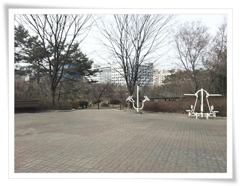

\- 횡단보도를 건너면 운동기구들이 있다.

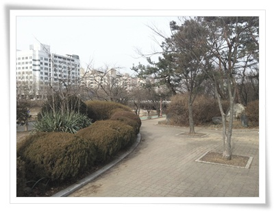

\- 운동기구를 지나면 조그마한 공원비스므레한 것이 있다.

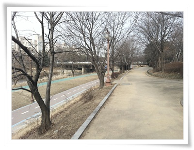

\- 왼쪽에는 탄천.

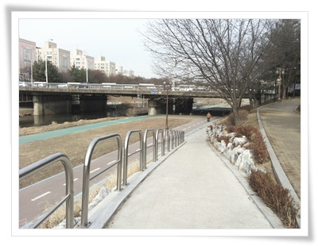

\- 탄천 산책길로 내려가는 길.

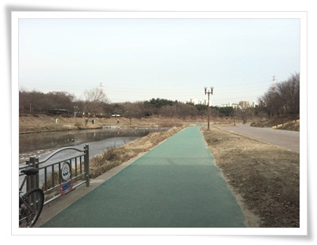

\- 탄천 산책길.  걷는 길은 우레탄바닥으로, 자전거길은 오른쪽에 아스팔트로 되어 있다.

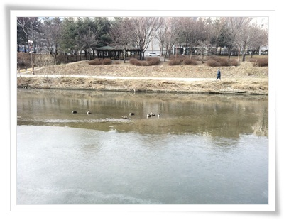

\- 추위에도 오리들은 물속에 잘 있다.

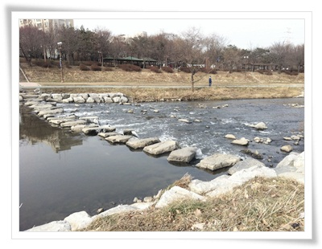

\- 도서관가기 위해 징검다리를 건넌다.

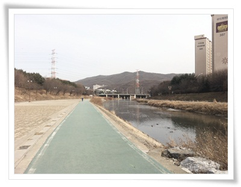

\- 징검다리를 건넜다.  역시 한가로운 산책길.

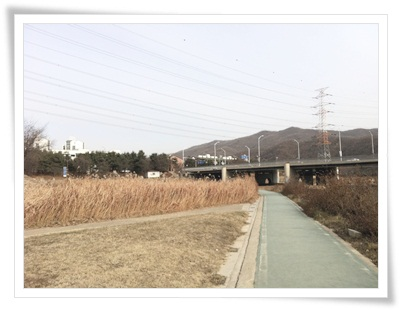

\- 갈대밭도 있고..  저 앞 다리는 구미교.

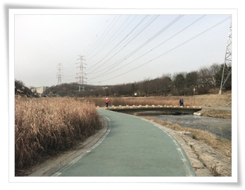

\- 구미교 왼편으로 돌아, 동막천으로 따라 걷는다.

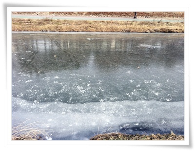

\- 얋트막한 동막천 또랑은 요며칠 한파로 꽁꽁 얼어 있다.

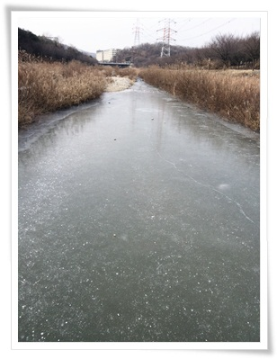

\- 얼어붙어 있는 동막천.  이 동막천으로 고기리유원지로 이어진다.

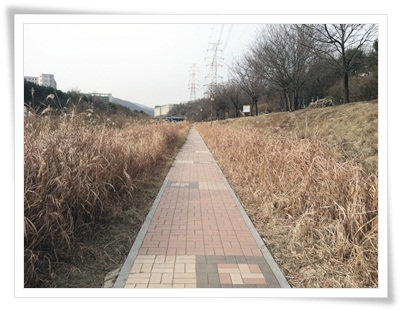

\- 동막천 옆 산책로.  관리가 잘 되어 있다.

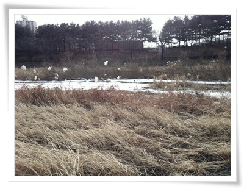

\- 갈대가와 얼어붙어 있는 또랑으로 겨울 운치를 느낀다.

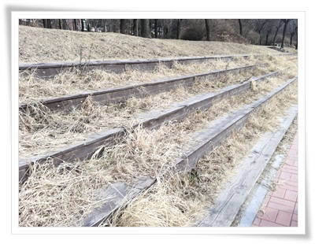

\- 동막천옆 나무계단.

여름,가을 풀이 많을 때는 몰랐는데 나무로 되어 있는 걸로 보아 앉아 쉴 수 있는 공간으로 만든 듯 싶다.

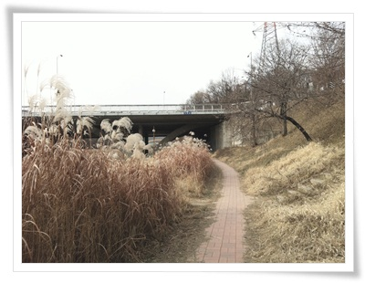

\- 이제 낙생교.  출퇴근할 때 102번 버스를 타고 저 낙생교를 지나간다.

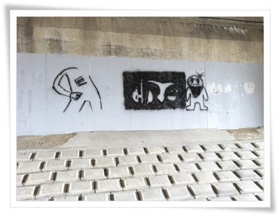

\- 낙생교밑 낙서.  뭔가 어설픈 것 같은데 연습작인가 보다.

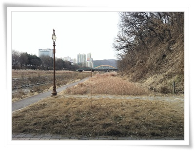

\- 낙생교 통과.  이제 오른편으로 올라간다.

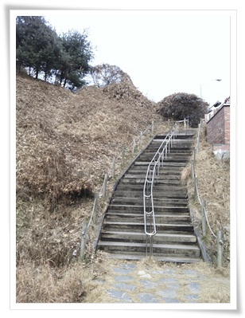

\- 낙생교 다리위로 올라가는 계단.

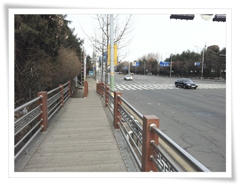

\- 계단을 오르면 낙생교 다리다.

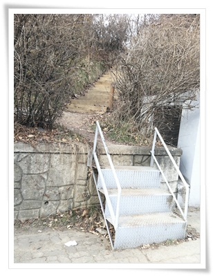

\- 낙생교 다리에 바로 왼편 계단으로 올라가는 머내공원 산책로가 나온다.

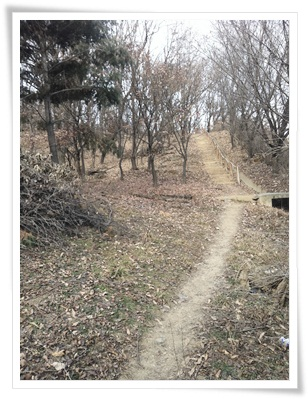

\- 머내공원 산책길.

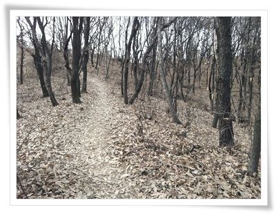

\- 겨울산 느낌이다.

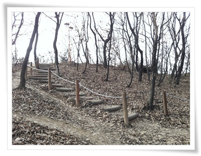

\- 저 언덕 너머는 분당수서간 도로와 경부고속도로.

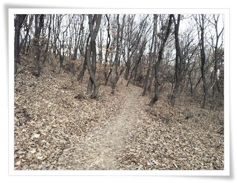

\- 머내공원 밑에 있는 도서관을 향해 있는 오솔길.

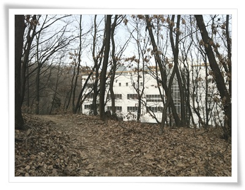

\- 오솔길 끝에 보이는 저 건물이 구미도서관.

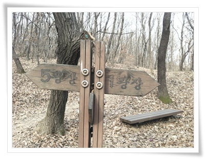

\- 머내공원의 광장 표지판.  그런데 "광"자를 붙이기에는 그리 넓은 공간은 아닌데,..

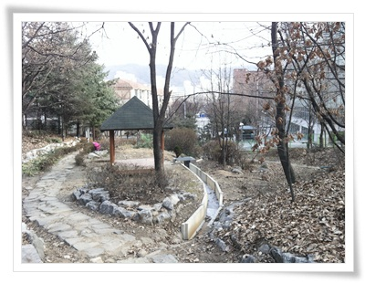

\- 이제 도서관을 향해 내려간다.

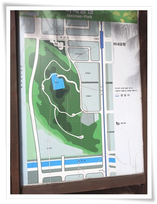

\- 머내공원 안내도.

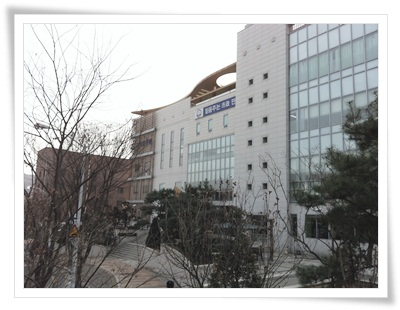

\- 목적지 구미도서관.

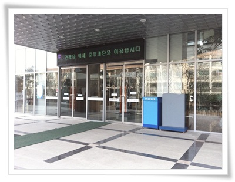

\- 도서관 입구.

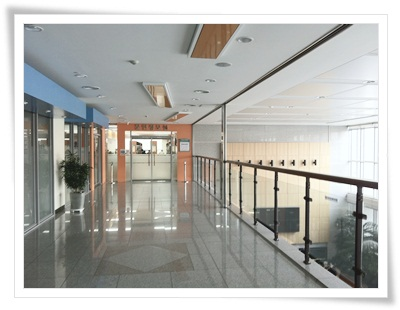

\- 제1문헌실 가는 길.

책을 빌리고 볼 수있는 문헌정보실은 09시부터 22시까지 한다.

그래서 저녁 먹고 산책하는 동안 도서관을 들릴 수 있어 참 좋다.

가지고 갔던 책 두권을 반납하고, 다시 두권을 빌렸다.

1인당 4권까지 빌릴 수 있는데, 전에 빌린 네권중 두권을 아직 다 못 읽어, 이번엔 두권만 반납했다.

\- runner's keeper로 기록한 이동 경로. 2Km 거리고, 천천히 걸으니 27분이 걸렸군.

