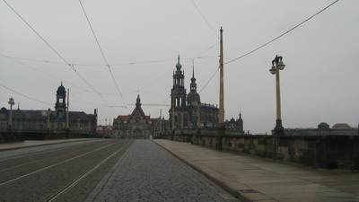

# 책 \"제5도살장\"을 읽고

\- 구미도서관에 빌린 "제5도살장".

-

2차대전 당시 미군으로 독일군의 포로가 되었던 저자 커트 보넨쿠트.

원래 도살장으로 사용되던 드레스덴 포로수용소에 있었고,

커트 보넨쿠트가 수감된 곳의 번호가 5번이어서, 제5도살장이라고 책 제목을 지었다고 한다.

책 제목만 듣고서는 아우츠비츠 유태인 수용소처럼 유태인 학살 이야기 아닌가 했다.

드레스덴은 내게 독일 출장당시, 일요일 새벽 당일치기로 체코로 놀러가기 위해 잠시 들렀던 매우 멋진 도시였다.

아우토반을 3시간 가량 쭉 달리다가, 논밭이 끝나고 나타난 장엄한 자태의 건물에 감탄을 금치 못했었다.

\- [독일 출장당시, 프라하 가는 길](../6166670.html) 에 드레스덴으로 들어가는 순간.

2차 대전 말기, 연합국은 이 드레스덴에 폭격을 가했고, 그 폭격에 드레스덴 시민 13만명이 학살당했다.

드레스덴은 예전 작센왕국의 수도로 문화유산이 많았고, 전략상 주요도시가 아니어서 거의 비무장상태의 도시였다고 한다.

그 드레스덴에 소이탄으로 융단 폭격을 해서, 주민 대부분 타죽고, 저자가 속한 미군 포로들은 도살장 깊숙히 있던 저장고 즉 5번 방에 있어 살아 남았다고 한다.

이후 독일은 전쟁패배국이자 나치 전범국으로 이에 대한 피해를 전혀 언급하지 않았다고 한다.

승자의 역사라는 말처럼, 나치의 유태인학살은 정말 지겨울 정도로 많이 언급되고, 이에 대해 이스라엘이 홀로코스트 장사를 하고 있다라는 비판마저 나오고 있는 반면, 패자의 이 사건에 대해서는 언급이 되질 않는구나 하는 생각이 들었다.

책 내용은 흥미로웠지만, 구성 자체는 그리 내 스타일이 아니었다.

저자의 경험을 대신한 주인공을 내세워, 시간여행하는 스타일로 구성을 하는데, 그리 썩 눈에 잘 들어오는 것 같지는 않더군.

같은 전범국으로 히로시마에 원자폭탄 맞았다고, 전쟁 피해국인양 행세하는 일본.

2차 대전의 가장 큰 피해자였으면서, 팔레스타인에게는 나찌에게 당했던 그대로 자행하고 있는 이스라엘.

전범국으로 진심으로 죄를 시인하고 과거청산을 했던 독일.

그래서 그런가 독일에 대해서는 우호적인 느낌이다.

