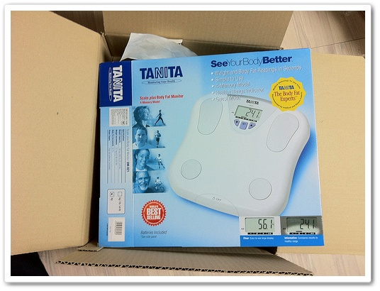
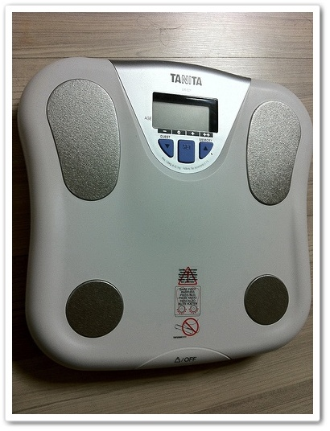
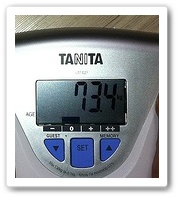

# 타니타 UM-021 체중계겸 체지방측정계 사용기

아무 계획이나, 의지없이 살이 7kg 빠지는 바람에, 비만1단계에서 과체중으로 내려왔다.

과체중으로 내려온 몸무게를 생각하니, 정상체중으로 되돌아가보곤 싶은 생각이 들더군.

bmi지수상 내 정상몸무게는 64kg ~ 68kg.

저 몸무게의 마지막이 2000년이 아니었나 싶다.

집에 체중계가 없어, 체중계부터 사기로 했다.

처음엔 단순한 체중계만 사려했으나, 무얼살까 에누리에서 검색하다가 보니 체지방도 측정해주는 것도 있더군.

몸무게 많이 나가는 것 보다 내장 비만이 더 문제라는 이야기를 들은 적도 있고, 그것보다 이제까지 체지방 측정해 본 적이 없어,  체지방 측정되는 것을 골랐다.

제일 싼 tanita 제품으로 가격은 41,000원

헬스클럽이나 무슨무슨클리닉에서 보는 비싼 의료기가 아닌 이상, 정확도는 많이 떨어질 것으로 예상하고, 단순한 참고용으로 생각하기로 했다.

주문하고, 배송되었다.

\- 제조국은 중국.  평은 괜찮았었다

.

체지방측정 기능이 있어서 그런가, 설명서를 읽고 시작해야 했다.

나이와, 키를 입력하고, 이를 기억시켜 놓는다.

4명까지 기억된다.

\- 체중계의 모습.  발바닥에는 전극이 붙어있다.

올라갔다.

처음 몸무게가 표시되고, 그 다음 체지방율이 표시되었다.

\- 체중 73.4kg,  체지방 21%.  기계상으로는 체지방 정상이라고 나오는군.

체지방측정의 방식으로 양 발바닥 사이에 약한 전기를 흘려보니, 몸의 저항을 측정하는 방식이라고 한다.

근육은 저항이 낮고, 지방은 저항이 높아, 그 저항값으로 지방은 어느정도 비율이 되는가 측정하는 거라고 적혀 있더군.

그래서, 측정하는 시간대와, 운동여부, 식사여부, 물을 먹었는지 여부에 따라 체지방측정치는 많이 변한다고 적혀 있었다.

체중계도 샀으니, 정상체중 68kg으로 함 돌아가보자.

