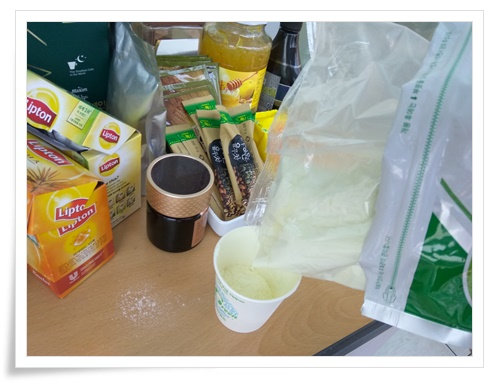
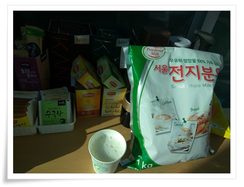

# 회사에서 따뜻한 우유 한잔.  전지분유

다른 회사에서 비해서 우리 회사는 먹을 것이 풍부하다.

과자와 음료, 차가 종류별로 가득차 있다.

그 과자로 인한 군것질이 몸무게 늘어나는데 크게 일조했는데, 다이어트를 하면서 과자를 안 먹었다.

그리고 요즘 유행하는 저탄수고지방에 맞게 설탕 들어간 것들을 줄였는데, 그래서 인스턴트 커피도 줄였다.

그러다 보니, 먹을 게 별로 없었다.

녹차, 루이보스티 등의 티백류를 한동안 먹었는데, 아무래도 이런 것들은 너무 맛이 없었다.

먹을 것 구매하는 담당자에게 회사에서 따뜻한 우유를 타 먹고 싶다고 전지분유도 비치해 달라고 건의했다.

그리고 마침내 전지분유도 비치되었다.

분유하면 어렸을 때 깡통에 든 분유 분말로 그대로 퍼 먹던 기억.

그리고 전지분유를 나 몰래 숨겨놓고 혼자만 드신 외할아버지 생각이 난다.

전지분유만의 고소한 맛을 좋아한다.

그리고 전지분유가 결코 싸지 않다는 점 때문에 선뜻 사지도 못했다.

\- 전지분유를 이렇게 종이컵에 아낌없이 투입.

물 타기 전 한 스푼 분말 그대로 입으로 투입.  전지 분유는 분말로 퍼 먹을 때의 맛이 또 기가 막히다.

\- 따뜻한 우유 한 잔.   좋다.

어렸을 때 자판기에서 파는 우유도 맛있다고 뽑아 먹었는데, 역시 진짜 우유에 비할 바는 못 된다.

