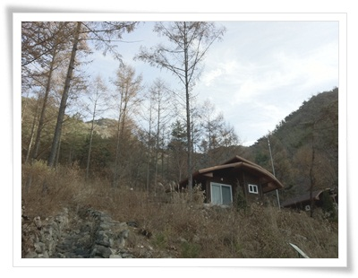
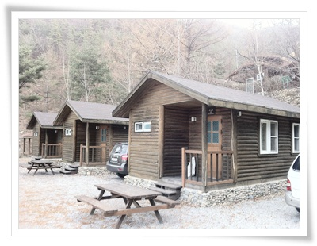
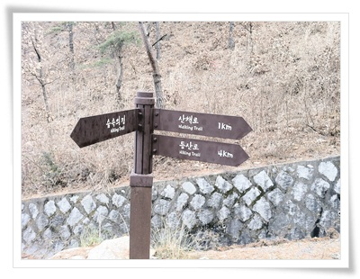
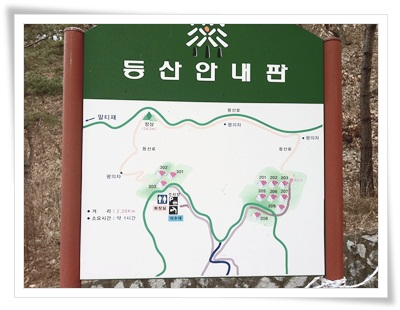
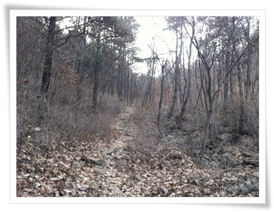
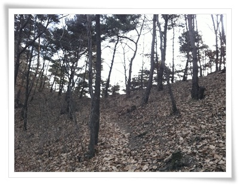
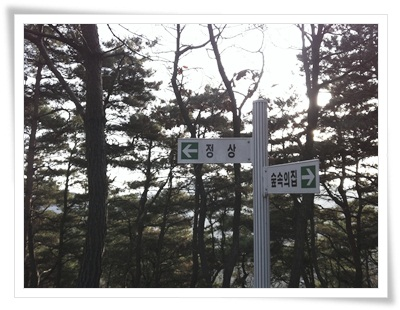
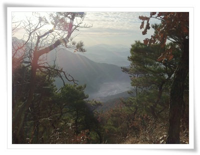
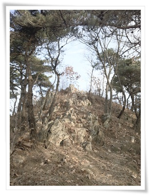
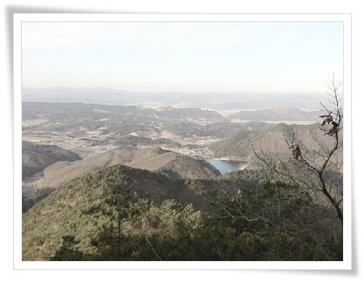

# 속리산 말티재

경기, 강원도쪽 자연휴양림만 이용하다가, 워낙에 예약이 힘들어, 이번엔 남쪽으로 향했다.

정한 곳은 속리산 말티재 자연휴양림.  충북 보은군이라 그렇게까지 남쪽은 아니지만,..

비수기, 평일이라 예약필요없이 갈 수 있었다.

숲속의 집.  207호.

평일이이라 1박에 5만원.

단촐하게 아내와 딸내미 이렇게 세명이서만 갔다.

뭐 뒤늦은 단풍여행이라 할까나..

\- 휴양림 안.

강원도의 산처럼, 높은 산은 아니지만, 그래도 말티재라는 이름처럼 산맥을 넘는 곳이 있는 곳이라, 산이 제법 깊었다.

\- 숲속의 집들이 이렇게 듬성듬성 위치해있고,.

\- 내가 묵은 곳 207호.

11월부터는 산불예방을 위해 바베큐 그릴을 이용못하도록 치워 놓았다고 하더군.

순전히 휴양을 위해 간 이유도 있고, 겨울이라 별다르게 할 것도 없어, 2박 3일간 뜨듯한 방안에 계속 누워있기만 했다.

그러다 마지막 날, 그래도 산에는 한번 올라가 봐야지 하고 하고 올라가 봤다.

\- 숲속의 집에서 등산로는 4km.

\- 산 자체가 해발 450m로 그리 높지 않아, 등산코스 역시 길지는 않다.

\- 등산로 초입부.  완만한다.

\- 9부 능선쯤 되는곳.

\- 능선에 올라서는 정상으로 가는 길과 숲속의 집을 가리키는 표지말이 있다.

\- 능선에 올라 잠깐 내려다본 풍경.  평온하다.

\- 정상까지 가는 길.

정말 완만한 길이었지만, 저질체력으로 힘들어 죽는 줄 알았다.

\- 정상에서 바라본 풍경.   충청도의 산들은 다들 나즈막하군.

숲해설이 하루에 두번 있어, 오후에 하는 숲해설을 들었다.

평일이라 참가자는 우리 가족 세명.

말티재휴양림은 다른 휴양림들과는 달리 야영장은 운영하지 않더군.

다른 휴양림에 비해 가진 장점은 숲속의 집들이 띄엄띄엄 있어, 정말 숲속의 한적함을 느낄 수 있겠다라는 생각이 든다.

경기도,강원도의 자연휴양림은 이제 평일도 예약이 힘들만큼 인기가 좋아, 다음에는 더 남쪽 휴양림으로 가 봐야겠다.

