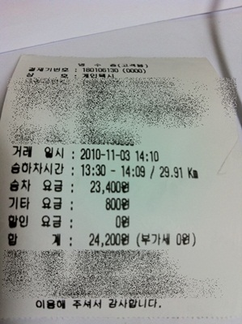

# 김포공항에서 택시를 탈려면 반드시 콜택시를

김포공항에서 인천항여객선터미널까지 가기위에서 택시 승강장으로 갔다.

택시들은 한산하게, 쭉 서 있었다.

삐끼로 보이는 아저씨 : 어디 가요?

나 : 인천항여객선터미널이요.

삐끼로 보이는 아저씨 : 저기 앞에 있는 인천택시를 타요.

그래서, 인천번호판의 택시를 탔다.

나: 인천항여객선터미널이요.

택시기사: 거기까지는 4만원이고, 통행료로 따로 주셔야 합니다.

나: 2만원5천원 나오는 거리인데, 무슨 4만원이예요.  거기 있는 미터기 켜고 갑시다.

택시기사: (비웃는 웃음으로)미터기켜도 비슷하게 나와요.  4만원이면 싸게 가는 거예요.

나: 그럼 다른 택시 탈랍니다. (택시 하차)

다른 택시 하나에게도 물어보니, 역시 4만원이고, 여기 기다리는 택시들은 전부다 미터기로 운행하지 않는다는 대답이었다.

핸드폰에 저장시켜 놓고 새벽 퇴근시 주로 이용하던 콜택시로 전화를 걸었다.(집에 경기도 시골이라, 가산동에서 택시 잡으면 승차거부나 웃돈 요구를 당연시 받아서, 새벽에 택시탈때면 꼭 콜택시를 이용한다)

5분후 콜택시가 도착했다.

이전 택시기사와 달리, 친절한 기사분.

탑승후 한 40여분을 갔다.

요금은 통행료 포함 24,200원.

이게 정상 요금인데, 그걸 두배로 바가지 씌우는 김포공항 택시들에 화가 난다.

혹시나 해서, "김포공항 택시"로 검색해보니, 택시의 이런 횡포가 하루 이틀 일은 아니더군.

물론, 택시업계도 "일부" 좋은 기사분들이 있지만, 그렇지 않은 "다수"의 기사가 있다.

택시를 직업으로 하는게, 힘들도 수입도 많지 않은 것을 충분히 이해한다마는, 왜 그 스트레스를 승객에게 풀고, 바가지를 씌워 수입을 증대시키려 하는건지...

