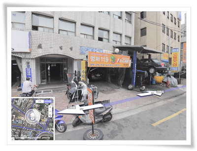
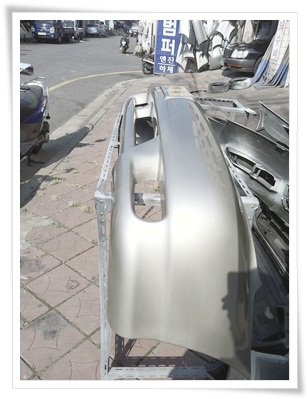
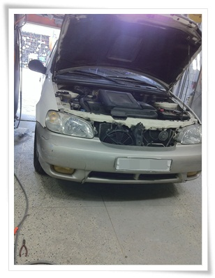
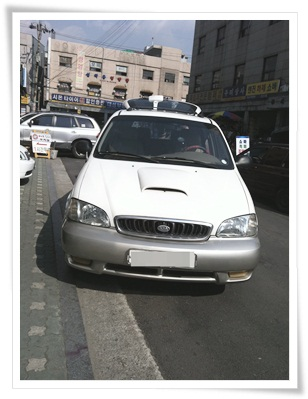
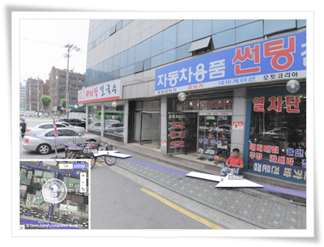

# 중고 범퍼로 교체하고 썬팅도 다시

죽음의 프로젝트를 석달째 하다보니, 몸과 정신모두 피폐해진 느낌.

사는게 사는 것 같지도 않고...

단지 시간이 없으니, 지출은 없더군.

그래서 차나 고쳐야겠다 생각했다.

올해 봄, 우회전하다가 앞차 정지를 못보고, 들이받는 바람에 범퍼가 깨졌었다.

그런상태로 1년 가까이 타고 다녔다.

혹시나 또 사고 나면, 그 때 가서 갈아볼 생각으로..

범퍼 깨진 상태로 다니다 보니, 자연스레 차 관리도 소홀히하게 되었다.

마치 뉴욕시장의 깨진유리창 법칙처럼..

그리고, 유난히 더웠던 올해 여름의 열기에 썬팅 필름도 쭈글쭈글해졌다.

쭈글쭈글해진 썬팅너머로 밖을 내다보면 멀미까지 날 지경이라, 어지간하면 차에 돈 안쓰는데, 결국 차에 돈 좀 쓰기로 했다.

중고차에 새범퍼란 사치이기에, 중고범퍼로 했다.

여러날은 검색과 고민끝에 범퍼119라는 곳으로 결정했다.

카니발2000년식이 중고범퍼가 없다면서, 새걸로 하라고 종용받았는데, 생각해 본다니까, 두어시간후에 중고범퍼를 구했다고 다시 전화와 하기로 했다.

주중에 예약을 하고 토요일 교체하기로  했다.

앞범퍼 교체 비용은 15만원.

\- 다음지도에서 본 장소.  대략적인 위치가 보고 갔다가 찾는데 좀 헤맸다.

\- 도색을 마친 중고범퍼.

\- 범퍼 교체전

\- 범퍼 교체후.

범퍼 교체하는 걸린 시간은 대략 1시간 정도.

작업 하는 모습을 보니 범퍼쪽은 DIY할 것이 못 되는구나라는 생각이 들었다.

범퍼를 교체한 김에, 썬팅까지 다시 하기로 했다.

범퍼한 곳의 사장이 추천한 썬팅집으로 갔다.

\- 역시 장안평에 있는 썬팅업체.

기존에 되어 있는 썬팅을 벗겨내고, 다시 입히는 거라 작업 시간이 꽤 걸렸다.

비용은 7만원인데,  세명이서 2시간동안을 아주 힘들게 작업하였다.

썬팅 벗겨내는 작업이 쌩고생의 극치라 보여지는데, 5cm정도되는 면도칼로 일일이 스티커 제거제 뿌려가며 벗겨내더군.

행여라도 썬팅은 절대로 DIY하면 안되겠더군.

범퍼교체한 곳과, 썬팅새로한 이 두군데 모두 성실하고, 친절한 모습이 아주 마음에 들더군.

이렇게 차에 돈을 쓰고나니, 마치 "모니터를 닦았더니, 인터넷이 빨라졌어요"라는 말처럼, 차도 잘 나가고, 승차감도 좋아진 것 같은 착각이 들더군.   그래서 몇달만에 세차까지 했다.

