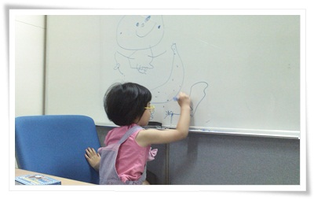

# 딸내미와 함께 간 회사

죽음의 프로젝트중이라, 주말에도 출근을 했다.

평소 집에서 나서는 시각이 6시반이라, 깨어 있는 딸래미를 보기 힘든 시각인데,

아주 가끔 그 시간에 일어날 때면 회사가지 말고 자기랑 놀자고 하며 눈물을 보인다.

이럴 시기가 앞으로 몇년이나 되겠냐싶어 아쉽기는 하지만, 달래놓고 출근하는 마음이 참 그렇다.

이러다  나중에 출근하던 퇴근하던 본체만채체는 시기가 오면 또 얼마나 허탈할까 싶기도 하고...

주말출근이라 느즈막히 출근하는데, 이번에도 딸내미는 회사 가지말라고 하다가, 자기도 따라가겠다고 한다.

그전에도 주말 출근할 때 두어번 회사에 따라 간 적이 있던터라, 이번에도 데려가기로 하고 차에 태웠다.

딸과 함께 출근하면서 불현듯 여렸을 때 아버지 출근길 따라가던 때가 생각났다.

나의 아버지는 초등학교 교사이셨다.

내가 초등학교 3학년때까지는 계속 격오지 섬에서 근무했었기에 학교안에 있는 관사에서 같이 지냈었다.

그 시절 아버지의 일상은 아침일찍 일어나, 학교 교실로 가서 아침자습문제를 칠판에 적어놓은 다음 , 다시 집에 와서 아침식사를 하셨다.  그 후에  다시 출근.

그 시절 아침식사전 아버지따라 학교에 같이 갔었다.

학교 들어가기 전이던 내게 학교는 뭐라까 신기한 것들이 많은 재밌는 곳이었다.

학교 교실은 누나,형들이 공부하는 곳이라, 동경의 공간이기도 했었고..

아버지가 칠판에 아침자습문제 쓰는 동안, 난 옆에서 칠판에 낚서하기도 했고, 교실 뒷편에 있는 무슨무슨 학습게시판들을 보며 놀곤 했었다.

딸내미도 나중에 지금의 나와 비슷한 추억을 하지 않을까 생각을 해본다.

\- 회의실 화이트보드에 그림 그리는 딸래미.

무엇을 그렸느냐고 물어보니  아침에 본 말괄냥이 삐삐와 해적석을 그렸다고 그런다.

이전까지는 혼자서도 재밌게 잘 놀았는데, 이제 신기한 것들이 떨어져서 그런가, 얼마못가 심심해했다.

집중력이 저하된 딸내미는 회사온지 두시간이 지나자, 집에 가자고 했고, 채 두시간밖에 일을 못 한 채 돌아왔다.

딸보고 "이제 회사 안 따라 올거지"하고 물으니, 이제 안 따라간다고 한다.

그런데, "아빠도 회사 가지 마"라고 한다.

그럼 돈은 누가 버냐고 하니까, 돈 벌지 말고 집에 있는 빵만 먹으면 된다고 하는군..

