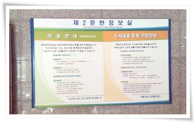
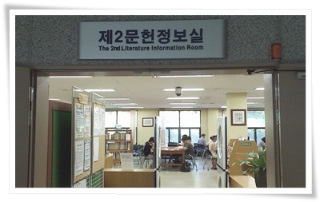
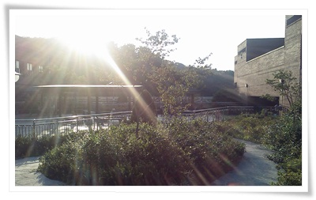
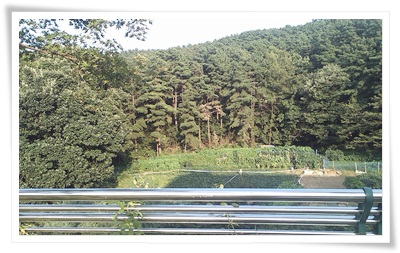
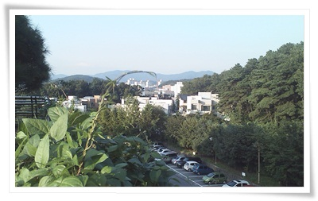

# 성남 중앙 도서관

가장 좋아하는 도서관은 서초에 있는 국립중앙도서관.

결혼하면서 신혼집을 어디로 정할까 했을때, 국립중앙도서관옆이라고 했다가, 아내한테 핀잔만 들었다.

서울에 살 때는 별 일 없는 주말이면 국립중앙도서관으로 갔었다.

가서 뭔가를 열심히 본 것은 아니고, 그냥 도서관에 가서 책좀 보다가, 커피좀 마시다가 하는 게 편안해서였다.

집 근처 구미도서관과 분당도서관만 이용하다가, 그래도 성남의 가장 크다는 중앙도서관을 가보기로 했다.

야탑에 있는 거라, 집에서 좀 먼 거리긴 하다.

문화센터와 같이 있어 도서관 부지는 꽤 넓다.

도서관 안에 놀이터도 있어, 가족단위로 놀러오는 사람이 꽤 되는 듯 했다.

\- 도서관 운영시간이 하절기는 밤 10시까지한다.  꽤 오랫동안 하는군.

\- 성남의 중앙도서관이라, 그래도 책이 많아 좋더군.

그냥 구미도서관에 없는 책을 복사할 것이 있어 온 것이기에, 책 복사하고, 주변 구경을 갔다.

\- 옥상은 정원이 꾸며져 있다.

\- 옥상에서 바라본 뒷 산.

\- 성남 구시가지 방향.

넓은 부지에서는 오는 여유로움 좋다.

집 근처라면 자주 올텐데,.  좀 멀긴 하다.

다음에는 구내식당 밥맛도 확인해봐야겠다.

