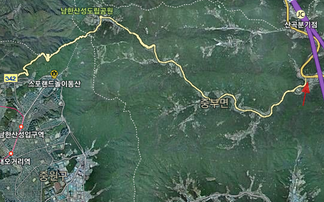
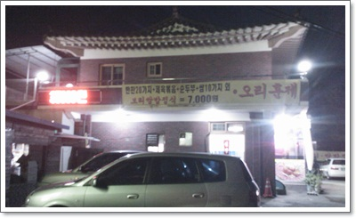
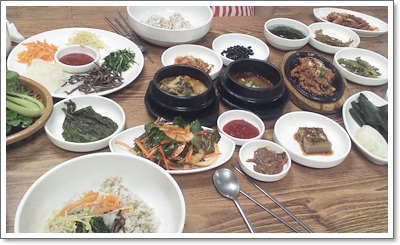
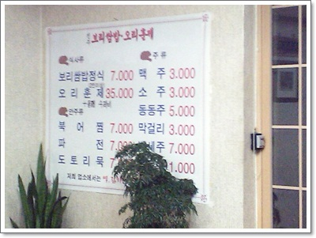

# 남한산성 갔다 발굴한 맛집 전주보리쌈밥정식

토요일 오후, 남한산성에 올랐다.

무얼 먹을까 하다가, 산성안에는 좀 비쌀 것 같아, 일단 광주방향으로 가면서 적당한 곳에서 저녁을 먹기로 했다.

남한산성계곡따라 식당은  즐비하다.

\- 남한산성에서 광주방향으로 내려간 끄트머리

광주시 중부면 광지원리 한산성입구삼거리에 있는 식당 전주보리쌈밥정식.

\-  현수막자체는 그냥 가격으로만 승부하는 식당처럼 보인다.

그냥 쌈밥정식 7,000원이라는 현수막에 순전히 가격적인 측면에 결정하고  들어갔다.

신장개업이라는 글자가 있어, 식당 인수한지 얼마 안된 듯 하였다.

나온 상차림은 보통 15,000 ~ 20,000원정도하는 한정식과 비슷한 정도였다.

\- 쌈밥정식 2인분.  맛도 좋았다.

-내가 먹은게 제일 위의 7,000원짜리 정식

