# 키자니아 방콕

이번 태국 여행은 방콕에서만 머물기로 했었다.

그 마지막 날 일정은 키자니아로 골랐다.

딸내미를 한 3년전쯤 잡월드에 데려갔었는데, 요즘에도 또 다시 잡월드 가고 싶다는 소리를 해서 이번 방콕 여행중 그 비슷한 키자니아로 선택했다.

예약은 몽키트래블을 통해서 했다.

예약사이트에서도 이 방콕 키자니아에서는 좋게 씌여 있지는 않았다.

이 키자니아는 예약도 3일전에만 가능하고, 어떠한 사유에서도 환불, 변경이 되지 않는다고..

그래서 예약사이트에서도 자기들도 굳이 여길 예약 중계하고 싶지는 않지만, 워낙 찾는 사람이 많아 하고 있다고 하더군.

나와 딸내미 2명만 예약하고, 아내는 호텔에 남아 오전동안 쉬다가, 체크아웃하고 기다리기로 했다.

키자니지는 National Stadium역, 씨암스쿼에 쇼핑몰에 있었다.

시작 시간은 10시.  종료는 오후는 5시.

10시반쯤 도착했다.

평일임에도 사람이 많았다.

바우처를 티켓으로 교환하고 입장했다.

한국 키자니아는 안가봐서 모르겠는데, 잡월드보다는 한 세배정도 종류가 많은 것 같았다.

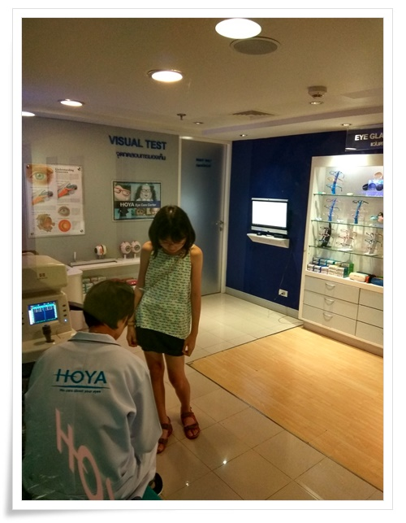

\- 제일 먼저 한 것은 시력 검사.

면허증 따는 체험도 있는데, 그 체험을 하려면 먼저 시력 검사를 해야 한다.

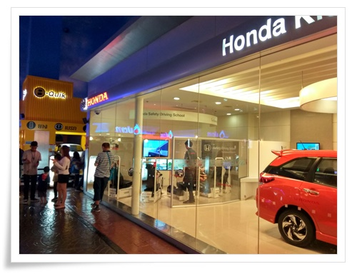

\- 그리고 혼다 체험센터에서 면허시험.

딸내미는 탈락.

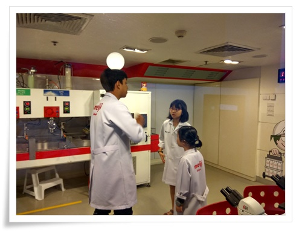

\- 다음 태국의 우유만드는 회사인 meiju에서 우유 만들기 체험

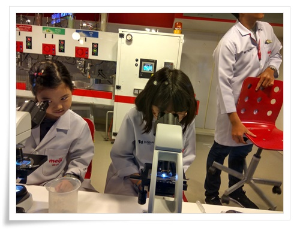

\- 뭔가 현미경도 바로 보고 그렇다.

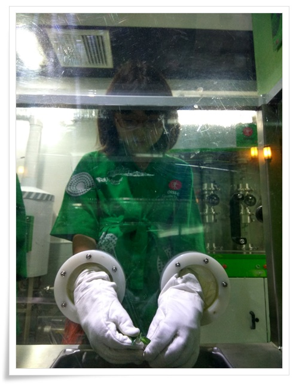

\- 녹차 만드는 체험에서 녹차 선별 작업 중.

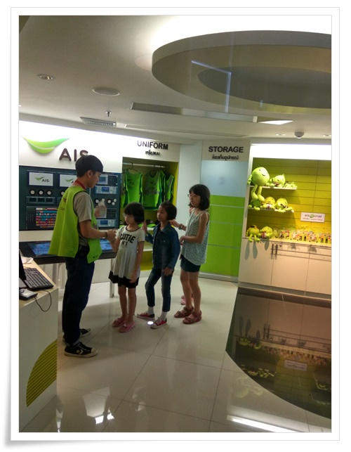

\- 통신사업자 AIS 직원 체험으로 중계기 복구 작업.

딸내미는 이날 여기 키자니아에서 최고령자 같았다.

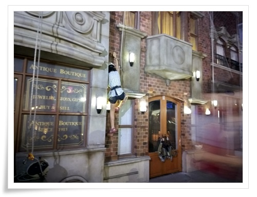

\- 이건 건물 타고 올라가는 체험.

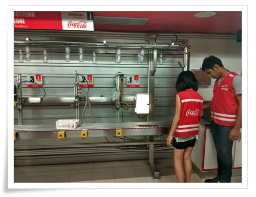

\- 코카콜라 생산 체험.

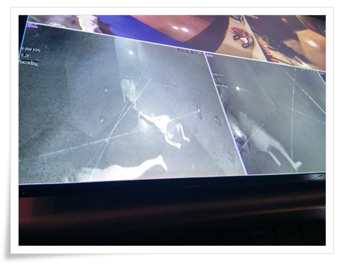

\- 그리고 비밀 요원 체험.

이건 밖에서 기다리는 부모가 볼 수 있게 이렇게 영상으로 제공해 주고 있다.

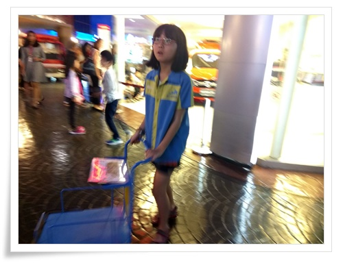

\- 택배 배달원.

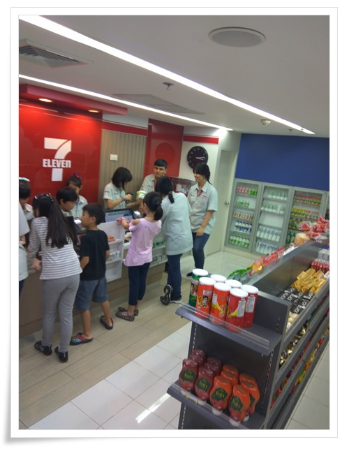

\- 그리고 편의점 직원.

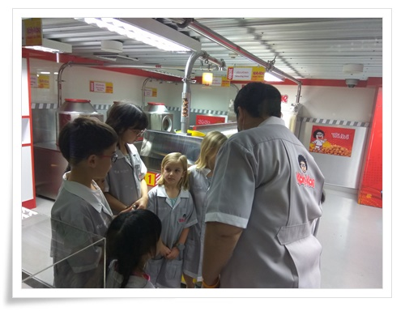

\- 땅콩 제조 체험.

체험할 수 있는 것들은 많았다.

가장 인기 많은 것은 소방수와 비행기 조종사였다.

딸내미도 그런 것 좀 해 보라고 하는데, 싫다고 하여 제조 체험 위주로만 했다.

11시부터 5시까지 했는데, 체험할 수 있는 것의 반 정도밖에 못 한 것 같다.

그래도 대기 시간이 없이 한 것이 만족스럽기는 하다.

여기도 한국의 잡월드처럼 좀비와 같은 부모들이 곳곳에서 볼 수 있다.

부모들이 할 수 있는 것은 그냥 대기하는 것 밖에 없기에, 벤치마다 피곤한 부모들이 앉아 폰만 만지작 거리고 있다.

