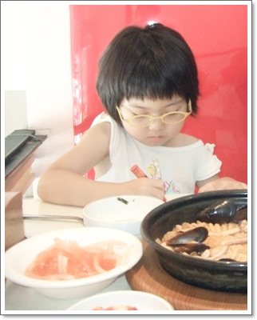
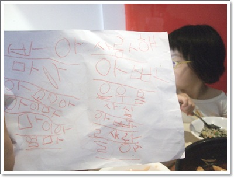

# 딸내미한테 받은 첫 편지

올해 다섯살인 딸내미, 그 나이대가 그러하듯 종이에 뭔가 그리는 것을 좋아한다.

서현에 있는 분식집 "돈쫄라"에 가, 음식을 기다리는 중, 딸내미는 그림 그리겠다고 한다.

\- 뭐가를 열심히 그리는 딸내미

\- 그림 그리는 줄 알았는데, 색연필로 나한테 편지를 썼단다.

종이 오른편에 쓴  편지 내용은

"사랑해 아빠 은우는 사실 아빠를 사랑해"

