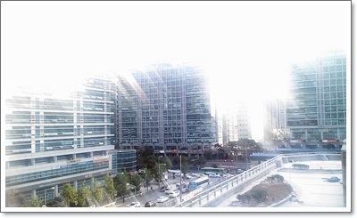
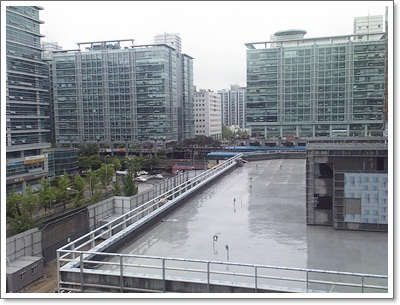
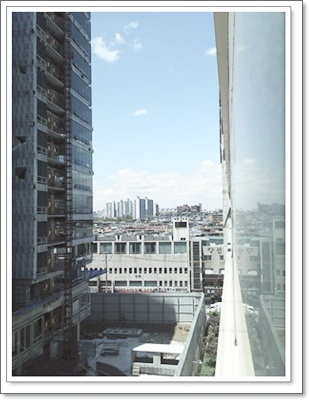
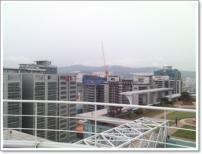
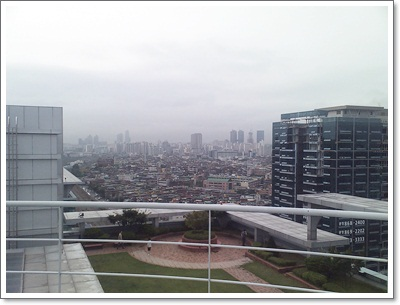

# 가산동 하늘

가산동으로 출근한지 어언 2년.

아직도 적응안되는 동네긴 하다.

취미중 하나가 동네 탐험인데, 이 동네는 도통 탐험의지가 안 생긴다.

도로는 좁고, 빽빽한 공장(아파트형)들도 하늘은 꽉 막혀 있다.

\- 무더운 여름.  회사 베란다에서 바라본 풍경.  노출과다인가 보다.  하늘 색깔이 날라갔군..

\- 비오는 여름 역시 베란다 밖 풍경

\- 핸드폰을 창 밖으로 내밀어 옆을 찍어본 것.

\- 옥상 풍경은 어떨까 하여, 우림라이온스 옥상에 올라가봤다.

\- 그런데, 왜 밖에다 안 만들고, 왜 옥상에다 이런 휴식공간을 만들어놨을까?

