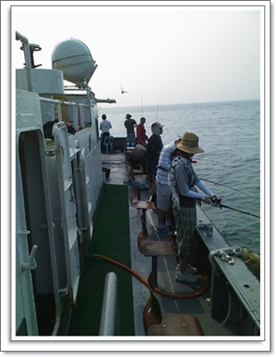
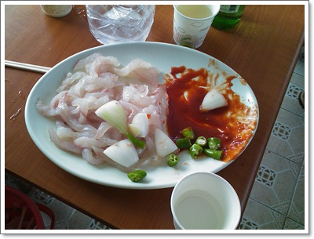

# 찜통 더위 속 바다 낚시

7월의 마지막 날, 바다낚시를 하러 갔다.

멤버는 늘상 같이 다니는 두명과 함께.

2001년부터 이렇게 셋이서 같이 낚시를 다녔으니 벌써 10년째로군.

바다낚시 한번 가려면, 좀 많이 피곤하긴 하다.

배는 인천 남항부두에서 4시반 출항이라, 3시반까지 도착해야 했다.

전날 밤 10시에 취침하여, 새벽 1시에 일어났다.

중간 모임 장소인 몽촌토성역으로 새벽 2시반에 가서, 먼저 기다리고 있는 두명을 태웠다.

3시 20분 목적지 현대유선에 도착하여, 낚시 채비를 준비했다.

낚시배 승선료 7만원과, 우럭채비와 추, 미끼, 얼음 준비에 2만원정도 들었다.

한번 낚시하시는 9만원정도가 들어가는군.

배를 타고 바로 아침식사로 제공되는 라면을 먹고, 바로 선실에 내라가 취침시작.

에어콘이 있음에도 후덥지근한 기운이 사라지지는 않았다.

두시간정도 신나게 달린 배는 덕적도 인근에 도착했고, 낚시 시작.

\- 더운 날에도 낚시에 여념없는 사람들.

물때는 11물.

낚시하기 좋은 물때는 아니었다.  물이 혼탁할 때라 고기가 잘 안 잡히는 때다.

그래도 설마했는데 정말 안 잡히더군.

하루종일 낚시해서,

내가 잡은 게 놀래미 한마리와 우럭 한마리.

다른 한분은 우럭 한마리만 잡았고,

또 다른 한분은 하루종일 한마리도 못잡다가 종료 30분을 앞두고 광어 한마리.

\- 돌아오는 배 안에서 우럭한마리와 광어한마리

날이 더우니, 육질도 많이 흐물흐물해 아주 좋은 맛 상태는 아니었다.

배는 4시에 낚시 종료하여 5시 40분쯤 출발지 남항부두로 들어왔다.

다시 서울 몽촌토성역에 내려준 시각은 7시 15분.

그리고 집에 오니 8시 10분.

고기는 배안에 먹은 것으로 끝나, 아이스박스는 텅빈 그대로 가져왔다.

덥기는 무지하게 더워 지쳐, 다시는 여름에 낚시하러 가지 말아야겠다.

