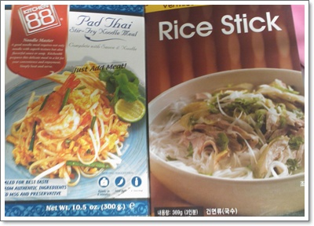
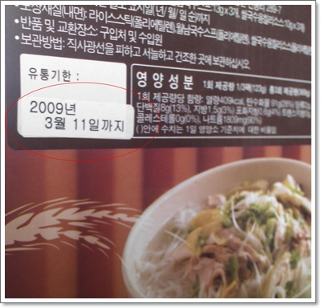
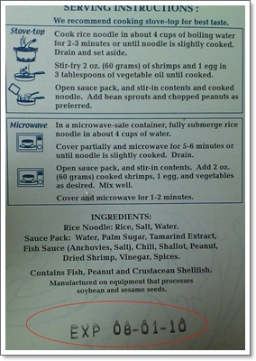
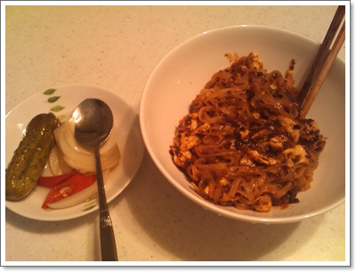

# 아내가 애 데리고 친정에 갔다.  올레!를 외쳤건만...

아내가 무려 5일동안을 친정에 가 있겠다고 했다.

올레~ 를 외쳤다.

친정가 있는 동안 뭔가 아주 보람찬 일을 벌어야겠다고 생각했지만, 현실은...

쌓여 있는 빨래 세탁기에 돌려 세탁하고, 널고, 걷고,..

집에 내가 전에 사 놓은 라면을 찾는데, 찾는 라면은 안 보인다.

아내가 벌써 다 먹어 치웠군.

\- 찾아낸 것은, 베트남쌀국수와 팟타이.

\- 베트남 쌀국수는 유효기간 넉달이 지났군.

인스턴트 식품인데, 그 정도 넘긴걸로 무슨 탈이 나겠어 하며 첫날 베트남쌀국수를 조리법대로 해 먹었다.

\- 파타이 유효기간은 일주일 남은, 그나마 양호하군.

파타이 조리법대로 면부터 삶고, 달걀과 소스를 볶아 면을 다시 넣어 볶았다.

\- 올레를 위친 저녁 만찬 팟타이.

팟타이를 무척 좋아한다.

[태국에서 먹었던 팟타이](../6166683.html) 의 맛은 잊지를 못하겠다.

역시 요리는 남이 해준 요리가 맛이 있는 것 같다.

