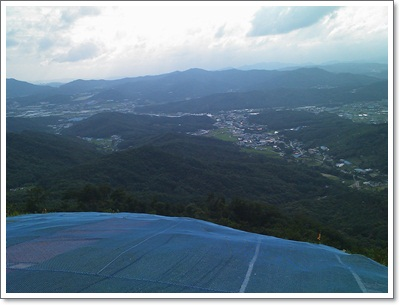
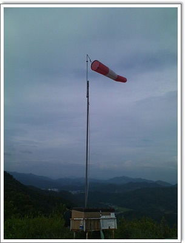
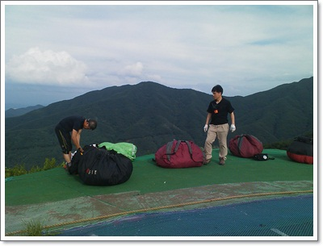
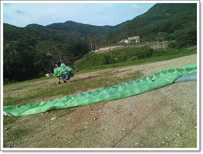
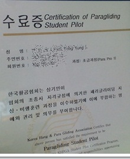

# 패러글라이딩 5일차 - 6회 비행, 수료, 그리고 종료

우기가 되니, 거의 주말마다 비가  오는 듯 했다.

[지난번 패러글라이딩](../10524455.html) 은 하루종일 비행하기만을 기다리다, 결국 차타고 하산했었다.

이번 일요일은 비는 안 오는네, 오후까지 바람이 거칠었다.

그래서 바람이 순해질 때까지  후방이륙법 지상훈련을 했다.

간만에 한 지상훈련이라고, 땀은 삐질삐질 나더군.

오후 늦게야 바람이 순해져서, 한번 밖에 비행을 못했다.

이날 들어간 돈은 기본 일비 2만원 + 비행1회 5천원 해서 총 25,000원.

\- 이륙장.  6번째인데도, 여전히 이륙을 위해 뛰어내릴때 겁이 난다.

\- 이 정도 바람이 아주 좋은 바람이라고 하더군.

\- 3일 집중호우 예보에 이륙장은 한산했다.

\- 오후내내 한 후방이륙연습.  연습도 바람이 불어줘야하는데, 바람이 도통 도와주질 않았다.

스쿨 강사는 계속 장비 사라고 부추겼다.

지난번에 장비 안 산다고 하니, 이번엔 중고 장비도 있으니, 250만원 정도에 중고 기본 세트(기체,하네스,낙하산,헬멧)는 구비할 수 있단다.

이정도도 투자를 못하면, 레져는 못한다며, 은근히 자존심까지 건드리더군.

아무리 뽐뿌를 해도 내가 지름신을 영접하지 않으니, 패러글라이딩 스쿨은 교육으로 이익 남는 게 없으며, 장비를 팔아야 대당 100만원정도가 남는다는 말까지 하더군.

패러글라이딩을 타는 회원들을 보면 같이 계속 타고 싶다는 생각은 든다.

어떤 모임에서도 이정도 괜찮은 회원들은 못 본 것 같다.

골프처럼 내기 골프를 할 수 있는 것도 아니고, 그렇다고 장비 자랑을 할 수 있는 것도 아니고, 오직 자연에 순응하며 하늘을 나는 거라서 그런가  나이와 사회적 지위가 제법 되는 분들도 매우 친절하고, 생각도 건전한다.

하긴 패러글라이딩은 장비병이 있기도 힘들 것이다.

다른 스포츠 장비야, 비싼 전문가용이면 초급보다는 거의 모든 면에서 다 좋지만,자기 실력에 맞는 장비를 꼭 사용해야 한다고 한다.

초급자가 고급장비 썼다가는 제어가 안되어 안전사고 발생하니까..

\- 초급반 수료했다고 받은 수료증

원래, 초급반이 8일코스이고, 이번에 5일차인데 수료증을 줘 버리는군.

초급반 과정을 5일코스로 변경했다고 한다.

나 등록할 때는 8일코스였지 않냐 하니, 그럼 수료증을 받고 3일은 그냥 나와도 된다고 하는군.

그런데 나가면 또 계속 장비 사라고 부추길 것 같다.

패러글라이딩이 매력있는 스포츠이고, 계속 하고 싶지만, 초급반으로 마무리하려고 한다.

패러글라이딩을 포기하는 이유.

1\. 내 재력에 감당키 힘든 고가 레저

\- 장비 풀셋(기체,하네스,낙하산,헬멧,무전기,고도계 등)으로 구비하는데 800만원 ~ 1,000만원.

\- [70만원짜리 차](../10466876.html) 를 타고 다니는 내게 너무 비싼 놀이다.

\- 교육비와 참가시마다 내는 일비를 합하면, 일일 비행시마다  평균 15만원정도 소모.

그래서 회원들 대부분이 이 정도로 감담할 수 있는 40~50대의 사장, 이사급들인 듯 싶다.

2\. 기나긴 기다림

\- 기상여건이 맞아야 한다.

    비도 안 오고, 바람도 적당한 세기로 지속적으로 일정 방향 불어야 한다.

    그 여건이 맞을 때까지, 마냥 기다려야 한다.

    이륙을 했더라도, 상승기류를 잘 타야 오래 날 수 있다.

초급반까지만 장비를 빌려주고, 중급반부터는 자기장비 없이는 아예 등록자체가 거부된다.(이는 내가 간 곳만 그럴지도 모르겠다.)

처음 등록할 때부터 이러한 사항과 계속하는데 들어가는 돈을 알았다면, 좀 달리 생각했을텐데, 좀 안타깝기도 하다.

암튼, 해 봤다는데 의의를 둔다.

