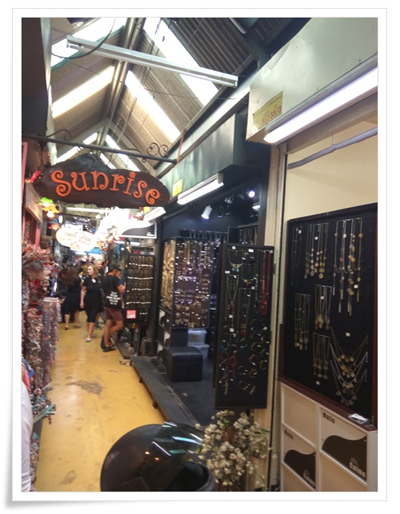
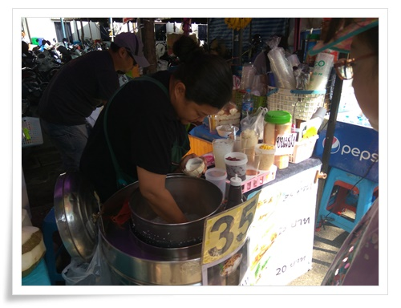
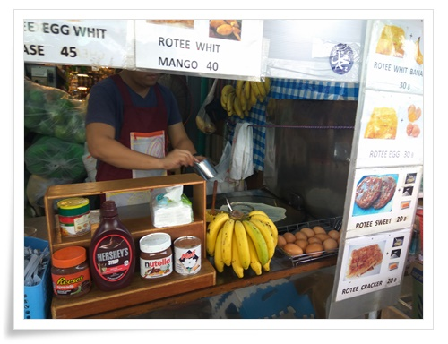
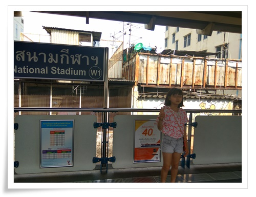

# 방콕에서의 쇼핑 - 짜뚜짝 시장과 터미널21

태국에서의 쇼핑은 짜뚜짝 주말시장과 터미널21 쇼핑몰 두 군데를 이용했다.

짜뚜짝 시장은 딸내미가 친구들 선물 고르게 하려고 갔다.

12월이지만 정오가 되면 방콕 날씨는 덥기에 정오전까지 마치려고 아침에 출발했다.

\- 팔찌 고르는 모녀.

이곳에서 둘 다 팔찌를 샀다.

헌데 딸내미의 팔찌는 귀국하면서 잃어버렸다.

\- 좁은 짜뚜짝 시장 내부.

생각해보니 내가 예전 출장때 여기와 왔었을 때는 한여름이었다.

그때는 정말 더웠었는데 말이다.

\- 시장에 왔으니 군것질도 해야지.

방콕의 유명한 간식인 코코넛 아이스크림 사는 중.

\- 그리고 바나나로띠.

다음 날 쇼핑은 터미널21.

아속역에 있는 거고, 방콕 쇼핑몰중 가장 좋다고 하여 갔다.

\- 아속역가기 위해 이번엔 전철을 타고 갔다.

MBK 쇼핑센터까지는 호텔에서 무료로 운영하는 셔틀이 있어 그거 타고 간 후 전철을 타고 아속역까지 갔다.

전철역과 터미널21은 바로 연결되어 있었다.

내가 가본 적이 있는 곳이라 생각했었는데, 아니더군.

예전 내가 출장갔을 때에는 없었던 쇼핑몰갔다.

제법 고급스럽고, 또 제법 비싼 곳이었다.

