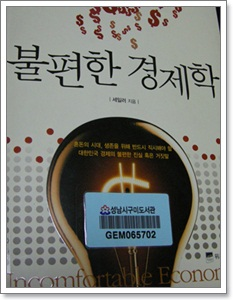
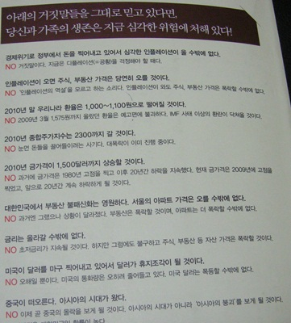

# 불편한 경제학을 읽고 되돌아본 나의 재테크 실패기

어려운 경제는 뭔 소리인지 몰라, 신문을 보더라도 경제면은 그냥 skip이었다.

남들은 주식하느라 경제공부 열심히 하는데, 그 동안 별 관심없이 지내왔다.

무관심 그리고 무식해서 좋은 것이 없더군.

1\. 주식 실패기

인터넷 포털 회사에서 우리사주라는 것을 샀다.

지금은 우리사주라는게 크게 인기 없지만, 그 당시 우리사주는 곧 재산증식의 최고봉으로 인식되었던 듯 하다.

하지만, 내가 우리사주 산 시점은 IT 거품이 상투를 지나 내리꽂기 시작하는 시점이었다.

1년보유 후 팔 수 있게 된 시점에는 반토막이 났었다.

다행히 우리사주조합 보유분에서 손실분을 메꿔주어 손실은 없긴 했었다.

얼마되지 않은 주식을 갖고 있는데도, 어느 시점에 팔지 고민하느라, 온통 정신은 주가에만 쏠려 있었다.

그후, 주식은 손을 아주 끊었다.

2. 펀드 실패기

급여통장으로 CMA라는게 큰 인기를 끌기 시작할 때, 동양종금CMA 통장을 만들었다.

펀드를 가입하고, 매달 10만원이상 자동이체토록 하면 각종 수수료를 면제해준다고 하여 펀드를 만들었다.

소심한 성격에 펀드는 채권형으로 했었다.

그리고, 증권회사 다니는 친구가 장기주택마련을 저축대신 펀드로 하는게 좋다고 하는 말에 팔랑귀가 또 팔랑거려, 추가불입은 펀드로 했었다.

이것도 채권형으로 했었다.

채권형인데도 손실이 나더군.

2008년 결국 손실을 감수하고 모두 환매했다.  대략 원금에서 300만원정도 날림.

3\. 부동산 실패기

결혼하면서 집을 샀다.

전세는 일단 제꼈다.  집주인과 관계에 대한 안 좋은 사례를 너무 많이 들은터라, 내 집에서 살기로 했다.

그 당시 부동산 거품론에 대한 정부의 우려가 있었고, 그래서 DTI등 대출규제 정책을 준비하던 때였던 듯  싶다.

어차피 대출은 받아야 했고, 빌라와 아파트 두 개중, 대출을 그나마 조금 받아도 된 빌라로 선택했다.

불패론보다는 거품론을 믿었고, 아파트가 많이 떨어질 거고, 빌라는 유지할 거라 생각했다.

내 예상은 빗나갔고, 아파트는 주구장창 오르더군.

당시 부동산은 진리라고 하며 아파트에 올인한 회사 상급자들의 재산 자랑을 많이 들으면서, 아울러 나의 어리섞음에 대한 조롱도 들었었다.

[이상한 이웃들과 빌라에 사는게 너무 힘들어](../10265990.html), 3년보유 시점에 이사가기로 했다.

때는 이명박정권 시작 시점.

그리고 혹시 거품이 지속되면, 영영 내집으로 아파트 장만은 불가능할지도 모른다는 생각도 있었다.

부동산 거품이 꺼지더라도 부동산 부양 정권으로 명박 정권말까지는 버틸 꺼라고 생각했고, 꺼지기 직전에만 탈출하면 되겠지라는 안이한 생각만 했었다.

헌데, 바로 꺼지더군.  내가 산 시점이 바로 상투.

요즘 내 아파트 매매가를 검색해 보니 살 때에 비해 1억정도가 떨어졌더군.

어차피 집한채 올랐다고 팔 수 있는 것도 아니고, 나만 떨어진 것은 아닌것에 위안을 삼는다.

무지한데다, 팔랑귀까지 가지고 있으니, 이거 안되겠다 생각했다.

최소한 내 재산에 대해서만은 판단의 책임을 질 수 있을 정도의 지식은 갖추어야겠다 생각했다.

신문은 사주과 광고주의 이익에 따라 기사를 쓰는 거라 믿을 수 없고,

애널리스트는 증권사의 이익과 회사의 눈치를 보느라 거의 긍정적으로만 쓰는 듯 하고,

정부는 국민에게 희망만 주기 위해 말할 뿐, 자기네들은 고급정보로 위험 회피하는 듯 하니,

결국 모든 책임은 본인이 지는 수 밖에..

경제에 관심을 가져야겠더군.

그런데 내겐 너무 어렵다.

추천서적인 불편한 경제학을 빌려 읽었다.

경제 상황에 대해 온갖 차트로 자세히 설명을 해주고, 비교적 쉽게 씌여 이해는 가지만, 워낙에 경제 지식이 없는터라, 자가 판단력없이 팔랑귀만 움직이더군.

책일 다 읽었는데도 뭔가 정리되지 않은 기분.

"세계경제는 디플레이션, 즉 공황으로 빠질 것이다.

공황으로 빠질 때까지 더블딥이라든가 하는 일시적인 반등은 있을 수 있다.

고로 개인은 생존을 위해 달러를 보유해야 한다."

오독일 가능성이 크겠지만, 대략 이 책의 주장하는 바는 이런 듯 하다.

기초부터 쌓아야하지, 처음부터 두꺼운 책을 보니 머리가 다 아프다.

경제학의 시작이라고 하는 국부론부터 함 읽어봐야겠다.

