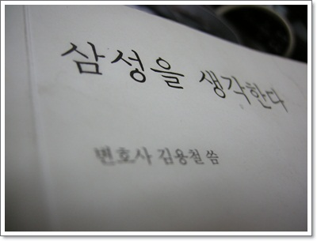
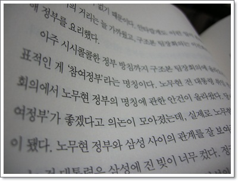

# 삼성을 생각한다를 읽고서 기억에 남는 것들

올해 2월 출간하면서부터 블로그, 트위터상에서는 엄청난 호평을, 언론에서는 철저한 무시를 받은 책.

삼성이 비리덩어리인 것은 누구나 아는 사실 아닌가하며 큰 관심은 두지 않았다.

[예문당 리뷰](http://yemundang.tistory.com/175) 를 보고서, 재미있겠는 걸, 하고 구미도서관에서 빌리려 했다.

엄청난 인기였다.

도서관의 예약시스템이 한 책당 4명정도까지만 예약을 받는 듯 했다.

예약하려고 항상, "권당 예약이 초과하였습니다."라고 하여 예약도 못했다.

그러다 드디어 빌렸다.

나온지 별로 안된 책이 얼마나 손때를 많이 탔는지, 아주 낡은 모습이다.

1\. 참여정부 명칭의 유래

**"정부와 삼성 사이의 거리는 늘 가까웠고, 구조본 팀장회의는 이건희의 이익을 위해 정부를 요리했다.**

**아주 시시콜콜한 정부 방침까지 구조본 팀장회의에 올라온곤 했다.  대표적인 게 '참여정부'라는 명칭이다.  노무현 전 대통령 취임 전 열린 팀장회의에서 노무현 정부의 명칭에 관한 안건이 올라왔다.  당시 회의에서 '참여정부'가 좋겠다고 의논이 모아졌는데, 실제로 노무현 정부의 공식명칭이 됐다."**

2\. SAP-R3 커스터마이징

아는 사람 중 예전 삼성 다닐 때 SAP의 ERP 프로그램을 삼성에 맞게 커스터마이징에 본인이 참여했다는 이야기를 아주 자랑스럽게 이야기하시는 분이 있다.  이 프로그램이 워낙 권위 있는 프로그램이라 웬만하면 회사의 프로세스를 프로그램에 맞추지, 프로그램을 뜯어고치지는 못한다는 거였다.  SAP에서도 불가능할 거라고 한 커스터마이징을 삼성 엔지니들이 엔진까지 뜯어고쳐 결국 완성했다는 거다.

이 이야기를 들었을 때는 별 쓸모 없는 짓을 다하는 삼성이구나라고만 생각했는데, 이 책을 보니, 왜 그렇게 힘들게 뜯어고쳤는지 나와있더군.

SAP 프로그램이 물류와 회계가 전부 연결되어 있어, 회계 투명성을 보증한다.

그런데 그러면 건희일가의 비자금이 다 드러나 버린다.

그래서 뜯어고쳤단다.

투명한 회계를 위해 사용되는 프로그램을, 비자금이 드러나지 않도록 회계가 투명한 거처럼 보이게끔만 한 것이다.

3\. 이건희 생일잔치

생일잔치 사회를 이금희가 보고, 금난새도 출현했다고 하는군.  좀 실망이군.

독보적으로 나훈아만이 "내 공연을 보기 위해 표를 산 대중 앞에서만 공연한다"라고 하며 거절했다고 하는군.

4\. 홍라희의 미적 감각

**"서울대 미대를 나온 홍라희는 패션과 미술에 관심이 많아 , 해마다 제일모직의 여성복 디자인을 직접 결정한다.  그 덕에 제일모직 여성복 사업부장은 매출부진으로 연말이면 항상 회사에서 쫒겨나가고 한다.  그래서 제일모직 여성복 사업부장 자리는 제일모직 임원의 무덤이라는 말이 나오곤 했다."**

이건 뭐 무협지를 읽는 듯한 느낌이었다.

읽다보면 그냥 허탈한 웃음나올 때도 있고, 자괴감같은 것이 느껴질 때도 있었다.

이런게 글로벌기업이라니..

언론상에 등장하는 삼성의 비리 기사는 전환사채니, 분식회계니 나에겐 어려운 용어들이 등장해서 고차원적인 방법 증거 인멸, 조작을 하는가 보다 했는데, 그런 고차원적인 별로 없더군.

그냥 돈으로 검사 매수, 판사 매수하는 거더군.

뻔한 증거도 무시하게끔 하고...  당하는 사람는 대체 얼마나 억울할까..

하긴 증거조작,인멸에 들어가는 비용보다 그냥 판검사 매수해서 무시하게끔 하는게 싸게 먹히겠지..

