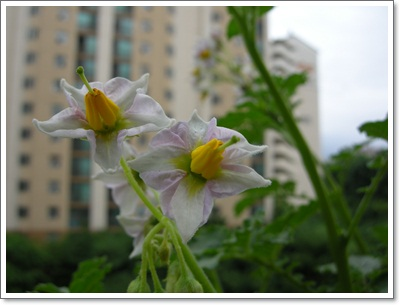
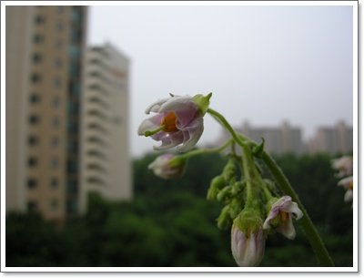
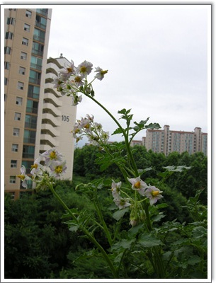

# 감자꽃

싹이 나 더이상 먹을 수 없게된 감자를 심기로 했다.

감자 나름대로 살아볼려고 싹을 틔웠는데, 그냥 음식물쓰레기통으로 넣기엔 죄짓는것 같았다.

베란다 화분에 감자를 심은 지, 한달정도 되었는데, 꽃이 피었다.

\- 제법 예쁜 꽃이다.

\- 꽃이 피기전 상태일때는 이렇게 별로였는데,..

\- 좁디 좁은 화분에 심은 감자

좁은 화분에 감자 통째로 심은거라,  비좁아 정상적으로 자라기는 힘들테다.

솎아주어야 하는 것이 맞는 일이나, 그냥 내비두기로 했다.

