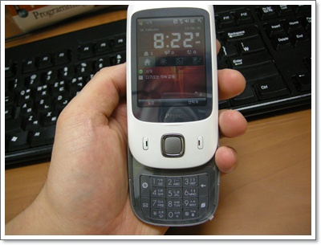

# 엑스페리아 A/S 수리하는 동안 임시로 쓴  HTC 터치듀얼

아이폰4 나온다는 소식에 멀쩡하던 엑스페리아가 고장났다.

핸드폰이 약전계에서 보조배터리까지 완전 방전되고 나니, 처음에 부팅도중 다운되고 그러더니만, 카메라 동작시키면 폰이 뻗어버렸다.

혹시 부팅실패로 메모리가 꼬였나 싶어 하드리셋했는데도 마찬가지.

그렇다면 이건 보드나 카메라모듈에 이상이 생겼겠구나하고 생각하고, A/S센터로 가야만 해결되겠구나 여겼다.

A/S 센터로 들어고 가기 위해선 롬을 순정상태로 돌려놓아야 하기에,

커스텀롬에서 순정롬으로 원복시켰다.

혹시나 싶어 순정롬상태에서 카메라 켜봤는데 역시 다운되더군.

회사 근처의 가장 가까운 곳이 구로지점이었다.  구로역 2번출구에서 10여분 걸어가면 있는 곳.

대충 위치를 보고 출발했는데, 못 찾고 해멨다.

A/S 센터 전화번호 1544-0110 로 열심히 걸어봐도 자동안내멘트만 열심히 돌아가고, 날씨는 덥고, 땀은 줄줄 흐르고..

그냥 다시 열심히 주변을 겨우 발견했다.

상태를 설명하고, 잠시 기다리라길래 기다렸는데, 1시간을 기다렸다.

기다리는 동안 센터 내부를 살펴봤봤다.

그 동안 센터로 전화 한 통 걸려오는 법이 없었다.

이런, 전화기를 발신전용으로 만들어 놓고, 전화는 ARS 기계음만 돌리는거였군.. **배신감!**

A/S 기사가 롬도 다시 쓰고, 카메라 모듈도 바꿔보고 했는데 마찬가지라면서 메인보드 문제같은데 메인보드 부품이 없어 내일 연락준다고 한다.

\- 수리간 임시로 받은 폰

교품으로 HTC 터치듀얼을 받고 복귀.

터치듀얼.

생긴모양은 스마트폰처럼 생기지는 않았더군.

그래도 안만져본 스마트폰이라 좀 흥미를 가지고 만져봤다.

WiFi 도 없고, GPS도 없고, SK의 위피 프로그램은 잔뜩깔려있는 영 별로인 폰이더군.

KT에서 아이폰 출시하기전이라 SKT가 베짱 영업하하면 스펙다운시켜 나온 폰인가 보다.

빨리 내 엑스페리아나 수리되면 찾아가야겠다.

