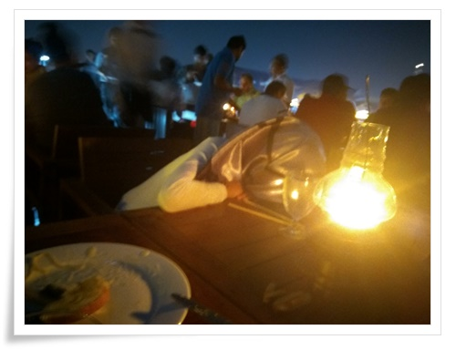
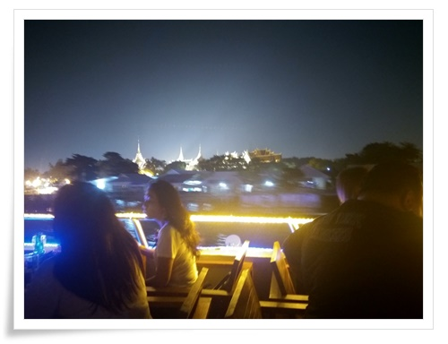

# 방콕 차오프라야강에서의 디너크루즈

태국 여행 계획중 저녁에 할 것이 별로 없어, 디너크루즈나 해보려 했다.

마찬가지로 몽키트래블을 통해 디너크루즈 예약했다.

종류가 많았으나 그중 가장 싼 화이트오키드를 예약했다.

별 기대는 없었다.

그냥 한강유람선이나 이거나 비슷하겠지 했다.

그냥 야경 구경하는 정도 생각했다.

출발은 차오프라야강가의 리버시터에서 했다.

시간이 맞게 갔다.

리버 시티는 완전히 시장바닥이었다.

배 타려는 사람들로 완전 바글바글 댔다.

사람 많은 것은 별로 안 좋아하는 터라, 괜히 이걸 선택했다라는 후회가 들었다.

바우처를 티켓과 교환하고, 배를 기다렸다.

원래 배는 7시반 출발인데, 앞의 배들이 늦어서 그런가 8시에야 승선했다.

그리고 출발은 8시20분쯤.

\- 배 타기전 리버시티에서 기다리는 중.

티켓을 받고 나면, 선사에서 사진을 찍고 저 꽂을 꽂아주는데, 저 의미가 사진을 찍었다는 것이라고 하더군.

그렇게 찍힌 사진은 배에 타는 동안 직원이 찾아다니며 인화한 사진을 팔러 다닌다.

물론 나는 안 샀다.

\- 3층에 앉아 음식을 먹으며 야경을 본다.

음식은 부페인데, 별로 맛은 없었다.

그리고 어디가나 많이 있는 중국 관광객과 인도관광객의 시끄러운 소리가 들렸다.

\- 게다가 딸내미는 감기 기운으로 배에 탄 내내 저렇게 엎어져 있었다.

\- 강가에서 보이는 야경 자체는 좋긴 하다.

그런데 노래를 안 했으면 좋았을텐데라는 생각이 들었다.

3층은 필리핀 가수가 부르고,

2층은 게이쇼

1층은 중국 관광객용 노래를 불러

귀가 아팠다.

\- 2층.

대부분의 손님은 야외인 3층에 있어, 1층과 2층은 좀 여유로운 편이었다.

단 시끄러운 노래 소리만 없다면.

\- 1층.  여기도 시끄러운 노래 소리

디너크루즈를 선택한 것은 실패였다.

전혀 만족스럽지 못했다.

마치고 숙소로 복귀할 때의 택시 또한 이 기분을 가속시켰다.

처음 택시는 500바트를 불렀다.

두번째 택시는 200바트를 불렀다.

그래서 큰 길까지 걸어나왔다.

지나가는 택시를 세웠다.

그 택시는 180바트를 불렀다.

결국 택시 타는 것 포기하고 우버를 불렀다.

우버는 70바트 정도 나왔다.

태국와서 총 4번의 택시를 타려는 시도 중 4번 모두 미터를 거부했으니 미터 거부율이 100%인 셈이다.

예전 출장으로 왔을 때는 미터 거부했던 게 없었던 것 같은데 그 사이 태국 정부의 택시 감독이 소홀해졌나 보다.

우버를 이용안했으면 여행 기분을 많이 망칠 뻔 했다.

