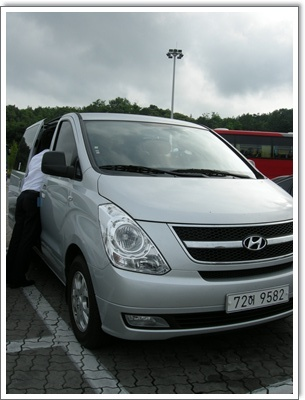
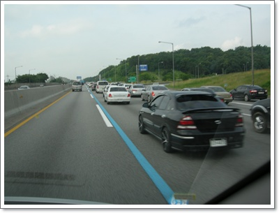

# 렌트카로 타본 스타렉스 소감

회사 직원 결혼식이 경남 거창에서 있어, 일요일 하루 종일을 차에서 보냈다.

같이 직원들끼리 타고 갈 차량을 금호렌트카에서 12인승 스타렉스로 빌렸다.

운전의 고통이 상당할 꺼란 생각에 그냥 고속버스 타고 생각이었으나, 직원 개개인의 교통비까지 아껴주겠다는 사장님때문에 회사비용으로 렌트카를 빌려 떠맡게 된 거다.

2명이서 교대로 운전하기는 했으나, 거창이라는 곳이 왕복 10시간에 해당하는 먼 곳이라 힘들기는 하더군.

그래도 한가지 스타렉스를 한번 몰아본다는 것은 기대되었다.

나의 드림카는 봉고3더블캡4륜 1톤트럭.

사람도 6명이나 탈 수 있고,

뒤에 오픈된 짐칸에 1톤이나 짐을 실을 수도 있고,

4륜구동이라 험한길도 잘 갈 수 있고,

높은 차고로 탁틔인 시야가 있다는 점이 좋은데, 도시에 살면서 보유하기는 좀 무리이기는 하다.

그 다음 선호차량이 카니발, 스타렉스.

스타렉스는 승합차분위기때문에 전에 카니발을 사기는 했지만, 스타렉스의 넉넉한 실내공간이 마음에 들기는 하더군.

\- 이번에 빌린 스타렉스.  주행거리 9천km의 새차량이었다.

\- 신형이라 내부도 깔끔하니 멋있더군.

\- 일요일 오후 정체되는 경부고속도로에서도 버스전용차선 주행.  물론 탑승객이 10명이나 되어서 그렇기 하지만..

전에 악질렌트카에 크게 데인적이 있어, 이번엔 금호렌트카에서 빌렸다.

하루 빌리는데 자차보험, 네비포함해서 15만원정도 들었다.

카니발보다 높은 차고로 시야가 좋긴 한데, 카니발보다는 의자가 불편하더군.

연비도 별로인 듯 하고..

거창갔다왔다하는데 기름값 10만원 들었다.

다음에 승합차 빌릴 일 있으면, 아직까지 못타본 승합차 11인승 로디우스를 빌려봐야겠다.

