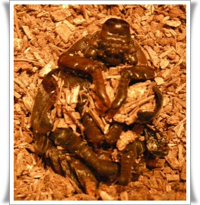
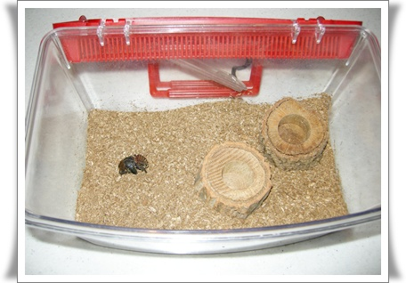
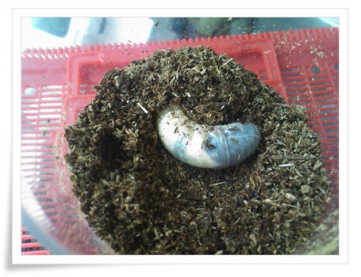

# 장수풍데이 우화중 사망

동물 키우는 것을 별로 안 좋아하는데, 장수풍뎅이를 키우게 됐다.

작년 12월에 역시 아내가 장수풍뎅이 애벌레 2마리를 분양받아왔다.

받아왔으면, 직접 키울 것이지, 꼭 나보고 키우라고 한다.

어렸을 때, 집에 키우는 개가 개고기가 되어 돌아오고 나서 동물과 교감하려는 것을 기피하고 있다.

장수풍데이가 보통 6~8개월 애벌레 생활을 하다, 3주 번데기 생활을 했다 우화하여 성충으로 50여일을 살다 죽는다고 하더군.

습도 맞춰주기 위해 매일 분무기로 물을 뿌려줬었다.

톱밥도 갈아주고.

지난달  톱밥갈아주다가 번데기방을 무너뜨렸다.

꼭꼭 숨어있어 번데기가 될 줄 몰랐었는데, 번데기 되어 있었다.

그래도 성충으로 되길 기원하며, 습도에 신경을 썼다.

2주까지는 그래도 번데기상태로 꿈틀거리길래 살아있구나 했는데, 그 후로 아무 움직임도 없어졌다.

검색해보니, 번데기방을 부셨을 때는, 오아시스로 인공번데기방을 만들어줘야 된다고 하던데, 그걸 못해서 이렇게 됐다.

\- 7개월을 애벌레로 살았었는데, 마지막 우화를 못하고 이렇게 죽었다.

\- 휑한 장수풍데이집

두마리 애벌레중 이제 한마리 남았다.

같은 자랐는데, 한마리는 성장이 영 느린 듯 하다.

\- 아직 애벌레상태.  애는 곧 번데기가 될 시기가 됐을 텐데,.

