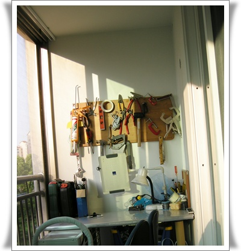
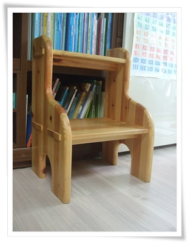
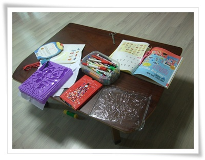

# 목공방에서 한달 교육 받고서 만든 베란다 작업대

\- 나의 베란다 작업책상

전에 [공구거치대](../10277278.html) 부터 만들고 나서 공구들을 여러개 걸고 다니, 비좁다.

\- [목공방에서 한달 교육을 받으면서 만든 첫 작품.  책장 사다리](../9338916.html).

2008년에 목공방을 한달 다닌 적이 있었다.

공방 교육비가 한달 10만원이었고, 일주일에 두번, 한달이면 총 8일 교육이었다.

이 교육비에는 재료비는 포함되어 있지 않기 때문에, 실제 한달 배우면서 들어가는 돈은 무엇을 만들 것인가에 따라 큰 차이가 난다.

딱 한달 다니고, 더이상 다니지는 않았다.

왜 다녔냐 하면, 그냥 목공 기술을 배워보고 싶었다.

목공에 대해서 배운 거는 중학교2학년 기술시간에 배운, 책꽂이 만들기 실습이 전부다.

그래서 맥가이버처럼 내가 필요한 것들이가 만들어보고 싶은 것들을 자유롭게 만들어보고 싶었다.

그래서 목공기술을 가르쳐 주는 곳을 찾아봤고, 목공방이라는 곳들에게 가르쳐준다는 것을 알았다.

공방도 몇년전에 불었던 웰빙바람을 타고 많이 생긴 것 같았다.

어디에서 배울까하고, 인터넷 카페등을 검색해봤는데, 공방 자체에 대한 사용자 평은 거의 없었다.

어찌저찌해서 회사 근처의 공방을 찾아 등록을 했다.

한달 교육받으면서 느낌 소감은, '내 기대와 많이 다르다'라는 거였다.

교육전 내 기대치는, 커리큘럼에 의한 공구사용법과 팁 위주의 기술 교육으로 값싼 재료로 연습 위주의 교육을 상상했었다.

첫날.

교육비 10만원 내고 등록(그런데 공방에서 교육비라는 용어보다는 공방이용료로 더 많이 사용하더군).

무엇을 만들고 싶은지 물어보는데, 난 그게 없었다.  그냥 단순히 기술을 배울려고 했었는데,..

생각나는대로, 거실용 탁자 어떤가 말해보니, 원목이 어느 정도 크기가 필요하여 재료비가 한 20만원 정도 나올 것 같다라는 말에 기겁하고, 크기 작은 것으로 급하게 생각해 낸게, 딸래미가 책장의 책을 잘 꺼낼 수 있도록 사다리로 바꿨다.

모양과 크기를 정하니 그 크기의 원목가격은 6만8천원이라고 하더군.

더 싼 목재는 없냐고 하니, 고급 목재만 취급하지, 싸구려 목재는 취급하지 않는다고 하더군.

그리고 공방의 규정이 모든 재료는 공방에서 파는 것만 구입해야 한다.

재료비를 지불하고, 원목에 직소로 톱질.

둘째날.

직소로 톱질.  그리고 라우터로 모서리 가공

세째날.

톱질과 나사못 고정.  나사못 자국 숨기기

넷째날.

사포질.

다섯째날.

페인트칠.

다음 주제로 무엇을 할 것인가를 물어본다.

일단 뭘 만들까라는 생각보다는 재료비가 얼마나 들것인가 든 생각이다.

여섯째날.

페인트칠.

별로 배운 것도 없고, 재료비의 부담이 커 계속 다는 것 포기.

일곱째날.

완성된 작품 가지고 집으로..

끝.

교육을 받는 나와, 공방주와의 입장에 있어 괴리감이 좀 많은 듯 했다.

목공방의 교육이라는 과정이 소비자의 수요에 의해 만들어진 것이 아닌, 공급자 위주로 만들어진 것이라,

내 입장은 "목공기술" 그자체에 대한 배움인 방면,

공방주는 목공작품을 만드는데 도움을 주며, 그에 필요한 재료판매로 이익을 얻는다라는 것 같다.

공방이야 이윤이 많이 남는 목재를 많아 팔아야 그게 이익으로 돌아가는거야 당연하지만, 그 때문에 소비자의 지갑 사정은 전혀 고려하지 않고, 그냥 '그까짓 돈 얼마' 이런식으로 대하는 게 마음에 들지 않았다.

교육비라는 것이 들어감에도 불구하고, 다른 사설 교육기관에서 처럼 친절한 가르침 없는 것은, 지식을 사고판다는 서비스재화라는 개념이 아닌, 도제식으로 '스승과 제자'라는 개념을 공방주들은 가지고 있어 그런 듯 하다.

그래서 가끔 잡지나, 신문기사에서도 공방에 대한 글들을 보면, 여지없이 '제자들은 혼냈다'라는 표현이 나오는 듯 싶다.

교육에 대한 비용을 지불한 사람인데, '제자', 그리고 '혼내다'라는 표현이 좋지 않다고 생각하는데, 저게 그쪽 세계의 일반적인 의식인 듯 싶더군.

비록 목공에 대한 기술을 배우기는 했지만, 들어간 돈 값어치만큼은 안되었다는 생각에 공방에 더이상 돈을 들일 필요가 없다 생각하고, 혼자 해보기로 했다.

베란다에 작업 공간을 만들고, 꼭 필요한 공구들만 샀다.

그리고, 자재는 보통 아파트에 버려지는 가구들을 뜯어다 만들고 있다.

그런데 역시나 자재 구하는게 쉽지는 않더군.

\- 최근에 만든 것.  버려진 침대로 딸래미 탁자 만들었다.

재료비는 인터넷에서 구입한 다리 4개 6,000원 끝.

혼자 배우기 위해, 인터넷에서 목공관련 서적도 사고, [철천지사이트](http://77g.com) 에서 강좌동영상도 보면서 조금씩 해보고 있다.

최대한 돈 안드는 방향으로.

