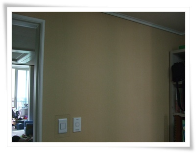
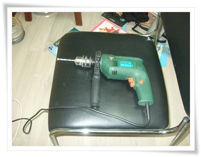
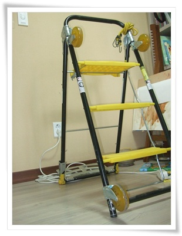
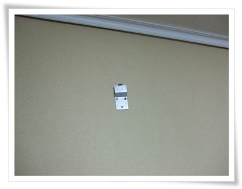
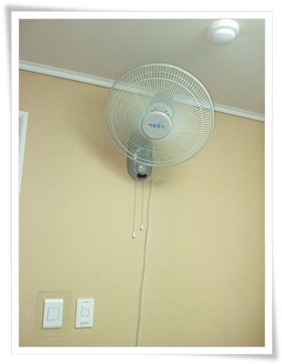
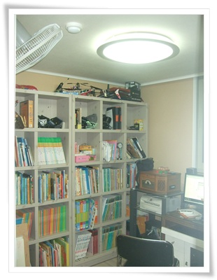

# 역시 벽걸이 선풍기

더운 여름이 됐다.

안방은 실링팬이 있어, 시원한데 내방은 선풍기가 없다.

벽걸이 선풍기를 설치하기로 했다.

일반 선풍기는 너무 자리도 많이차지하고 해서, 벽걸이로 설치했다.

요즘 가정집도 그렇고, 식당에서도 벽걸이 선풍기는 찾아보기 힘들더군.

벽에 구멍을 뚫고 하는 거라, 이른 아침, 아내가 안 일어난 때로 잡았다.

아내가 벽걸이 선풍기를 무지하게도 싫어한다.  이유는 폼이 안난다고 하여..

\- 설치할 장소

\- 드릴에 7mm 비트를 끼우고,

\- 의자로는 자세가 안나와, 예전 산 [다목적 사다리](../9291977.html) 를 펴고,

\- 구멍 세개 뚫어, 칼브럭에 나사못으로 고정,  조금 비뚤어졌군.

\- 드디어 벽걸이선풍기 장착 완료

\- 벽걸이 선풍기로 한층 품격이 높아진 내방.

일반선풍기에 비해 벽걸이 선풍기의 장점이라 하면, 공간 효율성이 좋다.

아무래도 벽에 붙어 있으니, 다른 공간을 침해하지 않는다.

그리고, 더 자연스럽게 시원하다.

바람의 방향이 위에서 아래로 부는 바람이라 그런 듯 하다.

